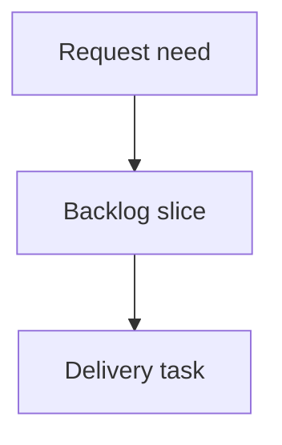

## req_204_notify_operators_when_logics_manager_updates_are_available - Notify operators when logics-manager updates are available
> From version: 2.2.0
> Schema version: 1.0
> Status: Done
> Understanding: 90
> Confidence: 82
> Complexity: Medium
> Theme: Operator workflow
> Reminder: Update status/understanding/confidence and linked backlog/task references when you edit this doc.

# Needs
- Notify operators when a newer `logics-manager` release is available while they use the CLI.
- Expose the same update-available signal in the local browser viewer, where CLI-driven users may spend most of their time.
- Keep the notification lightweight and non-blocking so normal commands, JSON output, automation, and viewer usage stay reliable.

# Context
- The CLI already has a `self-update` command, but operators must know to run it.
- Long-lived local installs can drift behind the published package, which means operators may miss fixes in the CLI, MCP server, local viewer, and bundled extension assets.
- The desired pattern is similar to `cdx-manager`: surface that an update is available, identify current and latest versions, and tell the operator what command to run.
- The implementation should account for both Python and npm installation paths without adding noisy network calls to every command execution.

# Scope
- Add a bounded version-check mechanism that can determine the current installed version and the latest available published version.
- Show a non-blocking update notice in human-oriented CLI output when a newer version is available.
- Suppress or structure the notice safely for JSON output so scripts do not receive mixed human text.
- Surface update availability in the local viewer, ideally in the top status area or a compact notice that links to the correct `logics-manager self-update` guidance.
- Cache or throttle remote version checks so routine commands and viewer refreshes stay fast and do not spam registries.
- Provide an opt-out or quiet mode if needed for automation-heavy environments.

# Out of scope
- Automatically installing updates without explicit operator action.
- Blocking command execution because a newer version exists.
- Changing the release process or package publishing pipeline.
- Adding update notifications to the VS Code Marketplace extension unless the same runtime check can be reused safely.

# Acceptance criteria
- AC1: Human-oriented CLI commands can display a concise update-available notice with current version, latest version, and recommended update command.
- AC2: JSON output remains machine-safe; update metadata is either omitted from stdout text or exposed through structured fields where appropriate.
- AC3: The local viewer can display update availability without blocking item loading, refresh, health, read, or edit-document flows.
- AC4: Remote version checks are cached or throttled and fail closed without noisy stack traces when offline or when a registry is unreachable.
- AC5: The implementation handles Python and npm installation paths well enough to recommend the right update command or a safe generic fallback.
- AC6: Tests cover version comparison, cache/throttle behavior, CLI output behavior, JSON safety, and local viewer update notice rendering.

# Definition of Ready (DoR)
- [x] Problem statement is explicit and user impact is clear.
- [x] Scope boundaries (in/out) are explicit.
- [x] Acceptance criteria are testable.
- [x] Dependencies and known risks are listed.

# Companion docs
- Product brief(s): (none yet)
- Architecture decision(s): (none yet)

# References
- `logics_manager/cli.py`
- `logics_manager/viewer.py`
- `clients/viewer/browser-host.js`
- `clients/viewer/index.html`
- `scripts/npm/logics-manager.mjs`
- `tests/python/test_logics_manager_cli.py`
- `tests/viewer.browser-host.test.ts`

# AI Context
- Summary: Add non-blocking update-available notifications for logics-manager in the CLI and local viewer.
- Keywords: update-notification, self-update, cli, local-viewer, version-check, operator-workflow
- Use when: Planning or implementing update availability checks and operator notices for logics-manager.
- Skip when: The work is only about release publishing or VS Code Marketplace update mechanics.

# Backlog
- none
- `item_368_notify_operators_when_logics_manager_updates_are_available`
