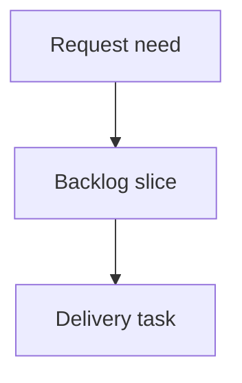

## req_205_redesign_local_viewer_corpus_filters_and_sorting - Redesign local viewer corpus filters and sorting
> From version: 2.2.0
> Schema version: 1.0
> Status: Ready
> Understanding: 94
> Confidence: 88
> Complexity: High
> Theme: UI
> Reminder: Update status/understanding/confidence and linked backlog/task references when you edit this doc.

# Needs
- Replace the local viewer filter panel with a model that helps operators manage a corpus, not just toggle low-level display flags.
- Add and remove controls based on actual corpus-navigation jobs: focus active work, inspect document types, isolate statuses, find relationship gaps, and identify recent or stale work.
- Make grouping and sorting visually secondary but still available, with clearer labels and active result counts.

# Context
- A first pass added presets, but it mostly moved the old controls around.
- The current operator feedback is that the panel is still not intuitive enough to manage a large corpus.
- The local viewer should expose compact corpus-control axes that can combine cleanly while preserving existing board/list rendering.

# Scope
- Replace the visible `Visibility` checkbox group with task-oriented axes: Focus, Type, Status, Relations, and Activity.
- Keep the old shared-web control IDs only as hidden compatibility inputs when needed by the existing renderer.
- Add combined local filter behavior that can express cases such as task plus blocked, unlinked docs, stale active work, companion docs, and needs-promotion items.
- Improve sort labels and add title sorting support.
- Preserve search, grouping, refresh, health, insights, read, and edit-document behavior.

# Out of scope
- Rebuilding the VS Code extension filter UX in this same slice.
- Adding a new frontend framework.
- Changing Logics document semantics or persisted workflow data.

# Acceptance criteria
- AC1: The visible local viewer filter panel is organized around Focus, Type, Status, Relations, Activity, and Organize sections.
- AC2: Low-level compatibility toggles are no longer the primary visible model.
- AC3: Filter axes can combine so operators can isolate cases such as blocked tasks, unlinked docs, stale work, companion docs, and items needing promotion.
- AC4: Group and sort controls have clearer labels, and title sorting is supported.
- AC5: Existing viewer flows continue to work: search, refresh, health, corpus insights, read, and edit document.
- AC6: Tests cover the combined local filter axes and existing shared webview filter behavior remains green.

# Definition of Ready (DoR)
- [x] Problem statement is explicit and user impact is clear.
- [x] Scope boundaries (in/out) are explicit.
- [x] Acceptance criteria are testable.
- [x] Dependencies and known risks are listed.

# Companion docs
- Product brief(s): (none yet)
- Architecture decision(s): (none yet)

# References
- `clients/viewer/index.html`
- `clients/viewer/browser-host.js`
- `clients/viewer/viewer.css`
- `clients/shared-web/media/webviewSelectors.js`
- `tests/viewer.browser-host.test.ts`
- `tests/webview.harness-details-and-filters.test.ts`

# AI Context
- Summary: Redesign local viewer corpus filters and sorting around operator navigation jobs instead of low-level display toggles.
- Keywords: local-viewer, filters, sorting, corpus-navigation, viewer-ux
- Use when: Implementing or reviewing local viewer filter and sort ergonomics.
- Skip when: The work targets the VS Code extension filter panel only.

# Backlog
- none
- `item_369_redesign_local_viewer_corpus_filters_and_sorting`
