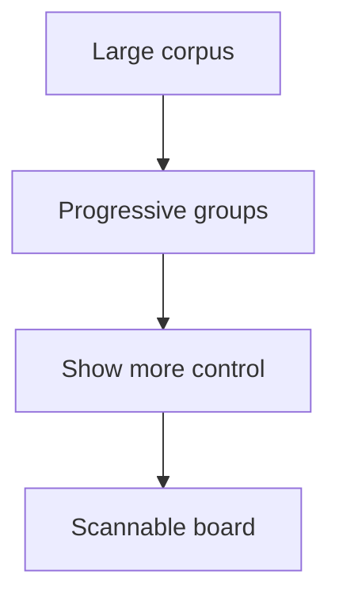

## req_206_add_progressive_group_rendering_for_large_item_lists - Add progressive group rendering for large item lists
> From version: 2.2.0
> Schema version: 1.0
> Status: Ready
> Understanding: 94
> Confidence: 86
> Complexity: Medium
> Theme: UI
> Reminder: Update status/understanding/confidence and linked backlog/task references when you edit this doc.

# Needs
- Keep large board/list groups usable when the Logics corpus contains many visible items.
- Render each group progressively, for example 10 items at a time, so the first paint stays readable and fast.
- Make hidden overflow explicit with an in-flow control such as `Show 10 more`, instead of silently hiding matches.

# Context
- The local viewer is evolving into a corpus-management surface, with task-oriented filters, grouping, sorting, search, health, and insights.
- As the corpus grows, a single group can contain dozens of cards. Rendering every matching card at once makes the board harder to scan and can increase DOM cost.
- The operator proposal is to use a lazy-loading-like pattern by group: show an initial slice, then add a visible cell/button that loads the next slice on demand.
- This is better framed as progressive group rendering than network lazy loading, because the viewer already receives the item payload up front from `/api/items`.

# Scope
- Add progressive rendering for item groups in board/list surfaces that display Logics items, starting with an initial visible limit such as 10 per group.
- Add an in-flow `Show more` control per truncated group that clearly states how many more items can be revealed.
- Keep group counts honest, for example showing both rendered and total item counts when a group is truncated.
- Reset or reconcile visible limits when filters, search, grouping, or sorting changes so users are not confused by stale expansion state.
- Ensure active search remains useful: search results should not require repeated reveal clicks before relevant matches become visible.

# Out of scope
- Server-side pagination or changing the `/api/items` payload contract in the first slice.
- Adding a virtual scrolling framework or a new frontend dependency.
- Changing Logics document semantics, workflow statuses, or item indexing rules.
- Rebuilding the whole board/list renderer beyond the minimal state and rendering hooks needed for progressive groups.

# Implementation notes
- Track visible limits per group key, for example `visibleLimitByGroup`, with a default page size of 10.
- After filtering/search/sorting/grouping, slice each rendered group to its current visible limit.
- Render a pseudo-card or row action at the end of truncated groups that increments only that group.
- Consider disabling truncation, increasing the limit, or auto-expanding matching groups when `searchQuery` is non-empty.

# Acceptance criteria
- AC1: Board/list groups render an initial bounded number of items per group when a group exceeds the configured threshold.
- AC2: Each truncated group exposes a visible in-flow control to reveal the next page of items, with copy that makes the hidden count clear.
- AC3: Group headers or summaries distinguish total matching items from currently rendered items when truncation is active.
- AC4: Filtering, search, grouping, and sorting produce predictable visible limits and do not leave stale expansion state that hides expected results.
- AC5: Search remains operator-friendly; relevant matches are not buried behind repeated `Show more` clicks.
- AC6: Tests cover initial truncation, reveal-more behavior, reset/reconciliation after filter or sort changes, and search behavior.

# Definition of Ready (DoR)
- [x] Problem statement is explicit and user impact is clear.
- [x] Scope boundaries (in/out) are explicit.
- [x] Acceptance criteria are testable.
- [x] Dependencies and known risks are listed.

# Companion docs
- Product brief(s): (none yet)
- Architecture decision(s): (none yet)

# References
- `clients/shared-web/media/renderBoardApp.js`
- `clients/shared-web/media/webviewSelectors.js`
- `clients/shared-web/media/mainCore.js`
- `clients/viewer/browser-host.js`
- `clients/viewer/index.html`
- `tests/webview.board-renderer.test.ts`
- `tests/webview.harness-core.test.ts`
- `tests/viewer.browser-host.test.ts`

# AI Context
- Summary: Add progressive per-group rendering for large Logics item lists so board and list views stay scannable without hiding overflow silently.
- Keywords: local-viewer, board-rendering, progressive-rendering, lazy-loading, large-corpus, show-more
- Use when: Planning or implementing large-corpus board/list rendering improvements.
- Skip when: The work is about server-side pagination, document indexing, or unrelated filter semantics.

# Backlog
- none
- `item_370_add_progressive_group_rendering_for_large_item_lists`
