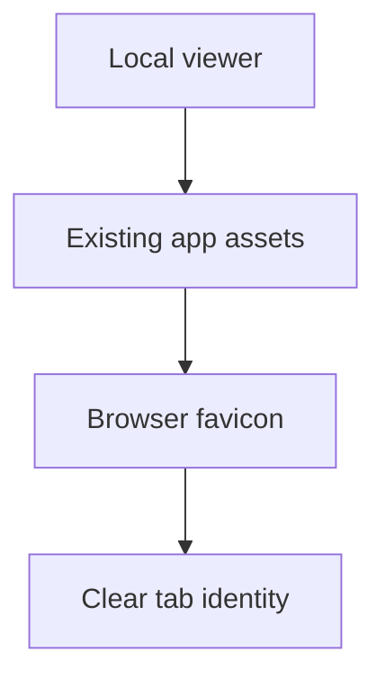

## req_207_add_local_viewer_favicon_from_existing_app_assets - Add local viewer favicon from existing app assets
> From version: 2.2.0
> Schema version: 1.0
> Status: Done
> Understanding: 97
> Confidence: 95
> Complexity: Low
> Theme: UI
> Reminder: Update status/understanding/confidence and linked backlog/task references when you edit this doc.

# Needs
- Show the Logics app icon in browser tabs when the local viewer is open.
- Reuse the existing extension/application assets instead of introducing a separate favicon source.
- Keep the change lightweight and packaging-safe for the bundled viewer.

# Context
- The local viewer is launched in a normal browser via `python3 -m logics_manager view`.
- Browser tabs currently do not expose the Logics app identity clearly.
- Existing icon assets are already present under `clients/shared-web/media/`, including `icon.png` and `logics.svg`.
- The viewer already serves shared media assets through `/media/...`, so the expected implementation is mostly HTML/package validation rather than new asset work.

# Scope
- Add favicon links to `clients/viewer/index.html` using existing shared media assets.
- Prefer `clients/shared-web/media/icon.png` as the primary browser favicon because it is already declared as the package icon.
- Optionally expose `clients/shared-web/media/logics.svg` as an alternate SVG icon if browser support and packaging behavior are clean.
- Ensure the local viewer HTTP server can serve the icon paths with the correct content type through the existing `/media/` route.
- Add focused coverage or packaging checks so the favicon asset remains included in the npm package/viewer bundle.

# Out of scope
- Designing a new icon.
- Changing the VS Code extension activity bar icon or package branding.
- Adding a favicon generation pipeline.
- Introducing browser-specific icon variants beyond what is already present in the repo.

# Acceptance criteria
- AC1: The local viewer HTML declares a favicon using existing app assets from `clients/shared-web/media/`.
- AC2: The favicon path is served by the local viewer without adding a new static route unless the existing media route proves insufficient.
- AC3: The selected primary icon works in common browsers from `http://127.0.0.1:<port>/` without requiring a page reload loop or external asset.
- AC4: Packaging or viewer tests cover that the referenced favicon asset is included and addressable.
- AC5: The implementation does not alter VS Code extension icon behavior or introduce a new icon source.

# Definition of Ready (DoR)
- [x] Problem statement is explicit and user impact is clear.
- [x] Scope boundaries (in/out) are explicit.
- [x] Acceptance criteria are testable.
- [x] Dependencies and known risks are listed.

# Companion docs
- Product brief(s): (none yet)
- Architecture decision(s): (none yet)

# References
- `clients/viewer/index.html`
- `clients/shared-web/media/icon.png`
- `clients/shared-web/media/logics.svg`
- `logics_manager/viewer.py`
- `package.json`
- `tests/npmPackage.test.ts`
- `tests/viewer.browser-host.test.ts`

# AI Context
- Summary: Add a browser favicon to the local Logics viewer by reusing existing app icon assets.
- Keywords: local-viewer, favicon, browser-tab, app-icon, packaging, shared-media
- Use when: Implementing or reviewing local viewer browser identity and static asset packaging.
- Skip when: The work targets new icon design, VS Code branding, or unrelated viewer navigation.

# Backlog
- none
- `item_371_add_local_viewer_favicon_from_existing_app_assets`
