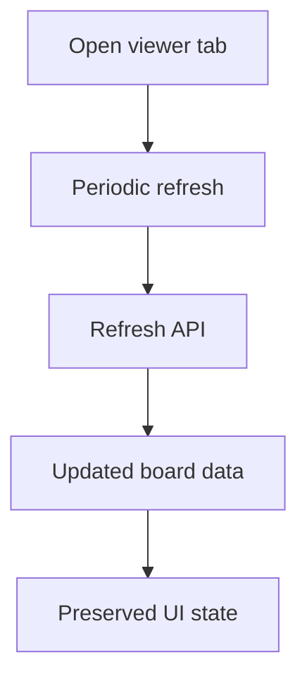

## req_208_auto_refresh_local_viewer_data_without_page_navigation - Auto refresh local viewer data without page navigation
> From version: 2.2.0
> Schema version: 1.0
> Status: Done
> Understanding: 96
> Confidence: 88
> Complexity: Medium
> Theme: UI
> Reminder: Update status/understanding/confidence and linked backlog/task references when you edit this doc.

# Needs
- Keep the local viewer data current while an operator leaves the browser tab open.
- Refresh item data in place without reloading the page, changing browser location, or closing the current document preview.
- Avoid noisy UI churn and concurrent refresh races.

# Context
- The local viewer already loads item data via `/api/items` and supports manual refresh through `/api/refresh`.
- Operators often keep the viewer open next to terminal-driven Logics work.
- Requiring manual refresh makes the browser view feel stale after CLI changes.
- A periodic client-side refresh can reuse the existing API surface if it preserves selection, open panels, and read-only viewer behavior.

# Scope
- Add a browser-host auto-refresh loop that refreshes viewer data roughly once per minute.
- Reuse the existing `/api/refresh` path and update the in-memory board data without page navigation.
- Preserve the current selected item, document preview panel, filter controls, search, grouping, sorting, and scroll-relevant state where practical.
- Avoid overlapping refreshes with a simple in-flight guard.
- Treat hidden tabs carefully: skip background ticks or defer them, then refresh when the tab becomes visible again.
- Keep status/meta feedback quiet for automatic refreshes while still surfacing real errors.

# Out of scope
- WebSocket, server-sent events, or file-watcher push updates.
- Reloading the whole page with `location.reload`.
- Persisting a user-configurable refresh interval in this first slice.
- Changing the local viewer API payload shape unless required by implementation evidence.

# Acceptance criteria
- AC1: The local viewer refreshes its item payload automatically about once per minute while visible.
- AC2: Automatic refresh uses existing viewer APIs and does not reload or navigate the browser page.
- AC3: Automatic refresh preserves the currently open document preview, selected item, filters, search, grouping, and sorting where practical.
- AC4: Refreshes do not overlap; a new automatic tick is skipped or deferred while a previous refresh is still in flight.
- AC5: Hidden-tab behavior is intentional: background ticks are skipped/deferred and the viewer refreshes when it becomes visible again.
- AC6: Tests cover timer-driven refresh, no page navigation, in-flight guarding, and state preservation for document/viewer UI.

# Definition of Ready (DoR)
- [x] Problem statement is explicit and user impact is clear.
- [x] Scope boundaries (in/out) are explicit.
- [x] Acceptance criteria are testable.
- [x] Dependencies and known risks are listed.

# Companion docs
- Product brief(s): (none yet)
- Architecture decision(s): (none yet)

# References
- `clients/viewer/browser-host.js`
- `clients/viewer/index.html`
- `logics_manager/viewer.py`
- `tests/viewer.browser-host.test.ts`
- `tests/python/test_logics_manager_cli.py`

# AI Context
- Summary: Add silent periodic in-place refresh for the local viewer so browser data stays current without page reloads or navigation.
- Keywords: local-viewer, auto-refresh, refresh-api, no-navigation, browser-host, stale-data
- Use when: Planning or implementing local viewer data freshness behavior.
- Skip when: The work requires push-based updates, WebSockets, server-side file watching, or unrelated viewer UI controls.

# Backlog
- none
- `item_372_auto_refresh_local_viewer_data_without_page_navigation`

# Notes
- Post-delivery clarification: AC3 includes focus-link selections. A viewer opened with ?focus=<item> must keep that item selected after manual or automatic refresh while preserving page location and avoiding repeated first-load side effects.
