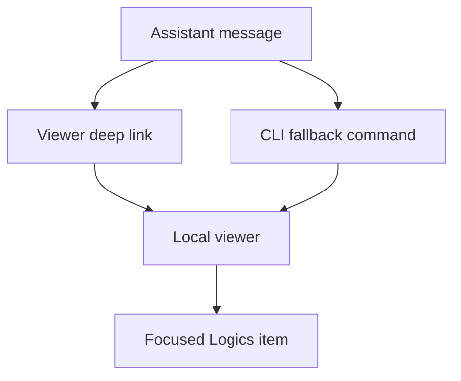

## req_209_viewer_focus_links - Open focused Logics items in the local viewer
> From version: 2.3.0
> Schema version: 1.0
> Status: Done
> Understanding: 92%
> Confidence: 86%
> Complexity: Medium
> Theme: DX
> Reminder: Update status/understanding/confidence and linked backlog/task references when you edit this doc.

# Needs
- Let AI assistants and humans point to a specific Logics corpus item with a local viewer link.
- Provide a robust fallback command that launches the viewer and opens the same focused item when the server is not already running.
- Make the focused item obvious in the viewer by selecting it, scrolling it into view, and opening the details or read surface.

# Context
- The local browser viewer is now a documented read-only way to inspect the Logics corpus outside VS Code.
- Assistant sessions often discuss a specific request, backlog item, task, product brief, ADR, or spec, but the handoff back to the user is still textual.
- A stable local deep-link contract would let an assistant say: "Open this item in the viewer" and provide both a browser URL and a command-line fallback.
- A plain `http://127.0.0.1:8765/...` link cannot launch a stopped server by itself. The product contract therefore needs both:
  - a deep link the viewer can consume when it is already running;
  - a CLI command that can start the viewer and open the deep link in one step.
- The feature must preserve the viewer's read-only runtime model. Workflow mutations should still happen through canonical CLI commands.

# Proposed operator experience
- Assistant response when the viewer may already be running:
  - Viewer link: `http://127.0.0.1:8765/?focus=logics/request/req_209_viewer_focus_links.md`
  - Fallback: `logics-manager view --focus logics/request/req_209_viewer_focus_links.md --open`
- Assistant response when robustness matters more than a raw link:
  - `logics-manager view --focus req_209_viewer_focus_links --open`
- Viewer behavior after loading a focus target:
  - resolve refs and repo-relative paths to a corpus item;
  - apply any needed board/list selection state;
  - scroll the matching card or row into view;
  - open the details pane;
  - optionally open the rendered Markdown preview when the link requests read mode.
- If the focus target is missing, the viewer should show a clear non-blocking message and still load the corpus.

# Scope
- In:
  - local viewer URL query support such as `?focus=<ref-or-path>` and optionally `&read=1`;
  - CLI support such as `logics-manager view --focus <ref-or-path> --open`;
  - viewer-side selection, scroll, details opening, and optional read-preview behavior;
  - a helper contract for assistant-facing surfaces so they can emit viewer links plus fallback commands;
  - README or CLI documentation that explains the pattern.
- Out:
  - remote hosted links or public sharing;
  - browser protocol handlers or OS-level URL schemes;
  - starting the viewer from a plain browser link without a local process;
  - workflow mutation from the viewer;
  - changing the MCP authorization model or giving assistants arbitrary shell access.

# Risks and constraints
- Browser links to localhost fail silently or show browser errors when the server is stopped; documentation and assistant guidance must make the fallback explicit.
- Focus resolution should reject path traversal and files outside the repository, matching existing CLI path-safety expectations.
- Query strings can expose local repo-relative filenames in browser history. This is acceptable for a local-only viewer but should be documented as local workspace data.
- Board rendering can be progressive for large corpora, so focus selection may need to coordinate with reveal or search/filter state before scrolling.

# Acceptance criteria
- AC1: The viewer accepts a focus target in the URL query and resolves both workflow refs and repo-relative Logics Markdown paths.
- AC2: `logics-manager view` supports a focus option that starts the local viewer and opens the focused URL when requested.
- AC3: A focused viewer load selects the item, scrolls it into view, and opens the details panel without mutating workflow files.
- AC4: Optional read-preview mode can open the rendered Markdown preview for the focused item, including Mermaid rendering fallback behavior.
- AC5: Missing, stale, or invalid focus targets produce clear viewer feedback while keeping the corpus usable.
- AC6: Assistant-facing guidance and README/CLI docs explain the link plus fallback-command pattern, including what to do when the server is not running.
- AC7: Focus target parsing is covered by tests for refs, repo-relative paths, URL encoding, missing items, and path traversal rejection.

# Definition of Ready (DoR)
- [x] Problem statement is explicit and user impact is clear.
- [x] Scope boundaries (in/out) are explicit.
- [x] Acceptance criteria are testable.
- [x] Dependencies and known risks are listed.

# Companion docs
- Product brief(s): (none yet)
- Architecture decision(s): (none yet)

# References
- `logics_manager/viewer.py`
- `clients/viewer/browser-host.js`
- `clients/viewer/index.html`
- `clients/shared-web/media/renderBoardApp.js`
- `clients/shared-web/media/mainCore.js`
- `tests/viewer.browser-host.test.ts`
- `tests/python/test_logics_manager_cli.py`
- `README.md`

# AI Context
- Summary: Add local viewer deep links and CLI focus launch support so assistants can point users to a specific Logics item with a robust fallback command.
- Keywords: local-viewer, deep-link, focus-target, assistant-handoff, viewer-url, CLI fallback, read-only viewer
- Use when: Implementing or reviewing viewer focus links, `logics-manager view --focus`, or assistant guidance for opening a specific Logics doc.
- Skip when: The work targets remote sharing, public hosted links, workflow mutation, or generic viewer filtering unrelated to a specific item.

# Backlog
- `item_373_open_focused_logics_items_in_the_local_viewer`
