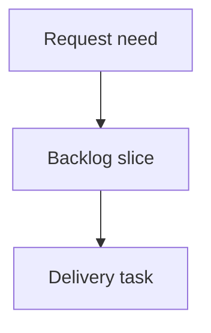

## req_210_improve_local_logics_viewer_controls_and_activity_signals - Improve local Logics viewer controls and activity signals
> From version: 2.3.3
> Schema version: 1.0
> Status: Draft
> Understanding: 90%
> Confidence: 85%
> Complexity: Medium
> Theme: Operator workflow
> Reminder: Update status/understanding/confidence and linked backlog/task references when you edit this doc.

# Needs
- Improve `logics-manager view` so the local browser viewer is less noisy, keeps refresh behavior under operator control, and exposes clearer runtime status.
- Preserve the current default behavior where the viewer auto-refreshes about once per minute, while allowing users to disable auto-refresh from the UI and configure a shorter interval from the CLI.
- Make recent activity easier to scan by adding a document-type signal at the start of each activity entry.

# Context
- The local viewer currently has a topbar with `Insights`, `Health`, and `Refresh`, a filter toolbar with an additional corpus-insights icon, and a small tools menu that is not useful in read-only browser mode.
- Auto-refresh is currently hard-coded in the browser host at one minute. Operators need to run the viewer with shorter intervals during active workflow editing without patching the source.
- The server start message only surfaces the localhost URL. When the viewer is bound to a non-localhost interface, operators need the reachable LAN/global address if it can be detected.
- The refreshed status line currently confirms the last refresh time, but it does not show when the next automatic refresh will happen.

# Scope
- Reorder the viewer topbar so the refresh control sits to the left of `Insights` and `Health`.
- Add an `Auto` checkbox immediately before `Refresh` to enable or disable automatic refresh from the viewer.
- Add CLI configuration for the auto-refresh interval, defaulting to 60 seconds and supporting lower values for active monitoring.
- Remove redundant viewer chrome: the filter-bar corpus-insights button and the read-only tools menu.
- Improve `logics-manager view` startup output with a network-facing URL when the bind address and local network interfaces make one available.
- Extend the refreshed metadata line with a countdown in seconds until the next automatic refresh when auto-refresh is enabled and the interval is known.
- Add a document-type dot/badge at the start of each Recent activity entry.

# Out of scope
- Changing the workflow document model or adding new document types.
- Making the browser viewer writable.
- Reworking the VS Code extension command surface beyond changes naturally shared by the reused web renderer.
- Persisting CLI defaults into repository configuration.

# Acceptance criteria
- AC1: In `logics-manager view`, the topbar shows `Auto`, `Refresh`, `Insights`, and `Health` in that order.
- AC2: The `Auto` checkbox enables and disables automatic refresh without disabling manual `Refresh`.
- AC3: The CLI supports configuring the automatic refresh interval, keeps a 60-second default, and accepts shorter positive intervals.
- AC4: The filter toolbar no longer includes the redundant corpus-insights icon, while the main `Insights` button still opens corpus insights.
- AC5: The local viewer tools menu is removed from the browser viewer UI.
- AC6: The viewer startup output includes the localhost URL and, when available/applicable, a network-facing address for the bound server.
- AC7: The refreshed metadata line includes a seconds countdown until the next automatic refresh when auto-refresh is active.
- AC8: Recent activity entries include a leading visual marker describing the document type.
- AC9: Existing viewer behavior for focus/read URLs, manual refresh, insights, health, and packaged PyPI/pipx assets remains covered by tests.

# Definition of Ready (DoR)
- [x] Problem statement is explicit and user impact is clear.
- [x] Scope boundaries (in/out) are explicit.
- [x] Acceptance criteria are testable.
- [x] Dependencies and known risks are listed.

# Companion docs
- Product brief(s): (none yet)
- Architecture decision(s): (none yet)

# References
- `logics_manager/viewer.py`
- `clients/viewer/index.html`
- `clients/viewer/browser-host.js`
- `clients/viewer/viewer.css`
- `clients/shared-web/media/webviewChrome.js`
- `clients/shared-web/media/css/toolbar.css`
- `tests/python/test_logics_manager_cli.py`
- `tests/viewer.browser-host.test.ts`
- `tests/webview.harness-core.test.ts`

# AI Context
- Summary: Improve the local browser viewer controls by adding configurable auto-refresh, simplifying redundant toolbar chrome, exposing network startup URLs, showing the next refresh countdown, and adding document-type markers in recent activity.
- Keywords: local-viewer, auto-refresh, viewer-toolbar, network-url, recent-activity, document-type-marker
- Use when: You need to implement or review the `logics-manager view` UX improvements requested for the local browser viewer.
- Skip when: The work is about workflow document semantics, writable viewer actions, or unrelated VS Code extension commands.

# Backlog
- none
- `item_374_improve_local_logics_viewer_controls_and_activity_signals`
