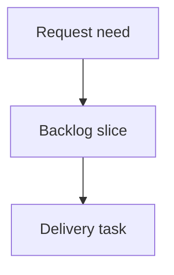

## req_211_improve_viewer_repository_identity_and_recent_activity_scanning - Improve viewer repository identity and recent activity scanning
> From version: 2.3.3
> Schema version: 1.0
> Status: Done
> Understanding: 90%
> Confidence: 85%
> Complexity: Medium
> Theme: Operator workflow
> Reminder: Update status/understanding/confidence and linked backlog/task references when you edit this doc.

# Needs
- Make the active repository immediately visible in the local Logics viewer header so operators can distinguish multiple open viewer windows.
- Improve Recent activity scanning by showing whether an entry represents a detected status change or a general document update.
- Keep the Recent activity panel compact by listing the first 10 entries by default and letting operators reveal the next entries in batches.

# Context
- The local viewer title currently reads `Logics Viewer` without an adjacent repository identity signal. Operators can have multiple viewer windows open and need a fast way to confirm which repository each window targets.
- Recent activity is currently sorted by recency, but each entry reads mostly the same. A small activity-type icon would help distinguish status movement from ordinary file updates.
- Status-change detection is only reliable when the viewer has a previous known status for a document. The implementation should avoid claiming a status change when no previous status snapshot is available.
- The Recent activity panel can become noisy when many workflow docs have changed. Showing 10 entries first, then allowing the next 10 to be revealed, keeps the panel scannable.

# Scope
- Add a compact repository-name pill beside the `Logics Viewer` title in the viewer topbar.
- Derive the pill label from the loaded repository root, using the short repository directory name for visible text.
- Provide the full repository path through accessible text or tooltip behavior where practical.
- Add a leading activity-type icon/marker in Recent activity entries.
- Detect and mark status changes only when the viewer can compare the current document status against a previous status snapshot.
- Mark ordinary changed entries as document updates when no reliable status-change signal is available.
- Show only the first 10 Recent activity entries by default.
- Add a control to reveal the next 10 entries, repeating until there are no more hidden entries.

# Out of scope
- Introducing a persistent server-side activity log.
- Reconstructing exact change reasons from Git history.
- Changing workflow document schemas or status names.
- Reworking the broader board/list pagination behavior.
- Replacing the existing Recent activity sort order.

# Acceptance criteria
- AC1: The viewer topbar displays a compact repository-name pill immediately to the right of `Logics Viewer`.
- AC2: The repository pill uses the short repo directory name and exposes the full repository path where practical.
- AC3: Recent activity entries show a leading activity-type icon or marker.
- AC4: A status-change marker is used only when the viewer can reliably detect that a document status changed since the previous known snapshot.
- AC5: A general update marker is used for entries that changed but do not have a reliable status-change signal.
- AC6: Recent activity initially renders at most 10 entries.
- AC7: A reveal control lets users show the next 10 Recent activity entries without changing the existing recency sort order.
- AC8: The reveal control is hidden or disabled when no additional activity entries remain.
- AC9: Existing activity entry selection, double-click read behavior, and timestamp rendering continue to work.

# Definition of Ready (DoR)
- [x] Problem statement is explicit and user impact is clear.
- [x] Scope boundaries (in/out) are explicit.
- [x] Acceptance criteria are testable.
- [x] Dependencies and known risks are listed.

# Companion docs
- Product brief(s): (none yet)
- Architecture decision(s): (none yet)

# References
- `logics_manager/viewer.py`
- `clients/viewer/index.html`
- `clients/viewer/browser-host.js`
- `clients/viewer/viewer.css`
- `clients/shared-web/media/webviewChrome.js`
- `clients/shared-web/media/webviewSelectors.js`
- `clients/shared-web/media/css/toolbar.css`
- `tests/viewer.browser-host.test.ts`
- `tests/webview.harness-core.test.ts`
- `tests/webview.chrome.test.ts`

# AI Context
- Summary: Add a repository identity pill to the local viewer header and improve Recent activity with activity-type markers plus 10-at-a-time reveal behavior.
- Keywords: local-viewer, repo-pill, recent-activity, status-change, document-update, pagination
- Use when: You need to implement or review viewer improvements for repository identity and Recent activity scanning.
- Skip when: The work is about auto-refresh controls, network startup URLs, writable workflow actions, or unrelated CLI commands.

# Backlog
- none
- `item_375_improve_viewer_repository_identity_and_recent_activity_scanning`
