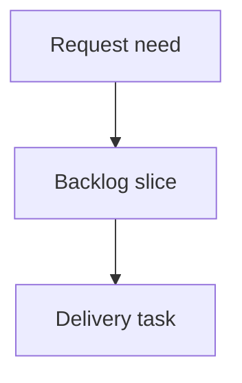

## req_212_expand_viewer_health_navigation_and_corpus_insights - Expand viewer health navigation and corpus insights
> From version: 2.3.3
> Schema version: 1.0
> Status: Draft
> Understanding: 90%
> Confidence: 85%
> Complexity: Medium
> Theme: Operator workflow
> Reminder: Update status/understanding/confidence and linked backlog/task references when you edit this doc.

# Needs
- Make Validation health findings actionable by letting operators open the related document directly from each document-scoped finding.
- Expand Corpus insights beyond a small summary into an operational overview that helps operators understand workflow shape, flow health, activity, traceability, quality signals, and recommended next checks.
- Restore confidence in the toolbar attention filter by verifying and fixing the `Show blocked, orphaned, unprocessed, or inconsistent items` button when it no longer filters the viewer as expected.
- Keep the expanded insights readable and bounded so the viewer remains a focused workflow tool rather than a heavy dashboard.

# Context
- The local viewer already exposes `Health` and `Insights` entry points from the topbar.
- Validation health findings can include document paths. Operators should not need to manually search for the referenced document after spotting a finding.
- Repository-level findings do not point to one document and should stay clearly non-clickable.
- Corpus insights should help operators answer practical questions quickly: what exists, what is blocked or stale, which workflow chains are incomplete, where traceability is weak, and which quality issues deserve attention first.
- The existing attention toggle is intended to show only blocked, orphaned, unprocessed, or inconsistent items. A reported regression suggests the button may no longer trigger the expected filter in the local viewer, or may no longer present its state clearly after recent viewer toolbar changes.

# Scope
- In Validation health, make document-scoped finding paths clickable so they open the matching document in the viewer read preview.
- Keep repository-level findings rendered as non-clickable text with a clear repository-level label.
- Preserve existing health summary cards, severity text, and lint/audit finding details.
- Expand Corpus insights with an `Overview` section containing total docs by type, open vs closed counts, blocked counts, ambiguous or missing status counts, and recently modified docs.
- Add a `Flow health` section covering requests not promoted, backlog items without tasks, tasks without linked backlog/request context, orphaned items, and incomplete request-to-backlog-to-task chains.
- Add an `Activity` section covering latest modifications, stale active documents, recently active documents, and a simple corpus activity signal such as stale-heavy, blocked-heavy, or mostly active.
- Add a `Traceability` section covering most referenced documents, documents with no incoming or outgoing links, broken references, and a compact summary of relationships by document type.
- Add a `Quality signals` section summarizing lint/audit finding categories, finding counts by document type, and documents concentrating the most issues.
- Add an `Operator actions` section with recommended next checks such as promoting ready requests, inspecting blocked tasks, linking orphaned backlog items, and reviewing stale active docs.
- Audit and fix the attention toggle so clicking `Show blocked, orphaned, unprocessed, or inconsistent items` updates pressed/active state and filters the visible board/list to attention-required items.
- Keep the attention toggle behavior working in both the local browser viewer and the shared webview renderer where the same UI code is reused.

# Out of scope
- Building a full analytics dashboard or historical trend database.
- Adding write actions from Insights.
- Replacing the existing Health screen.
- Reconstructing Git history beyond currently available viewer/audit/lint payloads.
- Adding large graph visualizations unless a compact relationship summary naturally fits the existing UI.

# Acceptance criteria
- AC1: Validation health document-scoped findings expose a clickable path or control that opens the referenced document in the viewer read preview.
- AC2: Repository-level findings remain non-clickable and are visually distinguishable from document-scoped findings.
- AC3: Missing, invalid, or unsafe finding paths are rendered safely and do not break the Health screen.
- AC4: Corpus insights includes an `Overview` section with document counts by type, open/closed counts, blocked counts, missing or ambiguous status counts, and recently modified document counts.
- AC5: Corpus insights includes a `Flow health` section with incomplete workflow chain signals and orphan/linkage risk signals.
- AC6: Corpus insights includes an `Activity` section with latest changes, stale active docs, recently active docs, and a simple activity classification.
- AC7: Corpus insights includes a `Traceability` section with most referenced docs, unlinked docs, broken references, and relationship counts by document type.
- AC8: Corpus insights includes a `Quality signals` section summarizing lint/audit categories, finding counts by document type, and documents with concentrated issues.
- AC9: Corpus insights includes an `Operator actions` section with recommended next checks that are derived from available corpus, lint, and audit signals.
- AC10: The `Show blocked, orphaned, unprocessed, or inconsistent items` button toggles active/pressed state and filters the board/list to attention-required items in the local viewer.
- AC11: Turning the attention filter off restores the previous visible corpus according to the active search/filter settings.
- AC12: Existing `Insights` and `Health` buttons continue to work in the local viewer and in packaged PyPI/pipx assets.

# Definition of Ready (DoR)
- [x] Problem statement is explicit and user impact is clear.
- [x] Scope boundaries (in/out) are explicit.
- [x] Acceptance criteria are testable.
- [x] Dependencies and known risks are listed.

# Companion docs
- Product brief(s): (none yet)
- Architecture decision(s): (none yet)

# References
- `logics_manager/viewer.py`
- `logics_manager/audit.py`
- `logics_manager/lint.py`
- `clients/viewer/browser-host.js`
- `clients/viewer/viewer.css`
- `clients/shared-web/media/mainInteractionHandlers.js`
- `clients/shared-web/media/mainInteractions.js`
- `clients/shared-web/media/renderBoardApp.js`
- `clients/shared-web/media/renderDetails.js`
- `tests/python/test_logics_manager_cli.py`
- `tests/viewer.browser-host.test.ts`
- `tests/webview.harness-core.test.ts`
- `tests/webview.selectors.test.ts`

# AI Context
- Summary: Make Health findings navigable, fix/regression-test the attention filter, and expand Corpus insights into a practical operator overview covering overview metrics, flow health, activity, traceability, quality signals, and recommended next checks.
- Keywords: local-viewer, validation-health, attention-filter, blocked-items, orphaned-items, corpus-insights, health-navigation, flow-health, traceability, quality-signals
- Use when: You need to implement or review viewer improvements for Health finding navigation or the Corpus insights screen.
- Skip when: The work is about auto-refresh controls, Recent activity pagination, repository identity pills, or writable workflow actions.

# Backlog
- none
- `item_376_expand_viewer_health_navigation_and_corpus_insights`
