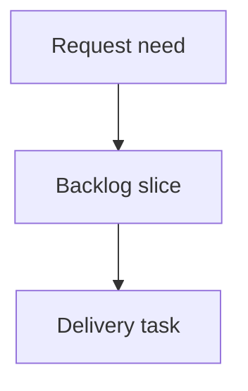

## req_213_dogfood_local_logics_viewer_on_real_corpora - Dogfood local Logics viewer on real corpora
> From version: 2.3.3
> Schema version: 1.0
> Status: Ready
> Understanding: 95
> Confidence: 85
> Complexity: Medium
> Theme: UX validation
> Reminder: Update status/understanding/confidence and linked backlog/task references when you edit this doc.

# Needs
- Validate the local browser viewer against real Logics corpora before adding more features on top of it.
- Capture concrete UX, layout, and workflow issues from actual operator usage instead of relying only on implementation-time assumptions.

# Context
- Recent viewer work added repository identity, configurable auto-refresh, richer activity markers, Health navigation, and expanded corpus Insights.
- The implementation passed CI, but the real value depends on how these controls behave when an operator works through a dense corpus.
- The dev entrypoint is `python3 -m logics_manager view --open --refresh-interval 10`.

# Scope
- In scope: manual dogfooding on the current repository corpus, focused viewport checks, navigation review, and a prioritized issue list.
- In scope: small follow-up fixes only when they are low-risk and directly observed during the review.
- Out of scope: new Insights capabilities, activity snapshot persistence, or Playwright automation; those are tracked by separate requests.

# Acceptance criteria
- AC1: The viewer is exercised from the local dev entrypoint against the current repo corpus.
- AC2: The review covers topbar controls, repository pill, Auto/Refresh, Insights, Health, attention filter, read preview, and recent activity.
- AC3: The review covers at least desktop, tablet-width, and mobile-width layouts.
- AC4: Findings are grouped into `must fix`, `should fix`, and `nice to have`.
- AC5: Any immediate fixes are small, validated, and documented; larger findings become new requests instead of being hidden in this work.
- AC6: The resulting backlog slice is actionable without needing the original chat context.

# Definition of Ready (DoR)
- [x] Problem statement is explicit and user impact is clear.
- [x] Scope boundaries (in/out) are explicit.
- [x] Acceptance criteria are testable.
- [x] Dependencies and known risks are listed.

# Companion docs
- Product brief(s): (none yet)
- Architecture decision(s): (none yet)

# References
- `logics_manager/viewer.py`
- `clients/viewer/browser-host.js`
- `clients/viewer/viewer.css`
- `clients/shared-web/media/webviewChrome.js`
- `clients/shared-web/media/css/toolbar.css`

# AI Context
- Summary: Validate the local viewer through real operator use and capture prioritized UX/layout follow-ups.
- Keywords: viewer, dogfooding, local viewer, UX validation, responsive layout, operator review
- Use when: You need a bounded validation pass before further viewer feature work.
- Skip when: You are implementing Insights actions, activity snapshots, or automated visual tests directly.

# Backlog
- none
- `item_377_dogfood_local_logics_viewer_on_real_corpora`

# AC Traceability
- AC1 -> `task_178_dogfood_local_logics_viewer_on_real_corpora`. Proof: Task AC1 covers exercising the viewer from the local dev entrypoint against the current repo corpus.
- AC2 -> `task_178_dogfood_local_logics_viewer_on_real_corpora`. Proof: Task AC2 covers topbar controls, repository pill, Auto/Refresh, Insights, Health, attention filter, read preview, and recent activity.
- AC3 -> `task_178_dogfood_local_logics_viewer_on_real_corpora`. Proof: Task AC3 covers desktop, tablet-width, and mobile-width layouts.
- AC4 -> `task_178_dogfood_local_logics_viewer_on_real_corpora`. Proof: Task AC4 requires findings grouped into must fix, should fix, and nice to have.
- AC5 -> `task_178_dogfood_local_logics_viewer_on_real_corpora`. Proof: Task AC5 limits immediate fixes to small validated changes and pushes larger findings to follow-up requests.
- AC6 -> `task_178_dogfood_local_logics_viewer_on_real_corpora`. Proof: Task AC6 requires the backlog slice to be actionable without chat context.
- `item_377_dogfood_local_logics_viewer_on_real_corpora`
