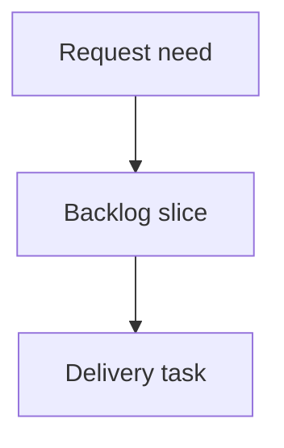

## req_214_make_local_viewer_corpus_insights_actionable - Make local viewer corpus insights actionable
> From version: 2.3.3
> Schema version: 1.0
> Status: Ready
> Understanding: 95
> Confidence: 85
> Complexity: Medium
> Theme: Viewer insights
> Reminder: Update status/understanding/confidence and linked backlog/task references when you edit this doc.

# Needs
- Turn corpus Insights from a static report into a practical navigation surface for operators.
- Let users move directly from an insight signal to the matching filtered corpus or document preview.

# Context
- Corpus Insights now includes Overview, Flow health, Activity, Traceability, Quality signals, and Operator actions sections.
- Some sections currently compress document lists into dense text, which makes them informative but not operational enough.
- The local viewer already has filter primitives and read-preview navigation that can be reused for insight actions.

# Scope
- In scope: clickable insight rows, direct filter application, compact document lists, read-preview links, and show-more controls.
- In scope: preserving existing Insights and Health entrypoints in source and packaged viewer assets.
- Out of scope: creating new corpus metrics that require persistent history; local activity snapshots are tracked separately.

# Acceptance criteria
- AC1: Flow health signals can apply the relevant local viewer filter where a matching filter already exists.
- AC2: Quality and traceability document lists render as compact rows with clickable read-preview controls for safe Logics document paths.
- AC3: Long lists initially render a bounded number of rows and expose a reveal control without changing sort order.
- AC4: Operator action rows either apply a filter, open Health, or open a relevant document preview.
- AC5: Turning an insight-derived filter off restores normal viewer filter behavior.
- AC6: Existing Insights and Health buttons continue to work in local dev and packaged assets.

# Definition of Ready (DoR)
- [x] Problem statement is explicit and user impact is clear.
- [x] Scope boundaries (in/out) are explicit.
- [x] Acceptance criteria are testable.
- [x] Dependencies and known risks are listed.

# Companion docs
- Product brief(s): (none yet)
- Architecture decision(s): (none yet)

# References
- `clients/viewer/browser-host.js`
- `logics_manager/viewer_assets/viewer/browser-host.js`
- `clients/viewer/viewer.css`
- `tests/viewer.browser-host.test.ts`

# AI Context
- Summary: Make local viewer corpus Insights clickable and filter-aware so operators can act on signals immediately.
- Keywords: viewer, corpus insights, operator actions, filters, traceability, health navigation
- Use when: You are improving the local viewer Insights workflow.
- Skip when: You need persistent activity history or browser-level visual regression tests.

# Backlog
- none
- `item_378_make_local_viewer_corpus_insights_actionable`

# AC Traceability
- AC1 -> `task_179_make_local_viewer_corpus_insights_actionable`. Proof: Task AC1 covers applying relevant local viewer filters from Flow health signals.
- AC2 -> `task_179_make_local_viewer_corpus_insights_actionable`. Proof: Task AC2 covers compact Quality and Traceability document rows with safe read-preview controls.
- AC3 -> `task_179_make_local_viewer_corpus_insights_actionable`. Proof: Task AC3 covers bounded initial rendering and reveal behavior for long lists.
- AC4 -> `task_179_make_local_viewer_corpus_insights_actionable`. Proof: Task AC4 covers operator action rows applying filters, opening Health, or opening a document preview.
- AC5 -> `task_179_make_local_viewer_corpus_insights_actionable`. Proof: Task AC5 covers restoring normal viewer filter behavior after insight-derived filters are turned off.
- AC6 -> `task_179_make_local_viewer_corpus_insights_actionable`. Proof: Task AC6 covers preserving local dev and packaged Insights and Health entrypoints.
- `item_378_make_local_viewer_corpus_insights_actionable`
