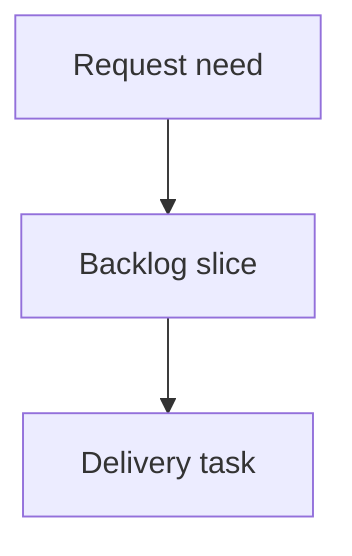

## req_215_add_reliable_local_activity_snapshots_to_the_viewer - Add reliable local activity snapshots to the viewer
> From version: 2.3.3
> Schema version: 1.0
> Status: Ready
> Understanding: 90
> Confidence: 80
> Complexity: Medium
> Theme: Viewer activity
> Reminder: Update status/understanding/confidence and linked backlog/task references when you edit this doc.

# Needs
- Detect real local viewer activity changes across refreshes without inventing status-change signals from the current document state alone.
- Give operators a trustworthy recent-activity feed that distinguishes general updates from confirmed status transitions.

# Context
- Recent activity currently uses document timestamps and type markers.
- A status-change marker is intentionally reserved for reliable signals, but the viewer does not yet persist a previous known snapshot.
- Local storage is already used for viewer state and can hold a small bounded activity snapshot.

# Scope
- In scope: localStorage snapshot persistence, status comparison across refreshes, bounded activity history, and a clear-history control.
- In scope: graceful first-load behavior with no false status-change markers.
- Out of scope: server-side Git history mining or cross-device synchronization.

# Acceptance criteria
- AC1: The viewer stores a minimal previous snapshot keyed by stable document path.
- AC2: `Status changed` appears only when the previous snapshot had a known status and the refreshed item has a different status.
- AC3: First load and newly discovered documents use general update markers, not status-change markers.
- AC4: The activity history is bounded and does not grow indefinitely in localStorage.
- AC5: A clear-history control removes local activity history without clearing unrelated viewer preferences.
- AC6: Existing recent activity selection, double-click read behavior, and timestamp rendering continue to work.

# Definition of Ready (DoR)
- [x] Problem statement is explicit and user impact is clear.
- [x] Scope boundaries (in/out) are explicit.
- [x] Acceptance criteria are testable.
- [x] Dependencies and known risks are listed.

# Companion docs
- Product brief(s): (none yet)
- Architecture decision(s): (none yet)

# References
- `clients/viewer/browser-host.js`
- `clients/shared-web/media/webviewSelectors.js`
- `clients/shared-web/media/webviewChrome.js`
- `tests/viewer.browser-host.test.ts`
- `tests/webview.harness-core.test.ts`

# AI Context
- Summary: Persist bounded local activity snapshots so status-change markers are reliable across viewer refreshes.
- Keywords: viewer, activity, localStorage, snapshot, status changed, recent activity
- Use when: You are implementing reliable local activity classification.
- Skip when: You only need static activity timestamp sorting or Insights filtering.

# Backlog
- none
- `item_379_add_reliable_local_activity_snapshots_to_the_viewer`

# AC Traceability
- AC1 -> `task_180_add_reliable_local_activity_snapshots_to_the_viewer`. Proof: Task AC1 covers storing a minimal previous snapshot keyed by stable document path.
- AC2 -> `task_180_add_reliable_local_activity_snapshots_to_the_viewer`. Proof: Task AC2 covers status-change markers only when previous and current known statuses differ.
- AC3 -> `task_180_add_reliable_local_activity_snapshots_to_the_viewer`. Proof: Task AC3 covers first load and newly discovered documents using general update markers.
- AC4 -> `task_180_add_reliable_local_activity_snapshots_to_the_viewer`. Proof: Task AC4 covers bounded localStorage activity history.
- AC5 -> `task_180_add_reliable_local_activity_snapshots_to_the_viewer`. Proof: Task AC5 covers clearing activity history without clearing unrelated viewer preferences.
- AC6 -> `task_180_add_reliable_local_activity_snapshots_to_the_viewer`. Proof: Task AC6 covers preserving activity selection, double-click read, and timestamp rendering.
- `item_379_add_reliable_local_activity_snapshots_to_the_viewer`
