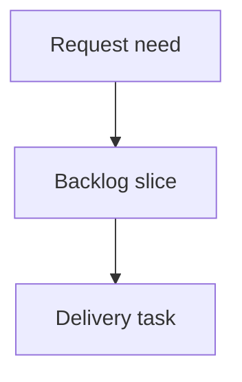

## req_216_add_visual_regression_smoke_coverage_for_the_local_viewer - Add visual regression smoke coverage for the local viewer
> From version: 2.3.3
> Schema version: 1.0
> Status: Done
> Understanding: 90
> Confidence: 80
> Complexity: Medium
> Theme: Testing
> Reminder: Update status/understanding/confidence and linked backlog/task references when you edit this doc.

# Needs
- Add browser-level smoke coverage that catches blank screens, obvious layout overlap, and broken viewer interactions before release.
- Cover the local viewer experience that unit tests cannot fully validate through DOM-only assertions.

# Context
- CI already runs Python tests, TypeScript compilation, linting, unit tests, coverage, extension smoke checks, npm CLI smoke checks, Logics lint, and package validation.
- Recent viewer changes are UI-heavy and benefit from browser screenshots across viewport sizes.
- The goal is smoke-level protection, not fragile pixel-perfect visual diffs.

# Scope
- In scope: Playwright or equivalent browser smoke tests for the local viewer dev server.
- In scope: desktop, tablet, and mobile viewport checks; screenshots as artifacts; console-error checks.
- Out of scope: full visual design approval or pixel-perfect snapshot gating.

# Acceptance criteria
- AC1: The test starts the local dev viewer from repo code and opens it in a browser.
- AC2: Desktop, tablet, and mobile viewport smoke checks verify the topbar, repository pill, board, details area, and document preview are nonblank and reachable.
- AC3: The test opens Insights and Health and verifies both surfaces render visible content.
- AC4: The test exercises Auto off/on, Refresh, recent activity selection, and double-click read behavior.
- AC5: The test fails on uncaught browser errors and stores screenshots or traces as CI artifacts where supported.
- AC6: The test is integrated into CI in a way that remains deterministic and does not depend on a published package.

# Definition of Ready (DoR)
- [x] Problem statement is explicit and user impact is clear.
- [x] Scope boundaries (in/out) are explicit.
- [x] Acceptance criteria are testable.
- [x] Dependencies and known risks are listed.

# Companion docs
- Product brief(s): (none yet)
- Architecture decision(s): (none yet)

# References
- `logics_manager/viewer.py`
- `clients/viewer/index.html`
- `clients/viewer/browser-host.js`
- `tests/viewer.browser-host.test.ts`
- `scripts/ci-check.mjs`

# AI Context
- Summary: Add browser-level smoke and screenshot coverage for the local viewer across key workflows and viewport sizes.
- Keywords: viewer, Playwright, visual smoke, responsive, screenshots, CI
- Use when: You are adding automated browser coverage for the local viewer.
- Skip when: Unit-level viewer behavior tests are sufficient.

# Backlog
- none
- `item_380_add_visual_regression_smoke_coverage_for_the_local_viewer`

# AC Traceability
- AC1 -> `task_181_add_visual_regression_smoke_coverage_for_the_local_viewer`. Proof: Task AC1 covers starting the local dev viewer from repo code and opening it in a browser.
- AC2 -> `task_181_add_visual_regression_smoke_coverage_for_the_local_viewer`. Proof: Task AC2 covers desktop, tablet, and mobile smoke checks for core viewer surfaces.
- AC3 -> `task_181_add_visual_regression_smoke_coverage_for_the_local_viewer`. Proof: Task AC3 covers opening Insights and Health and verifying visible content.
- AC4 -> `task_181_add_visual_regression_smoke_coverage_for_the_local_viewer`. Proof: Task AC4 covers Auto off/on, Refresh, recent activity selection, and double-click read.
- AC5 -> `task_181_add_visual_regression_smoke_coverage_for_the_local_viewer`. Proof: Task AC5 covers failing on browser errors and storing screenshots or traces where supported.
- AC6 -> `task_181_add_visual_regression_smoke_coverage_for_the_local_viewer`. Proof: Task AC6 covers deterministic CI integration against local source rather than a published package.
- `item_380_add_visual_regression_smoke_coverage_for_the_local_viewer`
