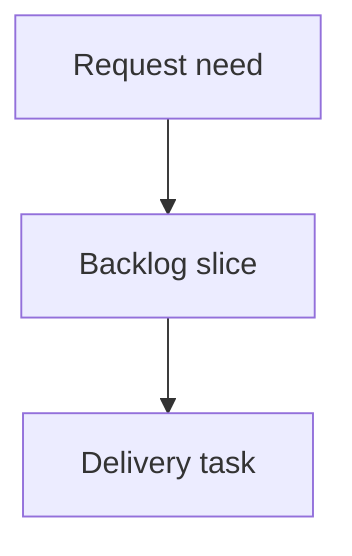

## req_217_add_local_viewer_git_status_summary - Add local viewer Git status summary
> From version: 2.3.3
> Schema version: 1.0
> Status: Done
> Understanding: 95
> Confidence: 90
> Complexity: Medium
> Theme: Developer experience
> Reminder: Update status/understanding/confidence and linked backlog/task references when you edit this doc.

# Needs
- Add a read-only Git status surface to the local Logics viewer so operators can understand the repository state without leaving the browser.
- Make the Git state quick to scan during Logics work: current branch, tracking state, dirty files, staged files, untracked files, and the latest commit should be visible at a glance.
- Keep the feature deliberately non-mutating: the viewer must never run `pull`, `push`, `fetch`, `checkout`, `reset`, or any other command that changes repository state.

# Context
- The local viewer already exposes high-level operational screens through topbar buttons: `Auto`, `Refresh`, `Insights`, and `Health`.
- Operators often need to know whether the repo is clean, ahead, behind, or has uncommitted workflow changes before deciding what to do next.
- `git status --short --branch` is the mental model users already understand; the viewer should translate that into a compact, readable screen rather than dumping raw terminal output.
- Git may be unavailable, the folder may not be a Git repository, or commands may fail; all of these states should be handled gracefully.

# UX intent
- Place a `Git` button in the topbar immediately after `Refresh` and before `Insights`, producing the order `Auto`, `Refresh`, `Git`, `Insights`, `Health`.
- Open Git status in the same read-preview style surface used by Insights and Health so the viewer keeps one consistent mental model for secondary operational screens.
- Make the first viewport answer the operator's most urgent questions:
  - Which branch am I on?
  - Is the working tree clean?
  - Am I ahead or behind the tracked remote?
  - Are there staged, modified, deleted, or untracked files?
  - What is the latest commit?
- Use compact status cards for the top-level state, followed by grouped file lists. Avoid dense prose and avoid raw command dumps unless an error must be shown.
- Treat color and iconography as secondary signals only; text labels must carry the meaning for accessibility and terminal-like precision.
- Keep file paths selectable/readable and allow long paths to wrap without overlapping nearby content.
- Show an explicit empty state when the repo is clean, rather than rendering an empty list.
- Show bounded error states:
  - `Git unavailable` when the executable cannot be found.
  - `No Git repository detected` when the viewer root is not inside a Git worktree.
  - `Git status unavailable` with a short sanitized detail when a read-only command fails.

# Scope
- In scope:
  - a local viewer topbar `Git` button between `Refresh` and `Insights`
  - a read-only backend payload for Git status
  - a browser-rendered Git status screen in the existing document panel
  - clean handling for Git unavailable, non-Git directories, and command failures
  - source and packaged viewer assets
- Out of scope:
  - mutating Git operations such as fetch, pull, push, checkout, reset, stash, commit, or branch creation
  - replacing terminal Git workflows
  - adding Git controls to the VS Code extension command surface
  - showing secrets or full credentials from remote URLs

# Acceptance criteria
- AC1: The local viewer topbar shows `Auto`, `Refresh`, `Git`, `Insights`, and `Health` in that order.
- AC2: Clicking `Git` opens a read-only Git status screen in the same secondary viewer surface used by Insights and Health.
- AC3: When Git is available and the viewer root is inside a worktree, the screen shows branch, tracking branch when available, ahead/behind counts when available, clean/dirty state, staged count, modified/deleted count, untracked count, and latest commit summary.
- AC4: File changes are grouped by useful operator categories such as staged, modified, deleted, renamed, and untracked, with long paths wrapping safely.
- AC5: A clean repository renders an explicit clean state and does not show empty or confusing file sections.
- AC6: Git unavailable, non-Git repository, and command failure states render safely with short user-facing messages and no stack trace.
- AC7: Remote URLs or tracking details are sanitized so credentials, tokens, or embedded secrets are not displayed.
- AC8: The backend uses only read-only Git commands and never performs network or mutating Git operations.
- AC9: Existing Auto, Refresh, Insights, Health, focus/read URLs, and packaged PyPI/pipx assets continue to work.
- AC10: Python tests cover the Git payload collector states, and browser-host tests cover the Git screen rendering and topbar placement.

# Definition of Ready (DoR)
- [x] Problem statement is explicit and user impact is clear.
- [x] Scope boundaries (in/out) are explicit.
- [x] Acceptance criteria are testable.
- [x] Dependencies and known risks are listed.

# Companion docs
- Product brief(s): (none yet)
- Architecture decision(s): (none yet)

# References
- `logics_manager/viewer.py`
- `clients/viewer/index.html`
- `clients/viewer/browser-host.js`
- `clients/viewer/viewer.css`
- `logics_manager/viewer_assets/viewer/index.html`
- `logics_manager/viewer_assets/viewer/browser-host.js`
- `tests/python/test_logics_manager_cli.py`
- `tests/viewer.browser-host.test.ts`

# AI Context
- Summary: Add a read-only Git status screen to the local viewer with a topbar Git button, scan-friendly branch and dirty-state cards, grouped file changes, sanitized remotes, and graceful unavailable/non-repo/error states.
- Keywords: local viewer, Git status, read-only Git, branch, ahead behind, dirty tree, developer experience
- Use when: You are implementing or reviewing the local viewer Git status feature.
- Skip when: The work involves mutating Git operations, release automation, or replacing terminal Git workflows.

# Backlog
- none
- `item_381_add_local_viewer_git_status_summary`
