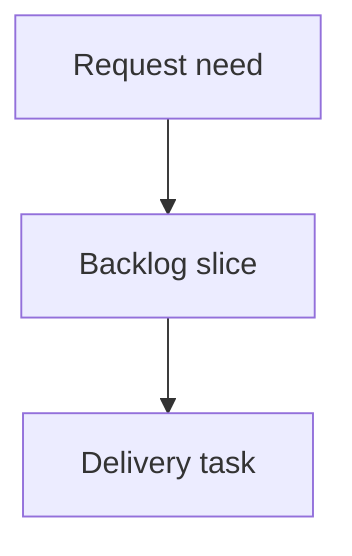

## req_218_add_a_git_cockpit_to_the_local_viewer - Add a Git cockpit to the local viewer
> From version: 2.4.0
> Schema version: 1.0
> Status: Done
> Understanding: 90%
> Confidence: 85%
> Complexity: Medium
> Theme: Operator workflow
> Reminder: Update status/understanding/confidence and linked backlog/task references when you edit this doc.

# Needs
- Add a Git-focused cockpit to `logics-manager view` so operators can inspect repository state without leaving the local viewer.
- Make branch, dirty state, staged/unstaged/untracked files, recent commits, and selected diffs visible in one coherent screen.
- Keep the first release read-only and focused on inspection, with future write actions deferred behind explicit safety design.

# Context
- The local viewer already exposes repository identity, workflow documents, recent activity, health, and markdown previews.
- Operators still need to switch to terminal Git commands to answer basic repository-state questions before committing, closing work, or handing off to another agent.
- The product brief `prod_021_git_cockpit_for_the_local_viewer` defines a dense, contextual Git cockpit that keeps status, file lists, history, branches, and diffs visible together.
- This request turns that product direction into a bounded delivery chain for the first inspectable viewer surface.

# Acceptance criteria
- AC1: The viewer gains a Git-focused surface or tab that starts from repository state rather than workflow document state.
- AC2: The screen exposes a compact status band with current branch, clean/dirty state, staged/unstaged counts, and upstream ahead/behind when available.
- AC3: Changed files are grouped by Git state and selecting a file shows a contextual diff or safe truncation message.
- AC4: Logics workflow documents under `logics/` are visually distinguishable from implementation files.
- AC5: The first delivery mode is read-only; mutating Git actions are either absent or clearly deferred.
- AC6: The implementation preserves existing viewer flows: search, refresh, health, insights, focus/read URLs, recent activity, and document preview.

# Definition of Ready (DoR)
- [x] Problem statement is explicit and user impact is clear.
- [x] Scope boundaries (in/out) are explicit.
- [x] Acceptance criteria are testable.
- [x] Dependencies and known risks are listed.

# Companion docs
- Product brief(s): `prod_021_git_cockpit_for_the_local_viewer`
- Architecture decision(s): (none yet)

# References
- `logics/product/prod_021_git_cockpit_for_the_local_viewer.md`
- `logics/product/prod_020_local_web_viewer_for_cli_driven_logics_work.md`
- `logics/request/req_210_improve_local_logics_viewer_controls_and_activity_signals.md`
- `logics/request/req_211_improve_viewer_repository_identity_and_recent_activity_scanning.md`
- `logics_manager/viewer.py`
- `clients/viewer/index.html`
- `clients/viewer/browser-host.js`
- `clients/viewer/viewer.css`
- `clients/shared-web/media/webviewChrome.js`

# AI Context
- Summary: Add a read-only Git cockpit to the local viewer so operators can inspect branch state, changed files, diffs, and recent history from the browser.
- Keywords: local-viewer, git-cockpit, repository-status, changed-files, diff-preview, branch-state
- Use when: You need to implement or review the local viewer Git cockpit.
- Skip when: The work is only about Logics document filters, auto-refresh controls, or unrelated Git CLI behavior.

# Backlog
- `item_382_add_a_git_cockpit_to_the_local_viewer`
