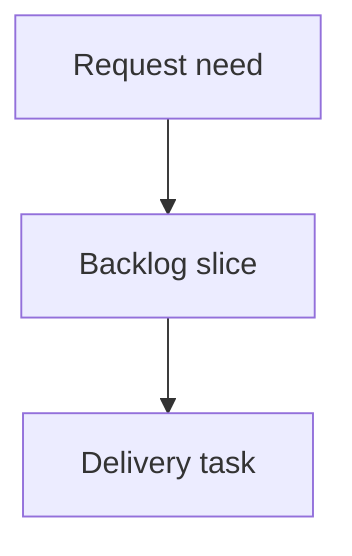

## req_219_add_a_cdx_status_cockpit_to_the_local_viewer - Add a CDX status cockpit to the local viewer
> From version: 2.4.0
> Schema version: 1.0
> Status: Draft
> Understanding: 90%
> Confidence: 85%
> Complexity: Medium
> Theme: Operator workflow
> Reminder: Update status/understanding/confidence and linked backlog/task references when you edit this doc.

# Needs
- Add a read-only CDX status cockpit to `logics-manager view` when `cdx-manager` is detected.
- Surface the equivalent of `cdx status` in a polished local viewer screen instead of requiring terminal context switching.
- Keep the integration optional, bounded, non-mutating, and safe when `cdx` is missing, broken, slow, or returns unsupported JSON.

# Context
- The local viewer already exposes operational screens for Git, Insights, Health, activity, and document previews.
- Operators also need assistant-runtime state while doing Logics work: provider readiness, sessions, auth/quota signals, degraded state, and next commands.
- `cdx-manager` already owns that state through `cdx status`; Logics should consume structured status output rather than duplicating provider logic.
- The linked product brief `prod_022_cdx_status_cockpit_for_the_local_viewer` defines the desired optional, read-only cockpit.

# Acceptance criteria
- AC1: `logics-manager view` detects whether `cdx` is available on `PATH` without making CDX a hard dependency.
- AC2: The local viewer exposes a `CDX` topbar button adjacent to `Git` when CDX status can be queried or when an explicit unavailable state should be shown.
- AC3: Clicking `CDX` opens a read-only status screen based on structured `cdx status --json` output.
- AC4: The screen renders CDX state as cards/lists for availability, sessions, providers, quota/readiness, and safe next commands rather than pasting terminal text.
- AC5: Missing executable, timeout, command failure, and invalid JSON states render safely and do not break the rest of the viewer.
- AC6: Manual and automatic viewer refresh update the CDX screen when it is open.
- AC7: No mutating CDX commands are exposed in the first slice.
- AC8: Tests cover backend status collection, unavailable/error states, UI rendering, refresh behavior, and packaged viewer assets.

# Definition of Ready (DoR)
- [x] Problem statement is explicit and user impact is clear.
- [x] Scope boundaries (in/out) are explicit.
- [x] Acceptance criteria are testable.
- [x] Dependencies and known risks are listed.

# Companion docs
- Product brief(s): `prod_022_cdx_status_cockpit_for_the_local_viewer`
- Architecture decision(s): (none yet)

# References
- `logics/product/prod_022_cdx_status_cockpit_for_the_local_viewer.md`
- `logics/product/prod_020_local_web_viewer_for_cli_driven_logics_work.md`
- `logics/product/prod_021_git_cockpit_for_the_local_viewer.md`
- `logics_manager/viewer.py`
- `clients/viewer/index.html`
- `clients/viewer/browser-host.js`
- `clients/viewer/viewer.css`
- `logics_manager/viewer_assets/viewer/index.html`
- `logics_manager/viewer_assets/viewer/browser-host.js`
- `tests/python/test_logics_manager_cli.py`
- `tests/viewer.browser-host.test.ts`

# AI Context
- Summary: Add an optional read-only CDX status cockpit to the local viewer using structured `cdx status --json` output.
- Keywords: local-viewer, cdx, cdx-manager, status, provider-readiness, sessions, assistant-runtime
- Use when: You need to implement or review CDX status visibility in `logics-manager view`.
- Skip when: The work is about mutating CDX sessions, provider login flows, or unrelated viewer health/Git screens.

# Backlog
- `item_383_add_a_cdx_status_cockpit_to_the_local_viewer`
