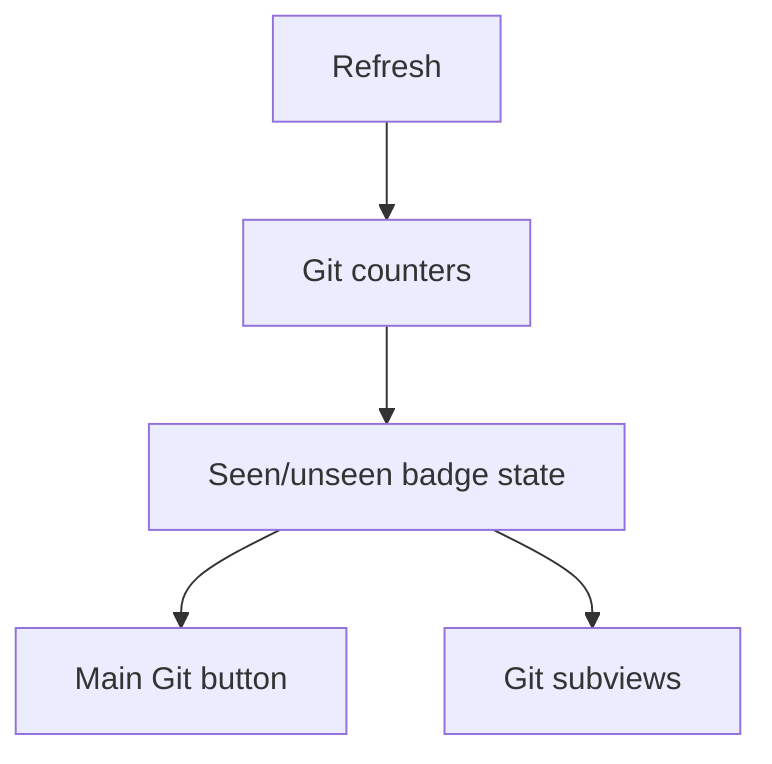

## req_220_add_git_notification_badges_for_unpushed_commits_and_uncommitted_changes - Add Git notification badges for unpushed commits and uncommitted changes
> From version: 2.4.0
> Schema version: 1.0
> Status: Done
> Understanding: 95%
> Confidence: 90%
> Complexity: Medium
> Theme: Git workflow visibility
> Reminder: Update status/understanding/confidence and linked backlog/task references when you edit this doc.

# Needs
- Show compact Git notification badges after each refresh so the operator can immediately see local commits that are not pushed and modified files that are not committed.
- Keep the badges as "new information seen/unseen" indicators, while preserving the real Git state inside the Git screen even after a badge is dismissed.

# Context
- The main Git entry point currently requires opening the Git screen to inspect local repository state.
- The requested counters are:
  - local commits present on the current branch but absent from its upstream branch;
  - files with uncommitted changes, using the same semantics as the existing Git status surface.
- Badges should be visible only when the corresponding count is greater than zero.
- Opening the Git window marks main Git button badges as seen.
- Opening the History sub-screen marks the unpushed commits badge on History as seen.
- Opening the local changes surface, when such a surface exists, marks the uncommitted files badge there as seen.
- A later refresh can show the badges again when the counters still report values greater than zero.

# Acceptance criteria
- AC1: After refresh, the main Git button can show a badge with the count of local commits not pushed to the configured upstream branch.
- AC2: After refresh, the main Git button can show a second badge with the count of modified/uncommitted files.
- AC3: Each badge is hidden when its count is zero.
- AC4: Opening the Git window marks badges on the main Git button as seen and hides them there without implying the Git state is resolved.
- AC5: The unpushed commits badge remains visible on the Git History control until History is opened.
- AC6: The uncommitted files badge remains visible on the relevant changes surface/control, when one exists, until that surface is opened.
- AC7: A subsequent refresh can show the badges again when counts greater than zero are detected.
- AC8: Each badge has its own color, compact placement, and a hover tooltip explaining the count.
- AC9: Missing upstream configuration, unavailable Git, or Git command failures are handled without blocking the rest of the refresh.

# AC Traceability
- AC1 -> `item_384_compute_git_badge_counters_on_refresh`, `task_185_count_local_commits_not_pushed_to_upstream`, `task_187_expose_badge_counters_through_the_refresh_result`, `task_191_render_two_compact_badges_on_the_main_git_button`. Proof: backend badge counters expose unpushed commits and viewer refresh displays the commits badge on the main Git button.
- AC2 -> `item_384_compute_git_badge_counters_on_refresh`, `task_186_count_modified_and_uncommitted_files_consistently_with_git_status`, `task_187_expose_badge_counters_through_the_refresh_result`, `task_191_render_two_compact_badges_on_the_main_git_button`. Proof: backend badge counters expose uncommitted files and viewer refresh displays the files badge on the main Git button.
- AC3 -> `item_386_render_git_notification_badges_in_the_ui`, `task_191_render_two_compact_badges_on_the_main_git_button`, `task_192_render_the_unpushed_commits_badge_on_the_git_history_control`, `task_193_render_the_uncommitted_changes_badge_on_the_changes_surface_when_available`. Proof: `gitBadgeHtml` returns no badge for zero counts and tests cover zero-count hidden states.
- AC4 -> `item_385_track_git_badge_visibility_and_viewed_state`, `task_188_persist_viewed_state_for_the_main_git_button`. Proof: opening the Git screen marks main badges viewed and tests assert the main Git button badges disappear while Git state remains visible.
- AC5 -> `item_385_track_git_badge_visibility_and_viewed_state`, `item_386_render_git_notification_badges_in_the_ui`, `task_189_persist_viewed_state_for_git_history_and_changes_subviews`, `task_192_render_the_unpushed_commits_badge_on_the_git_history_control`. Proof: History keeps the unpushed commits badge after opening Git and removes it only when the History domain is opened.
- AC6 -> `item_385_track_git_badge_visibility_and_viewed_state`, `item_386_render_git_notification_badges_in_the_ui`, `task_189_persist_viewed_state_for_git_history_and_changes_subviews`, `task_193_render_the_uncommitted_changes_badge_on_the_changes_surface_when_available`. Proof: the Changes domain is the existing local changes surface and marks the files badge viewed when opened.
- AC7 -> `item_385_track_git_badge_visibility_and_viewed_state`, `task_190_reset_badge_visibility_when_refresh_detects_counts`. Proof: refresh resets badge visibility from the latest positive badge counts.
- AC8 -> `item_386_render_git_notification_badges_in_the_ui`, `task_194_add_badge_colors_placement_and_hover_tooltips`. Proof: CSS defines distinct compact badge colors and badge markup includes French hover tooltips.
- AC9 -> `item_384_compute_git_badge_counters_on_refresh`, `task_185_count_local_commits_not_pushed_to_upstream`, `task_187_expose_badge_counters_through_the_refresh_result`. Proof: upstream inspection returns safe unavailable metadata without blocking Git status payload collection.

# Scope
- In:
  - compute Git badge counters during refresh;
  - maintain seen/unseen notification state for the main Git button and relevant Git subviews;
  - render compact colored badges and tooltips in the existing UI.
- Out:
  - changing the underlying Git history/status features beyond the data needed for the badges;
  - adding push/commit actions;
  - treating badge dismissal as resolving Git changes.

# Definition of Ready (DoR)
- [x] Problem statement is explicit and user impact is clear.
- [x] Scope boundaries (in/out) are explicit.
- [x] Acceptance criteria are testable.
- [x] Dependencies and known risks are listed.

# Dependencies and risks
- Depends on the existing refresh pipeline and Git status/history surfaces.
- The unpushed commit count requires an upstream branch; no upstream must degrade gracefully.
- The uncommitted file count must match the existing app's interpretation of status, including whether untracked files are included.
- Badge visibility must not mislead the operator into thinking local changes were committed or pushed.

# Companion docs
- Product brief(s): (none yet)
- Architecture decision(s): (none yet)

# References
- Existing Git refresh implementation and Git screen controls.
- `git rev-list --count @{u}..HEAD` as the intended baseline for unpushed local commits when upstream exists.
- Existing Git status parsing for modified/uncommitted file counts.

# AI Context
- Summary: Add Git notification badges for local unpushed commits and modified/uncommitted files, with seen/unseen behavior across the main Git entry point and Git subviews.
- Keywords: git, notification badge, unpushed commits, uncommitted files, refresh, history, tooltip
- Use when: Implementing or reviewing Git state visibility in the viewer UI.
- Skip when: The change is unrelated to Git refresh state or Git screen notifications.

# Backlog
- `item_384_compute_git_badge_counters_on_refresh`
- `item_385_track_git_badge_visibility_and_viewed_state`
- `item_386_render_git_notification_badges_in_the_ui`
