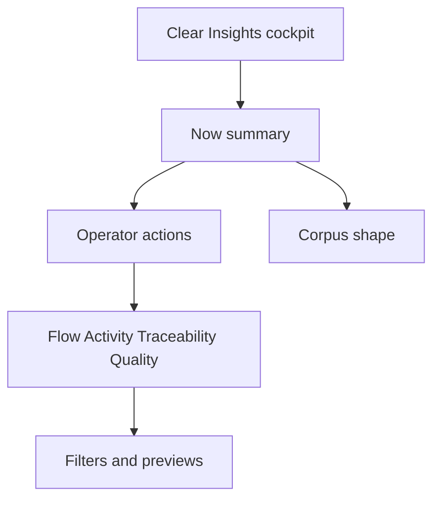

## req_221_refondre_l_ecran_insights_du_viewer_local - Refondre l'ecran Insights du viewer local
> From version: 2.5.2
> Schema version: 1.0
> Status: Draft
> Understanding: 95%
> Confidence: 85%
> Complexity: Medium
> Theme: Viewer insights
> Reminder: Update status/understanding/confidence and linked backlog/task references when you edit this doc.

# Needs
- Redesign the local viewer Insights screen so it is clearer, more attractive, and consistent with the other viewer screens.
- Shift Insights from a dense report into an operator cockpit that shows what needs attention first, then explains why.
- Preserve the existing Logics/VS Code-like theme and avoid decorative dashboard patterns or fake analytics.

# Context
- The current local viewer Insights surface already exposes useful signals: corpus overview, flow health, activity, traceability, quality signals, and operator actions.
- The current layout is hard to understand because it stacks many cards and flat lists without a strong reading order.
- Several rows concatenate many document names or counts into one long line, which makes scanning difficult and creates weak click targets.
- Operator actions currently appear after overview, flow, activity, traceability, and quality sections, even though they are the most useful part of the screen.
- Related completed work made Insights actionable, but this request focuses on information hierarchy, visual polish, and readability.

# Problem
- Operators cannot quickly answer "what should I look at now?" when opening Insights.
- The screen mixes inventory metrics, diagnostic signals, document lists, and actions at the same visual priority.
- Long text rows reduce readability and make the screen feel noisier than the board, detail panel, Git, CDX, and Health views.
- The visual treatment is functional but not refined enough for a primary viewer surface.

# Scope
- In scope:
  - Reorder Insights around a top "Now" summary, an action-first area, and secondary diagnostic sections.
  - Replace long comma-separated values with structured rows, compact document cards, status badges, and bounded lists.
  - Add a corpus-shape visualization using restrained CSS bars or equivalent native UI primitives.
  - Make Activity read like a short timeline with recent, stale, and quiet signals.
  - Make Traceability prioritize broken references and unlinked docs before "most referenced" inventory.
  - Keep Quality as a summary that links toward Health for detailed findings.
  - Reuse existing viewer tokens, classes, filters, document preview links, and VS Code theme variables where possible.
- Out of scope:
  - Adding persistent analytics history or new fake trend metrics.
  - Replacing the Health screen.
  - Building a graph editor or full corpus explorer.
  - Changing the Logics workflow model.

# Acceptance criteria
- AC1: Insights opens with a compact "Now" summary that highlights the most important corpus signals before secondary detail.
- AC2: Operator actions are visible near the top of the screen and each action clearly applies a filter, opens Health, or opens a relevant document preview.
- AC3: Overview metrics are reduced to a small set of meaningful tiles and do not dominate the screen.
- AC4: Corpus shape is shown with a readable, theme-native visual treatment such as compact horizontal bars by document type.
- AC5: Flow health rows explain the document, status, reason, and next action without relying on comma-separated text blobs.
- AC6: Activity uses a short timeline or grouped rows for recent, stale, and quiet docs, with bounded lists and reveal behavior where needed.
- AC7: Traceability prioritizes broken references and unlinked documents before lower-priority inventory such as most-referenced docs.
- AC8: Quality signals summarize lint/audit health and route detailed findings to the Health screen rather than duplicating the full Health view.
- AC9: The redesigned layout remains consistent with the viewer theme, uses existing CSS variables and controls, and avoids decorative dashboard filler.
- AC10: Focused browser-host or viewer tests cover the new layout structure, action wiring, and at least one dense-data readability case.

# Definition of Ready (DoR)
- [x] Problem statement is explicit and user impact is clear.
- [x] Scope boundaries (in/out) are explicit.
- [x] Acceptance criteria are testable.
- [x] Dependencies and known risks are listed.

# UX direction
- Structure the screen as:
  - Now: four high-signal tiles such as Needs attention, Active work, Flow gaps, and Recent changes.
  - Actions: a short prioritized list of operator next moves.
  - Corpus shape: document type distribution with compact bars.
  - Flow health: structured diagnostic rows.
  - Activity: recent, stale, and quiet groups or timeline rows.
  - Traceability: broken refs, unlinked docs, then most referenced.
  - Quality: summary only, with a clear route to Health.
- Add a deterministic "Explain this corpus" summary if it can be generated from existing data:
  - Main pressure.
  - Delivery shape.
  - Best next move.

# Risks and dependencies
- Dense corpora can still overwhelm the screen, so every list needs bounded initial rendering and reveal controls.
- The redesign should not fork the local viewer and packaged viewer behavior; shared source and packaged assets must stay aligned.
- The visual update should reuse existing theme variables and avoid adding a parallel design system.
- Existing Insights action wiring from prior work must keep working after the layout changes.

# Companion docs
- Product brief(s): (none yet)
- Architecture decision(s): (none yet)

# References
- `logics/request/req_214_make_local_viewer_corpus_insights_actionable.md`
- `logics/request/req_184_add_a_corpus_explorer_with_map_and_timeline_views_to_logics_insights.md`
- `logics_manager/viewer_assets/viewer/browser-host.js`
- `logics_manager/viewer_assets/viewer/viewer.css`
- `tests/viewer.browser-host.test.ts`

# AI Context
- Summary: Redesign local viewer Insights into a clearer action-first operator cockpit that remains native to the existing viewer theme.
- Keywords: viewer insights, UI redesign, readability, operator actions, corpus health, traceability, activity, visual hierarchy
- Use when: Planning or implementing the local viewer Insights redesign.
- Skip when: Working only on CLI health output, persistent analytics history, or the separate full corpus explorer.

# Backlog
- none
