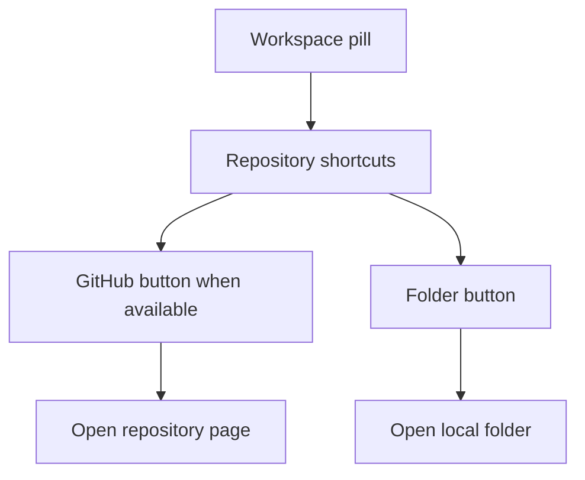

## req_222_add_github_and_folder_shortcuts_to_viewer_topbar - Add GitHub and folder shortcuts to viewer topbar
> From version: 2.5.2 (linked)
> Schema version: 1.0
> Status: Done
> Understanding: 96%
> Confidence: 86%
> Complexity: Low
> Theme: Viewer navigation
> Reminder: Update status/understanding/confidence and linked backlog/task references when you edit this doc.

# Needs
- Add compact repository shortcuts beside the workspace title pill in the local viewer topbar.
- Show a GitHub shortcut only when the current workspace is backed by a GitHub remote.
- Always provide a repository-folder shortcut when the viewer can resolve the local repo root.
- Keep the controls visually quiet and consistent with the existing topbar, badges, and VS Code-like theme.

# Context
- The local viewer topbar already displays the viewer title, a workspace/repository pill, status meta text, and right-aligned actions such as Refresh, Git, CDX, Insights, and Health.
- Operators sometimes need to jump from the viewer to the canonical GitHub repository or to the local repository folder.
- These shortcuts are navigation affordances, not primary workflow actions, so they should live next to the workspace identity rather than in the main action cluster.
- The GitHub shortcut must not appear for non-GitHub repositories because an inactive or misleading button would add noise.

# Problem
- The current workspace pill identifies the repository but does not provide direct repository navigation.
- Opening GitHub or the local folder requires leaving the viewer and manually finding the correct destination.
- The topbar can support this with small icon buttons without changing the main viewer workflow.

# Scope
- In scope:
  - Detect a canonical GitHub web URL from the current Git remotes, preferring `origin` when available and falling back to another GitHub remote.
  - Render a compact GitHub icon button beside the workspace/repo pill only when a valid GitHub URL exists.
  - Render a compact folder/file-system icon button beside the workspace/repo pill when the local repo root is known.
  - Open the GitHub URL in the browser or external handler.
  - Open the local repository folder in the operating system file browser.
  - Show a discreet viewer status message if opening the folder fails.
  - Preserve responsive topbar alignment on desktop and mobile.
- Out of scope:
  - Adding repository management, clone, fork, branch, or remote-editing workflows.
  - Supporting arbitrary forge-specific UI beyond GitHub detection.
  - Showing disabled shortcut buttons when no target exists.
  - Moving existing Git, CDX, Insights, or Health actions.

# Acceptance criteria
- AC1: The viewer topbar renders compact repository shortcut buttons immediately beside the workspace/repository pill.
- AC2: The GitHub shortcut is visible only when a valid GitHub remote URL can be resolved for the current repository.
- AC3: GitHub SSH and HTTPS remote formats are normalized to the canonical web URL before opening.
- AC4: Clicking the GitHub shortcut opens the repository page externally without changing the current viewer state.
- AC5: The local folder shortcut opens the resolved repository root in the operating system file browser.
- AC6: If the repository folder cannot be opened, the viewer reports a discreet failure message in the existing status/meta surface.
- AC7: Shortcut buttons use icon-first controls with accessible labels and tooltips, and no disabled empty states are shown.
- AC8: The controls remain aligned with the workspace pill and do not collide with the topbar action cluster on narrow viewports.
- AC9: Tests cover GitHub remote detection, hidden GitHub state for non-GitHub repos, and the folder-open action path.

# Definition of Ready (DoR)
- [x] Problem statement is explicit and user impact is clear.
- [x] Scope boundaries (in/out) are explicit.
- [x] Acceptance criteria are testable.
- [x] Dependencies and known risks are listed.

# UX direction
- Place the shortcuts as a small inline action group directly after the workspace pill:
  - `Logics Viewer`
  - `[workspace] [GitHub icon] [Folder icon]`
  - `Read-only local viewer`
- Keep the buttons icon-only with accessible names:
  - GitHub: `Open GitHub repository`.
  - Folder: `Open repository folder`.
- Match the compact badge/topbar language:
  - 14 to 16 pixel icons.
  - Secondary or ghost treatment.
  - Existing border, background, focus ring, and color variables.
- Hide the GitHub button entirely when there is no GitHub target.

# Risks and dependencies
- Git remote parsing must handle common formats such as `git@github.com:owner/repo.git`, `https://github.com/owner/repo.git`, and `ssh://git@github.com/owner/repo.git`.
- Opening a local folder is platform-specific and should use the existing Python/runtime pattern for macOS, Linux, and Windows where available.
- The local viewer may run in packaged and source asset modes, so any API or payload change must keep both paths aligned.
- The topbar is already dense on mobile, so the shortcut group must wrap predictably without pushing main actions off-screen.

# Companion docs
- Product brief(s): (none yet)
- Architecture decision(s): (none yet)

# References
- `logics_manager/viewer.py`
- `logics_manager/viewer_assets/viewer/index.html`
- `logics_manager/viewer_assets/viewer/browser-host.js`
- `logics_manager/viewer_assets/viewer/viewer.css`
- `tests/viewer.browser-host.test.ts`

# AI Context
- Summary: Add compact GitHub and local folder shortcuts beside the local viewer workspace pill.
- Keywords: viewer topbar, repository shortcuts, GitHub remote, open folder, workspace pill, navigation
- Use when: Planning or implementing topbar shortcuts that open the current repository in GitHub or on disk.
- Skip when: Working on Git status details, CDX status, Insights, Health, or repository management workflows.

# Backlog
- `item_388_add_github_and_folder_shortcuts_to_viewer_topbar`

# AC Traceability
- AC1 -> `task_196_add_github_and_folder_shortcuts_to_viewer_topbar`. Proof: Task AC1 covers compact repository shortcut buttons beside the workspace pill.
- AC2 -> `task_196_add_github_and_folder_shortcuts_to_viewer_topbar`. Proof: Task AC2 covers showing the GitHub shortcut only for a valid GitHub remote.
- AC3 -> `task_196_add_github_and_folder_shortcuts_to_viewer_topbar`. Proof: Task AC3 covers normalizing GitHub SSH and HTTPS remotes to a web URL.
- AC4 -> `task_196_add_github_and_folder_shortcuts_to_viewer_topbar`. Proof: Task AC4 covers opening the GitHub repository externally without changing viewer state.
- AC5 -> `task_196_add_github_and_folder_shortcuts_to_viewer_topbar`. Proof: Task AC5 covers opening the resolved local repository root in the OS file browser.
- AC6 -> `task_196_add_github_and_folder_shortcuts_to_viewer_topbar`. Proof: Task AC6 covers discreet failure reporting through the viewer status/meta surface.
- AC7 -> `task_196_add_github_and_folder_shortcuts_to_viewer_topbar`. Proof: Task AC7 covers icon-first accessible controls and no disabled empty states.
- AC8 -> `task_196_add_github_and_folder_shortcuts_to_viewer_topbar`. Proof: Task AC8 covers alignment with the workspace pill on narrow viewports.
- AC9 -> `task_196_add_github_and_folder_shortcuts_to_viewer_topbar`. Proof: Task AC9 covers tests for GitHub detection, hidden non-GitHub state, and folder-open action paths.
