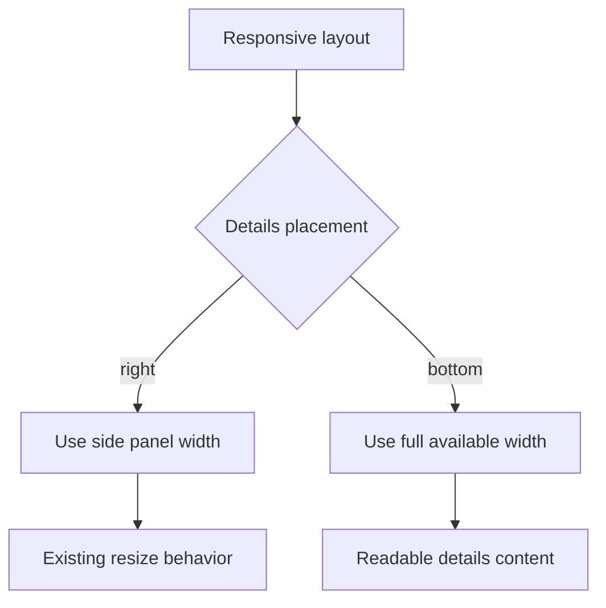

## req_223_fix_bottom_details_panel_width_in_narrow_breakdown_layout - Fix bottom details panel width in narrow breakdown layout
> From version: 2.5.2 (linked)
> Schema version: 1.0
> Status: Draft
> Understanding: 96%
> Confidence: 86%
> Complexity: Low
> Theme: Viewer layout
> Reminder: Update status/understanding/confidence and linked backlog/task references when you edit this doc.

# Needs
- Fix the details panel layout when the UI switches from right-side details to bottom/stacked details.
- In the narrow breakdown layout, the details panel must take the full available width when it is positioned below the board or list.
- Prevent the bottom details panel from keeping a narrow side-panel width after the layout breakpoint changes.

# Context
- In the current app version, the details panel can appear at the bottom of the view instead of on the right.
- In that bottom/stacked placement, the panel sometimes keeps a constrained width that looks like the right-side panel width budget.
- The result is a bottom details surface that does not take the full available horizontal space, leaving unusable empty area and making the layout feel broken.
- The expected behavior is explicit: when Details is at the bottom, it is a full-width bottom panel.
- Related completed requests covered stacked collapse behavior and disappearing board/list items after resizing, but this issue is specifically about the width contract for bottom-positioned details.

# Problem
- Users in narrow or low-breakdown layouts expect the bottom details panel to behave like a full-width row across the view.
- When it keeps side-panel sizing, details content becomes cramped even though horizontal space is available.
- The board/list and details surfaces no longer align, which weakens readability and makes the responsive layout feel unreliable.

# Scope
- In scope:
  - Ensure the details panel uses the full available width whenever the layout places it below the main content.
  - Reset or override side-panel width constraints when entering bottom/stacked details mode.
  - Preserve right-side resizable details behavior in wide layouts.
  - Preserve collapsed bottom details behavior from the existing stacked-layout contract.
  - Add regression coverage for the layout breakpoint or state that reproduces the narrow bottom-details width issue.
- Out of scope:
  - Redesigning details panel content hierarchy.
  - Changing when the app decides to switch between right-side and bottom details.
  - Reworking board/list rendering or virtualized item behavior.

# Acceptance criteria
- AC1: When the layout places the details panel below the board/list, the details panel takes the full available width of the view/content area.
- AC2: Bottom-positioned details do not inherit the right-side panel width, max-width, flex-basis, or persisted resize value.
- AC3: Wide layouts continue to render the details panel on the right with the existing resizable width behavior.
- AC4: Collapsed details in bottom/stacked mode remain compact and do not re-enable splitter resizing while collapsed.
- AC5: Switching between wide and narrow layouts restores the correct width contract for each placement without requiring a reload.
- AC6: Board/list content remains visible and aligned after the details panel moves to the bottom.
- AC7: Regression coverage or a visual smoke case verifies the bottom-details full-width state at the relevant narrow breakpoint.

# Definition of Ready (DoR)
- [x] Problem statement is explicit and user impact is clear.
- [x] Scope boundaries (in/out) are explicit.
- [x] Acceptance criteria are testable.
- [x] Dependencies and known risks are listed.

# Risks and dependencies
- The bug may be tied to persisted splitter state, so the fix should cover both fresh state and previously resized details state.
- CSS and layout-controller state must agree on the active placement; a CSS-only patch may hide the issue without fixing resize state.
- The fix should not regress prior stacked-layout behavior from `req_010_stacked_layout_disable_splitter_and_compact_details_when_collapsed`.
- The fix should not reintroduce item disappearance issues covered by `req_153_fix_board_and_list_items_disappearing_when_the_detail_panel_is_resized_or_collapsed`.

# Companion docs
- Product brief(s): (none yet)
- Architecture decision(s): (none yet)

# References
- `logics/request/req_010_stacked_layout_disable_splitter_and_compact_details_when_collapsed.md`
- `logics/request/req_153_fix_board_and_list_items_disappearing_when_the_detail_panel_is_resized_or_collapsed.md`
- `logics/request/req_157_initialize_detail_panel_collapsed_in_list_mode_and_all_collapsable_sections_closed_by_default.md`
- `logics_manager/viewer_assets/media/css/layout.css`
- `logics_manager/viewer_assets/media/css/details.css`
- `logics_manager/viewer_assets/media/layoutController.js`
- `tests/webview.harness-details-and-filters.test.ts`

# AI Context
- Summary: Fix the responsive details panel so bottom/stacked placement uses full available width instead of retaining side-panel sizing.
- Keywords: details panel, stacked layout, bottom details, responsive width, splitter state, narrow layout
- Use when: Planning or implementing fixes for details panel width after the layout moves details below the board or list.
- Skip when: Working on details content hierarchy, initial collapsed defaults, or unrelated board/list rendering.

# Backlog
- `item_389_fix_bottom_details_panel_width_in_narrow_breakdown_layout`

# AC Traceability
- AC1 -> `task_197_fix_bottom_details_panel_width_in_narrow_breakdown_layout`. Proof: Task AC1 covers full-width bottom details when Details is below board/list.
- AC2 -> `task_197_fix_bottom_details_panel_width_in_narrow_breakdown_layout`. Proof: Task AC2 covers preventing bottom details from inheriting side-panel width, max-width, flex-basis, or persisted resize values.
- AC3 -> `task_197_fix_bottom_details_panel_width_in_narrow_breakdown_layout`. Proof: Task AC3 covers preserving right-side resizable details in wide layouts.
- AC4 -> `task_197_fix_bottom_details_panel_width_in_narrow_breakdown_layout`. Proof: Task AC4 covers keeping collapsed bottom details compact without splitter resizing.
- AC5 -> `task_197_fix_bottom_details_panel_width_in_narrow_breakdown_layout`. Proof: Task AC5 covers correct width contracts when switching between wide and narrow layouts.
- AC6 -> `task_197_fix_bottom_details_panel_width_in_narrow_breakdown_layout`. Proof: Task AC6 covers keeping board/list content visible and aligned after Details moves to the bottom.
- AC7 -> `task_197_fix_bottom_details_panel_width_in_narrow_breakdown_layout`. Proof: Task AC7 covers regression or visual smoke coverage for the bottom-details full-width state.
