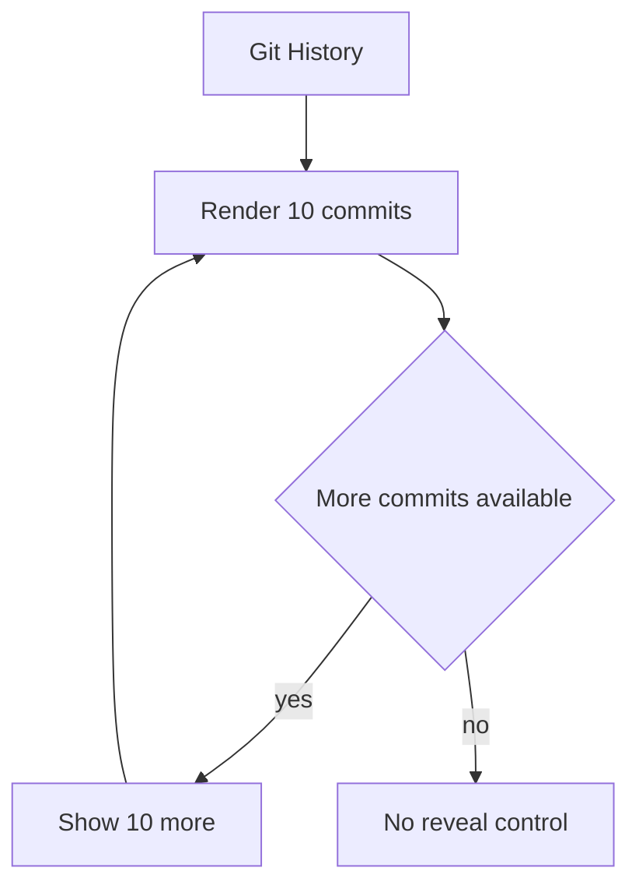

## req_224_add_progressive_reveal_to_git_history_commits - Add progressive reveal to Git history commits
> From version: 2.5.2 (linked)
> Schema version: 1.0
> Status: Done
> Understanding: 96%
> Confidence: 86%
> Complexity: Low
> Theme: Viewer Git
> Reminder: Update status/understanding/confidence and linked backlog/task references when you edit this doc.

# Needs
- Make the Git cockpit History section easier to scan by showing 10 commits by default instead of the current visual limit of 8.
- Add an in-flow reveal control that shows 10 more commits each time the user asks for more.
- Reuse the same progressive-disclosure behavior already established for large corpus groups in the board/list.

# Context
- The local viewer Git cockpit exposes a History domain with recent commits.
- Today the History section is visually limited to a small fixed set, currently 8 commits.
- Operators often need a little more history while preparing a commit, reviewing recent work, or checking what has not been pushed.
- Showing too many commits by default would make the Git cockpit noisy, so the default should remain bounded while allowing explicit expansion.
- The board/list already has a progressive "Show more" pattern for large groups, which is the right interaction model to reuse here.

# Problem
- Eight visible commits is slightly too low for practical review.
- There is no visible way to reveal additional commits in the History section.
- Users must leave the viewer or rely on terminal Git commands when the needed commit is just beyond the initial visual limit.

# Scope
- In scope:
  - Render 10 commits by default in the Git History section.
  - Add a visible in-flow control such as `Show 10 more` when additional commits are available.
  - Reveal the next 10 commits per click until the available recent commit payload is exhausted.
  - Keep commit ordering stable while revealing more rows.
  - Keep the History domain count accurate for the available payload, not only the currently rendered rows.
  - Reset or reconcile the visible History limit predictably after refresh or when the Git payload changes.
  - Add focused tests for initial limit, reveal-more behavior, and no-control state when there are 10 or fewer commits.
- Out of scope:
  - Server-side pagination or fetching unlimited Git history.
  - Changing the Git payload contract unless the existing payload cannot supply more than the new reveal behavior needs.
  - Adding commit diff drill-downs, checkout actions, or mutating Git commands.
  - Changing unpushed-commit badge behavior.

# Acceptance criteria
- AC1: Git History renders 10 commit rows by default when at least 10 commits are available.
- AC2: When more than 10 commits are available, the History list shows a clear in-flow `Show 10 more` control after the rendered rows.
- AC3: Each activation of the reveal control displays the next 10 commits without reordering or duplicating existing rows.
- AC4: The reveal control disappears when all available commits in the current payload are visible.
- AC5: The History domain count continues to represent the available recent commit count, while the list itself can show a smaller visible subset.
- AC6: Refreshing or receiving a materially different Git payload reconciles the visible limit predictably and avoids stale expansion state.
- AC7: The empty-history and single-commit fallback states remain unchanged.
- AC8: Focused tests cover the initial 10-row render, one or more reveal clicks, and the absence of the reveal control when no hidden commits remain.

# Definition of Ready (DoR)
- [x] Problem statement is explicit and user impact is clear.
- [x] Scope boundaries (in/out) are explicit.
- [x] Acceptance criteria are testable.
- [x] Dependencies and known risks are listed.

# UX direction
- Use a compact in-flow row/button at the end of the commit list, matching the existing board/list "Show more" affordance.
- Prefer copy that states the increment, such as `Show 10 more`, and optionally includes the hidden count if existing patterns support it.
- Keep the control inside the History section so it is discoverable without adding toolbar complexity.
- Preserve keyboard accessibility and focus styling for the reveal control.

# Risks and dependencies
- If the backend only fetches a very small fixed number of commits, implementation may need to raise that bounded payload limit while still avoiding unlimited history fetches.
- The reveal state should not conflict with the History badge viewed/unviewed behavior from the Git notification work.
- Refresh behavior should avoid surprising users by either resetting to 10 or preserving expansion only when the payload identity is clearly unchanged.

# Companion docs
- Product brief(s): (none yet)
- Architecture decision(s): (none yet)

# References
- `logics/request/req_218_add_a_git_cockpit_to_the_local_viewer.md`
- `logics/backlog/item_370_add_progressive_group_rendering_for_large_item_lists.md`
- `logics/request/req_220_add_git_notification_badges_for_unpushed_commits_and_uncommitted_changes.md`
- `logics_manager/viewer_assets/viewer/browser-host.js`
- `logics_manager/viewer_assets/viewer/viewer.css`
- `tests/viewer.browser-host.test.ts`

# AI Context
- Summary: Add progressive reveal to Git History so the viewer shows 10 commits initially and reveals 10 more per user action.
- Keywords: git cockpit, history, commits, show more, progressive reveal, local viewer
- Use when: Planning or implementing bounded progressive rendering for commit rows in the local viewer Git History section.
- Skip when: Working on Git badge counts, commit diff drill-down, or board/list corpus group pagination.

# Backlog
- `item_390_add_progressive_reveal_to_git_history_commits`

# AC Traceability
- AC1 -> `task_198_add_progressive_reveal_to_git_history_commits`. Proof: Task AC1 covers rendering 10 Git History commit rows by default.
- AC2 -> `task_198_add_progressive_reveal_to_git_history_commits`. Proof: Task AC2 covers showing an in-flow Show 10 more control when additional commits are available.
- AC3 -> `task_198_add_progressive_reveal_to_git_history_commits`. Proof: Task AC3 covers revealing the next 10 commits per activation without reordering or duplication.
- AC4 -> `task_198_add_progressive_reveal_to_git_history_commits`. Proof: Task AC4 covers hiding the reveal control once all available commits are visible.
- AC5 -> `task_198_add_progressive_reveal_to_git_history_commits`. Proof: Task AC5 covers keeping the History domain count tied to available commits rather than the visible subset.
- AC6 -> `task_198_add_progressive_reveal_to_git_history_commits`. Proof: Task AC6 covers predictable visible-limit reconciliation after refresh or payload changes.
- AC7 -> `task_198_add_progressive_reveal_to_git_history_commits`. Proof: Task AC7 covers preserving empty-history and single-commit fallback states.
- AC8 -> `task_198_add_progressive_reveal_to_git_history_commits`. Proof: Task AC8 covers tests for initial rendering, reveal clicks, and no hidden-commit state.
