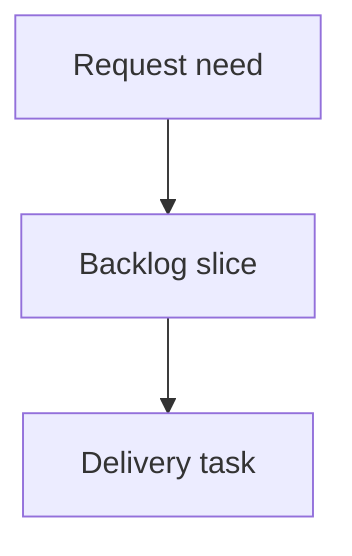

## req_225_show_local_viewer_server_connection_status - Show local viewer server connection status
> From version: 2.5.2
> Schema version: 1.0
> Status: Ready
> Understanding: 90%
> Confidence: 85%
> Complexity: Medium
> Theme: Operator workflow
> Reminder: Update status/understanding/confidence and linked backlog/task references when you edit this doc.

# Needs
- When the local viewer loses contact with its server process, the UI must make that state visible to the operator instead of only failing refresh actions silently or through transient meta text.
- The viewer should automatically clear the disconnected state after the server is restarted and a normal data refresh succeeds.

# Context
- The local viewer is served by a local `logics-manager` process. Operators may stop that server from the terminal while the browser tab remains open.
- The viewer already has an auto-refresh loop that calls `/api/items` and `/api/refresh`, plus an update notice banner in the page chrome.
- Today, if the server is stopped, fetch failures can leave the visible corpus stale without an explicit persistent indication that synchronization is broken.
- The desired behavior is closer to a connection/sync status than a one-off error: disconnected while API calls fail, connected again when the server responds successfully.

# Scope
- In scope: browser-hosted local viewer connection state, visible banner/chrome treatment, automatic recovery on successful refresh, and last successful sync context.
- In scope: preserving the currently displayed corpus while clearly marking it as stale or disconnected.
- In scope: reusing existing refresh calls as the primary health signal unless implementation shows a dedicated health endpoint is necessary.
- Out of scope: changing workflow document semantics, adding remote monitoring, or requiring users to manually dismiss the disconnected warning.
- Out of scope: detecting whether the terminal process was intentionally stopped versus crashed; the viewer only needs to report that the server is unreachable.

# Proposed behavior
- On initial load or refresh success, the viewer records the last successful sync time and hides any disconnected banner.
- When `/api/items`, `/api/refresh`, or equivalent viewer data refresh fails due to network/server unavailability, the viewer shows a persistent warning banner.
- The banner copy should tell the operator that the local viewer server is disconnected and that the page is waiting for reconnection.
- Auto-refresh should continue attempting to reconnect while enabled. When a subsequent refresh succeeds, the banner disappears automatically.
- Manual refresh should also retry the connection and clear the banner on success.

# Acceptance criteria
- AC1: The local viewer displays a persistent disconnected banner when its data refresh cannot reach the local server.
- AC2: The banner makes clear that the currently displayed data may be stale and that the viewer is waiting for reconnection.
- AC3: The disconnected state clears automatically after the local server is restarted and a viewer refresh succeeds.
- AC4: Existing auto-refresh behavior is reused for reconnection attempts unless a dedicated health endpoint is justified during implementation.
- AC5: Manual refresh also retries the connection and updates the connection banner state consistently.
- AC6: The implementation preserves the existing corpus display while disconnected instead of replacing it with a blank or fatal error screen.
- AC7: The UI treatment reuses existing viewer chrome patterns such as the update banner styling, with an appropriate warning/error tone.
- AC8: Both source viewer assets and packaged viewer assets remain in sync.

# Definition of Ready (DoR)
- [x] Problem statement is explicit and user impact is clear.
- [x] Scope boundaries (in/out) are explicit.
- [x] Acceptance criteria are testable.
- [x] Dependencies and known risks are listed.

# Companion docs
- Product brief(s): (none yet)
- Architecture decision(s): (none yet)

# References
- `clients/viewer/index.html`
- `clients/viewer/browser-host.js`
- `clients/viewer/viewer.css`
- `logics_manager/viewer_assets/viewer/index.html`
- `logics_manager/viewer_assets/viewer/browser-host.js`
- `logics_manager/viewer_assets/viewer/viewer.css`

# AI Context
- Summary: Add a visible and self-healing disconnected state for the local viewer when the backing server stops responding.
- Keywords: local-viewer, connection-status, disconnected-banner, auto-refresh, stale-data, browser-host
- Use when: Planning or implementing viewer chrome that reports server connectivity and synchronization state.
- Skip when: Working on unrelated Logics workflow document semantics or non-viewer server commands.

# Backlog
- `item_391_show_local_viewer_server_connection_status`
