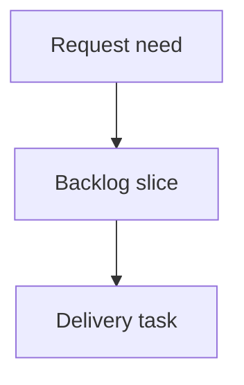

## req_226_show_github_actions_ci_status_in_local_viewer - Show GitHub Actions CI status in local viewer
> From version: 2.5.2
> Schema version: 1.0
> Status: Done
> Understanding: 90%
> Confidence: 85%
> Complexity: High
> Theme: Operator workflow
> Reminder: Update status/understanding/confidence and linked backlog/task references when you edit this doc.

# Needs
- The local viewer should expose GitHub Actions CI state next to the existing repository/runtime controls, so operators can see whether the current work is validated, failing, or still running without leaving the viewer.
- The CI control should only appear for repositories that have a GitHub remote and GitHub Actions workflows configured.

# Context
- The viewer already has topbar actions for `Git`, `CDX`, and `Health`.
- `Git` explains local repository state, but it does not show whether GitHub Actions has accepted or rejected the pushed work.
- Operators need a quick status signal and a detailed view for CI runs, especially when deciding whether code is safe to merge or whether a failure needs attention.
- GitHub Actions data may require a GitHub remote, workflow files under `.github/workflows/`, and an authenticated `gh` CLI or equivalent API token.

# Scope
- In scope: add a `CI` action between `Git` and `CDX` in the local viewer topbar.
- In scope: show a compact status badge on the `CI` action for success, failure, running, queued, cancelled, unavailable, or unknown state.
- In scope: open a dedicated CI status view listing relevant GitHub Actions run details.
- In scope: hide the `CI` action when GitHub is not configured or no GitHub Actions workflows are detected.
- In scope: prefer status for the current branch or current HEAD, with a clear fallback to the latest branch run when exact HEAD data is unavailable.
- In scope: expose CI status through a local backend endpoint rather than calling GitHub directly from browser code.
- Out of scope: managing GitHub credentials in the browser, modifying workflow YAML files, triggering or rerunning CI jobs, or supporting non-GitHub CI providers in this slice.

# Proposed behavior
- The topbar renders `Git`, `CI`, `CDX`, and `Health` when CI is available.
- The `CI` button shows a small status badge, for example green for passing, red for failing, yellow for running or queued, and gray for unavailable or unknown.
- Opening `CI` shows the latest relevant run with workflow name, run conclusion/status, branch, commit SHA, commit message, author when available, start/update time, duration when available, and a link to GitHub.
- The detailed view should include job-level status when the backend can retrieve it cheaply.
- If GitHub Actions exists but local authentication is unavailable, the button may appear with an unavailable badge and the view should explain the missing auth requirement.
- The viewer should refresh CI status on load and on normal refresh paths without blocking the core corpus display.

# Acceptance criteria
- AC1: The viewer has a `CI` action positioned between `Git` and `CDX` when GitHub Actions support is available for the repository.
- AC2: The `CI` action is hidden when the repository has no GitHub remote or no configured GitHub Actions workflows.
- AC3: The `CI` action displays a compact status badge for passing, failing, running, queued, cancelled, unavailable, or unknown CI state.
- AC4: Clicking `CI` opens a dedicated viewer panel with the latest relevant GitHub Actions run details.
- AC5: CI status prioritizes the current branch or current HEAD and uses a documented fallback when exact matching data is unavailable.
- AC6: The backend provides the CI data through a local endpoint and does not expose GitHub credentials to browser code.
- AC7: If GitHub Actions is configured but authentication is unavailable, the UI reports that state clearly instead of showing a misleading success or failure.
- AC8: CI status refresh does not block normal corpus rendering or existing Git, CDX, Health, and viewer refresh behavior.
- AC9: Both source viewer assets and packaged viewer assets remain in sync.

# Definition of Ready (DoR)
- [x] Problem statement is explicit and user impact is clear.
- [x] Scope boundaries (in/out) are explicit.
- [x] Acceptance criteria are testable.
- [x] Dependencies and known risks are listed.

# Companion docs
- Product brief(s): (none yet)
- Architecture decision(s): (none yet)

# References
- `clients/viewer/index.html`
- `clients/viewer/browser-host.js`
- `clients/viewer/viewer.css`
- `logics_manager/viewer_assets/viewer/index.html`
- `logics_manager/viewer_assets/viewer/browser-host.js`
- `logics_manager/viewer_assets/viewer/viewer.css`
- `.github/workflows/`

# AI Context
- Summary: Add conditional GitHub Actions CI status to the local viewer with a topbar button, quick badge, and detailed run panel.
- Keywords: local-viewer, github-actions, ci-status, topbar-button, status-badge, gh-cli, browser-host
- Use when: Planning or implementing local viewer CI visibility for GitHub Actions repositories.
- Skip when: Working on local Git status only, CDX runtime status, or non-GitHub CI providers.

# Backlog
- `item_392_show_github_actions_ci_status_in_local_viewer`
