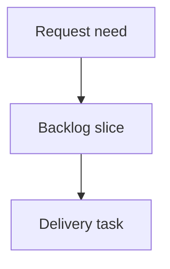

## req_227_group_viewer_utility_actions_under_settings_menu - Group viewer utility actions under settings menu
> From version: 2.5.2
> Schema version: 1.0
> Status: Done
> Understanding: 90%
> Confidence: 85%
> Complexity: Medium
> Theme: Operator workflow
> Reminder: Update status/understanding/confidence and linked backlog/task references when you edit this doc.

# Needs
- The local viewer topbar should reserve first-level space for primary runtime/status views while grouping lower-frequency utility actions into a compact `Settings` menu.
- `Refresh`, `Insights`, and `Health` should move out of the main topbar button row and into that menu, reducing visual noise now that `Git`, `CI`, and `CDX` are primary status controls.

# Context
- The viewer topbar currently exposes multiple peer actions: refresh controls, `Git`, `CI`, `CDX`, `Insights`, and `Health`.
- Recent additions made the topbar more status-oriented by adding `CI` between `Git` and `CDX`.
- `Refresh`, `Insights`, and `Health` are still important, but they are operational utilities rather than always-visible status destinations.
- A `Settings` or utility menu can preserve these actions while keeping the primary topbar scan focused.

# Scope
- In scope: replace the visible `Refresh`, `Insights`, and `Health` topbar buttons with a right-side `Settings` menu.
- In scope: keep `Git`, `CI`, and `CDX` as first-level status actions.
- In scope: preserve existing refresh behavior, including auto-refresh toggle, interval selection, and manual refresh.
- In scope: preserve existing `Insights` and `Health` panels and their loading behavior.
- In scope: keep source viewer assets and packaged viewer assets in sync.
- Out of scope: redesigning the full viewer toolbar, changing Git/CI/CDX panel behavior, or changing Logics workflow semantics.

# Proposed behavior
- The topbar shows primary status actions first: `Git`, conditional `CI`, and `CDX`.
- A `Settings` button appears on the right side of the topbar action group.
- Opening `Settings` reveals menu items for refresh controls, `Insights`, and `Health`.
- The refresh section should retain `Auto`, interval selection, and manual refresh now.
- The menu should close predictably when the operator clicks outside it or presses Escape, following the existing refresh menu behavior.
- The layout should remain usable on narrow widths without crowding or overlapping topbar controls.

# Acceptance criteria
- AC1: `Git`, conditional `CI`, and `CDX` remain visible as first-level topbar status actions.
- AC2: `Refresh`, `Insights`, and `Health` are accessible from a right-side `Settings` menu instead of separate topbar peer buttons.
- AC3: Manual refresh, auto-refresh toggle, and refresh interval selection continue to work from the new menu.
- AC4: `Insights` and `Health` continue to open their existing viewer panels from the new menu.
- AC5: The settings menu closes on outside click and Escape with behavior consistent with existing viewer menus.
- AC6: The topbar remains readable and non-overlapping on narrow and desktop widths.
- AC7: Both source viewer assets and packaged viewer assets remain in sync.

# Definition of Ready (DoR)
- [x] Problem statement is explicit and user impact is clear.
- [x] Scope boundaries (in/out) are explicit.
- [x] Acceptance criteria are testable.
- [x] Dependencies and known risks are listed.

# Companion docs
- Product brief(s): (none yet)
- Architecture decision(s): (none yet)

# References
- `clients/viewer/index.html`
- `clients/viewer/browser-host.js`
- `clients/viewer/viewer.css`
- `logics_manager/viewer_assets/viewer/index.html`
- `logics_manager/viewer_assets/viewer/browser-host.js`
- `logics_manager/viewer_assets/viewer/viewer.css`

# AI Context
- Summary: Group local viewer utility actions under a Settings menu while keeping Git, CI, and CDX as primary status actions.
- Keywords: local-viewer, topbar, settings-menu, refresh, insights, health, chrome
- Use when: Planning or implementing local viewer topbar changes around utility action grouping.
- Skip when: Working on Git, CI, or CDX status panel internals without changing topbar chrome.

# Backlog
- `item_393_group_viewer_utility_actions_under_settings_menu`
