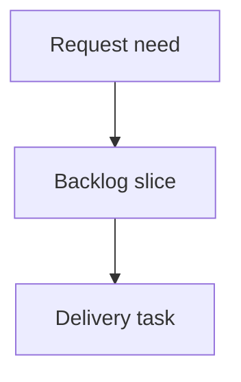

## req_228_show_active_assistant_indicator_on_cdx_button - Show active assistant indicator on CDX button
> From version: 2.5.2
> Schema version: 1.0
> Status: Ready
> Understanding: 90%
> Confidence: 85%
> Complexity: Medium
> Theme: Operator workflow
> Reminder: Update status/understanding/confidence and linked backlog/task references when you edit this doc.

# Needs
- The local viewer should show a quick visual indicator on the `CDX` button when at least one assistant/session is active.
- Operators should be able to see active assistant presence without opening the full CDX status panel.

# Context
- The viewer already has a `CDX` topbar button and a detailed CDX status panel.
- The CDX status payload can include provider/session/runtime information, but the topbar currently does not signal whether assistant activity is happening.
- A compact badge on `CDX` would match the existing quick-status pattern used by `Git` and `CI`.
- The indicator should only appear when there is at least one active assistant/session, so an idle CDX state does not add noise.

# Scope
- In scope: add a compact status badge to the `CDX` button when at least one assistant/session is active.
- In scope: derive the badge from the same CDX status data used by the CDX status panel when available.
- In scope: hide the badge when no assistant/session is active or when CDX status is unavailable.
- In scope: preserve existing CDX status panel behavior and existing CDX button placement.
- In scope: keep source viewer assets and packaged viewer assets in sync.
- Out of scope: changing CDX session semantics, starting/stopping assistants, or adding a new assistant management panel.

# Proposed behavior
- On viewer load and refresh, the browser fetches CDX status as it does for other quick badges.
- If at least one assistant/session is active, the `CDX` button shows a small badge.
- The badge can show a count when reliable, such as `1` or `3`, or a compact active marker if count is not reliable.
- The badge tooltip should explain that one or more assistants are active.
- Clicking `CDX` continues to open the existing detailed CDX status panel.

# Acceptance criteria
- AC1: The `CDX` topbar button displays a compact badge when at least one assistant/session is active.
- AC2: The badge is hidden when CDX reports no active assistants/sessions.
- AC3: The badge is hidden or neutral when CDX status is unavailable, so it does not imply active work incorrectly.
- AC4: The indicator uses the existing CDX status data path and does not introduce a separate assistant polling API unless implementation proves it necessary.
- AC5: Clicking `CDX` continues to open the existing CDX status panel without behavior regression.
- AC6: The badge remains readable and non-overlapping in the topbar, including after the Settings menu request is implemented.
- AC7: Both source viewer assets and packaged viewer assets remain in sync.

# Definition of Ready (DoR)
- [x] Problem statement is explicit and user impact is clear.
- [x] Scope boundaries (in/out) are explicit.
- [x] Acceptance criteria are testable.
- [x] Dependencies and known risks are listed.

# Companion docs
- Product brief(s): (none yet)
- Architecture decision(s): (none yet)

# References
- `clients/viewer/browser-host.js`
- `clients/viewer/index.html`
- `clients/viewer/viewer.css`
- `logics_manager/viewer_assets/viewer/browser-host.js`
- `logics_manager/viewer_assets/viewer/index.html`
- `logics_manager/viewer_assets/viewer/viewer.css`

# AI Context
- Summary: Add a compact active-assistant badge to the CDX topbar button when CDX reports at least one active assistant or session.
- Keywords: local-viewer, cdx, assistant-active, status-badge, topbar, quick-status
- Use when: Planning or implementing quick CDX activity indicators in the local viewer topbar.
- Skip when: Working on unrelated CDX panel internals or assistant lifecycle management.

# Backlog
- `item_394_show_active_assistant_indicator_on_cdx_button`
- `item_394_show_active_assistant_indicator_on_cdx_button`
