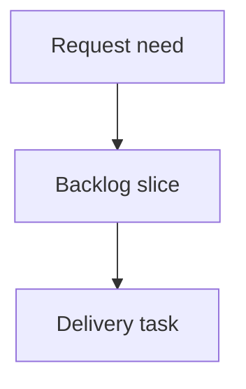

## req_229_fix_collapsed_bottom_details_panel_empty_space - Fix collapsed bottom details panel empty space
> From version: 2.5.2
> Schema version: 1.0
> Status: Ready
> Understanding: 90%
> Confidence: 85%
> Complexity: Medium
> Theme: Operator workflow
> Reminder: Update status/understanding/confidence and linked backlog/task references when you edit this doc.

# Needs
- When the local viewer is in bottom-details layout, collapsing the details panel with the right-side chevron should reclaim the panel height.
- Today the details content collapses visually, but the bottom area can remain reserved as empty space, reducing the usable board area.

# Context
- The local viewer has a details panel at the bottom in some layouts or viewport states.
- The details header includes a chevron control that toggles the collapsed state.
- When the panel is collapsed, the expected behavior is that the main board expands into the freed space.
- The observed behavior leaves a visible blank area at the bottom, which makes the collapse feel broken and wastes screen space.

# Scope
- In scope: fix the local viewer bottom-details collapse layout so the bottom panel no longer reserves empty height when collapsed.
- In scope: preserve the chevron toggle behavior, accessibility state, and restore behavior when expanding the details panel again.
- In scope: verify both source viewer assets and packaged viewer assets if implementation touches viewer assets.
- Out of scope: redesigning the details panel content, changing card selection behavior, or changing unrelated topbar/menu work.

# Proposed behavior
- Clicking the details chevron in bottom-details mode collapses the panel to its intended compact/header-only footprint.
- The main board area expands to occupy the space that was previously taken by details content.
- Expanding the panel restores the previous usable details height without layout overlap.
- The behavior remains stable when resizing the viewport or switching between list/board display modes.

# Acceptance criteria
- AC1: Collapsing the bottom details panel removes the visible empty reserved area below the main board.
- AC2: Expanding the details panel restores the details area without overlapping board content.
- AC3: The chevron toggle remains accessible and keeps accurate expanded/collapsed state.
- AC4: The fix works after viewport resize and view-mode changes.
- AC5: The change is limited to viewer layout behavior and does not alter details content semantics.
- AC6: Source viewer assets and packaged viewer assets remain in sync if viewer assets are changed.

# Definition of Ready (DoR)
- [x] Problem statement is explicit and user impact is clear.
- [x] Scope boundaries (in/out) are explicit.
- [x] Acceptance criteria are testable.
- [x] Dependencies and known risks are listed.

# Companion docs
- Product brief(s): (none yet)
- Architecture decision(s): (none yet)

# References
- `clients/viewer/index.html`
- `clients/viewer/viewer.css`
- `clients/shared-web/media/layoutController.js`
- `clients/shared-web/media/mainApp.js`
- `logics_manager/viewer_assets/viewer/index.html`
- `logics_manager/viewer_assets/viewer/viewer.css`
- `logics_manager/viewer_assets/media/layoutController.js`

# AI Context
- Summary: Fix the local viewer bottom details collapse so it releases empty vertical space and lets the board expand.
- Keywords: local-viewer, details-panel, collapsed-layout, bottom-panel, empty-space, chevron
- Use when: Planning or implementing viewer layout fixes for the bottom details panel collapse behavior.
- Skip when: Working on unrelated topbar actions, CDX badges, or details content rendering.

# Backlog
- `item_395_fix_collapsed_bottom_details_panel_empty_space`
