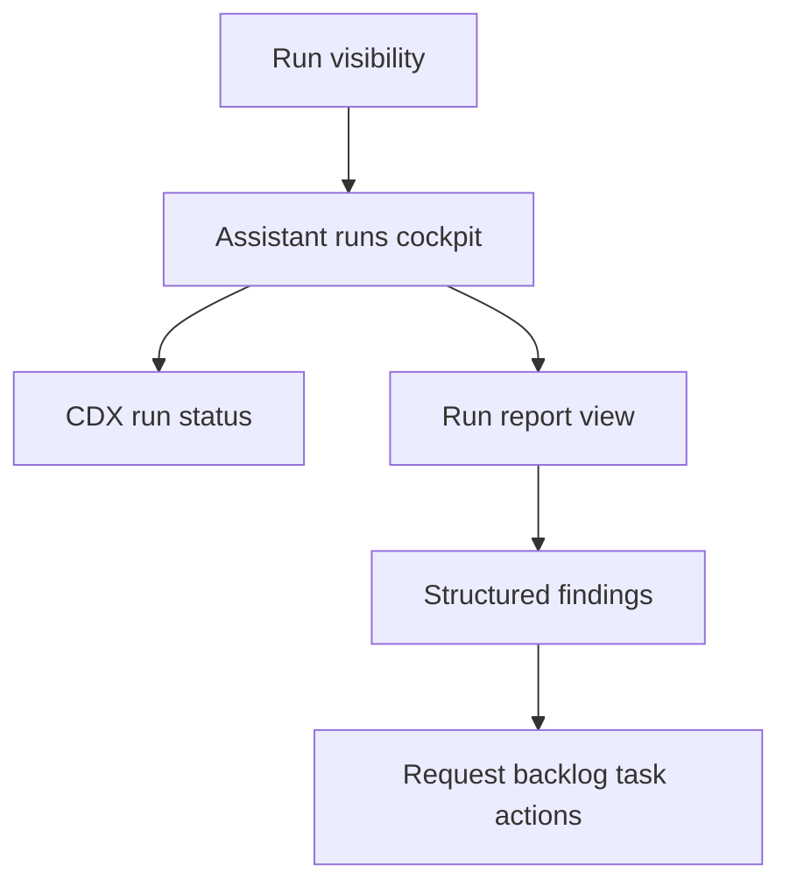

## req_230_add_logics_assistant_runs_cockpit_and_report_to_workflow_actions - Add Logics assistant runs cockpit and report-to-workflow actions
> From version: 2.6.0
> Schema version: 1.0
> Status: Draft
> Understanding: 95%
> Confidence: 90%
> Complexity: High
> Theme: Assistant orchestration
> Reminder: Update status/understanding/confidence and linked backlog/task references when you edit this doc.

# Needs
- Logics should expose assistant run execution as an operator-visible workflow surface, not as invisible background activity.
- Operators need a dedicated runs cockpit that shows what assistant runs are in progress, what finished, what failed, and where the resulting report/artifacts are.
- Structured CDX reports, especially code-review findings, should be convertible into Logics workflow docs so follow-up work can be tracked as requests, backlog items, and tasks.

# Context
- CDX is the right owner for provider execution, process lifecycle, session/provider selection, run artifacts, and normalized report JSON.
- Logics is the right owner for workflow visibility and conversion of assistant output into durable request/backlog/task records.
- The paired CDX request will add a headless run registry and structured task reports that Logics can consume through CLI JSON surfaces.
- Today the Logics viewer has status cockpits for Git, CI, CDX, and workflow activity, but not a focused screen for assistant run execution.
- The desired end state is an operator flow where a code-review run can be launched or observed, then its findings can seed a request such as "Address code review findings" with linked follow-up work.

# Scope
- In: add a Logics viewer sub-screen or cockpit for assistant runs backed by CDX run status/report JSON.
- In: show recent and active runs with status, kind, provider/session, cwd/repository, started/ended timestamps, duration, exit code, summary, and artifact links.
- In: distinguish active, succeeded, failed, timed out, cancelled, and stale runs with clear scan-friendly states.
- In: poll or refresh CDX run state without requiring page navigation.
- In: open a completed run report, including code-review findings when present.
- In: provide report-to-workflow actions that draft or create Logics requests/backlog/tasks from structured report findings.
- In: keep generated workflow docs reviewable and traceable back to the CDX `run_id`, report path, and source repository.
- In: preserve a bounded manual-review step before creating or mutating workflow docs unless an explicit execution mode says otherwise.
- Out: implementing CDX process lifecycle, run registry storage, or provider execution.
- Out: parsing raw provider transcripts as the primary integration path.
- Out: making every assistant output automatically actionable; unsupported report types can remain display-only.

# Acceptance criteria
- AC1: The viewer exposes an assistant runs cockpit or sub-screen that lists recent and active CDX runs from a stable JSON source.
- AC2: Active and terminal run states are visually distinct and include enough metadata to understand what is running, where, and through which provider/session.
- AC3: The cockpit can refresh or poll run state so a run visibly moves from running to a terminal state without restarting the viewer.
- AC4: A completed run can be opened as a report with summary, structured output, artifact paths, and errors when present.
- AC5: Code-review reports render normalized findings with severity, title, file/line references when available, and recommendation text.
- AC6: Operators can draft a Logics request from code-review findings with traceability back to the CDX `run_id` and report artifact.
- AC7: Report-to-workflow actions keep an operator review boundary before writing docs by default.
- AC8: The implementation degrades clearly when CDX does not yet expose run status/report commands or when a run has only raw artifacts.
- AC9: Tests cover CDX payload mapping, active/terminal rendering, refresh behavior, report rendering, and request draft/create behavior.

# Definition of Ready (DoR)
- [x] Problem statement is explicit and user impact is clear.
- [x] Scope boundaries (in/out) are explicit.
- [x] Acceptance criteria are testable.
- [x] Dependencies and known risks are listed.

# Dependencies and risks
- Depends on CDX exposing a stable run registry/status/report JSON contract.
- The UI should avoid coupling to CDX internal filesystem layouts; it should consume CLI/API payloads.
- Report-to-workflow generation must preserve operator control so assistant findings do not silently mutate workflow docs.
- Code-review findings may be incomplete or lack line numbers, so the workflow action needs graceful handling for partial evidence.
- Cross-repo traceability needs clear source fields because CDX may execute against repositories outside the Logics viewer repo.

# Companion docs
- Product brief(s): (none yet)
- Architecture decision(s): (none yet)

# References
- `logics_manager/viewer_assets/viewer/browser-host.js`
- `logics_manager/viewer_assets/viewer/index.html`
- `logics_manager/viewer_assets/viewer/viewer.css`
- `logics_manager/viewer.py`
- `logics_manager/flow.py`
- Paired CDX request: `req_005_add_observable_assistant_run_registry_and_structured_task_reports` in `cdx-manager`

# AI Context
- Summary: Add a Logics assistant runs cockpit that consumes CDX run status/report JSON and turns structured reports such as code-review findings into reviewable workflow docs.
- Keywords: assistant runs, CDX status, run cockpit, code review findings, report-to-workflow, request generation, viewer
- Use when: Designing or implementing Logics UI/workflow support for observing assistant jobs and converting reports into request/backlog/task records.
- Skip when: Work is only about CDX provider execution or run registry persistence.

# Backlog
- none
