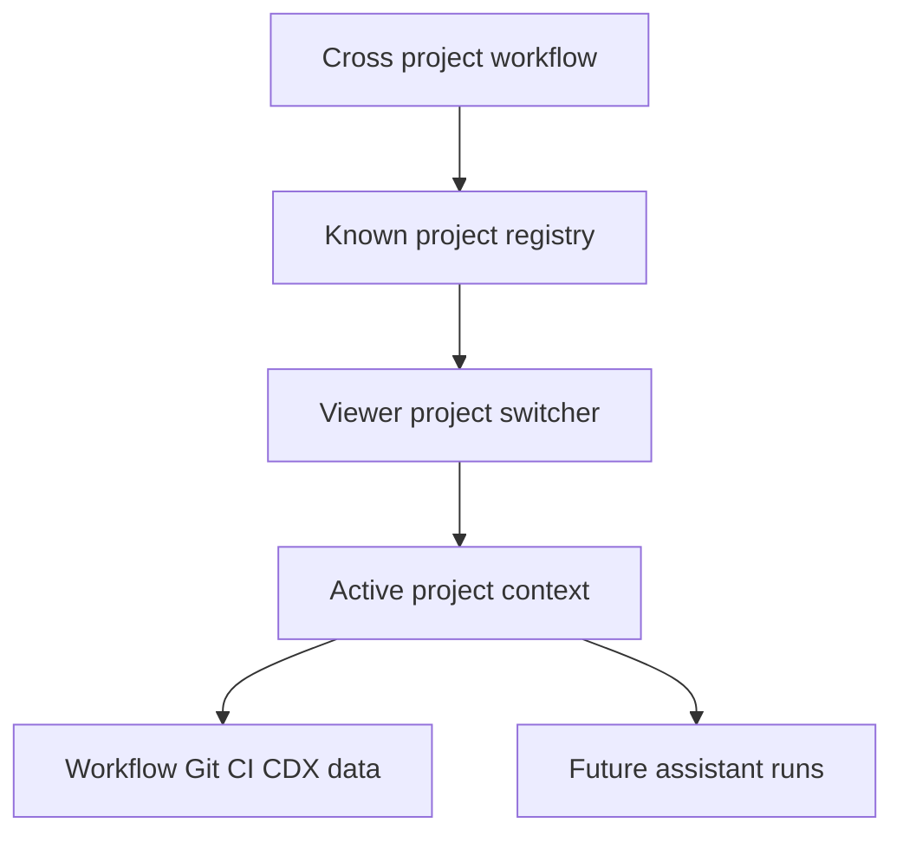

## req_231_add_multi_project_navigation_to_the_logics_viewer - Add multi-project navigation to the Logics viewer
> From version: 2.6.1
> Schema version: 1.0
> Status: Done
> Understanding: 97%
> Confidence: 92%
> Complexity: High
> Theme: Viewer navigation
> Reminder: Update status/understanding/confidence and linked backlog/task references when you edit this doc.

# Needs
- The Logics viewer should let an operator move between known projects without stopping and relaunching a separate viewer for each repository.
- Operators working across Logics, CDX, and product repositories need quick project switching to inspect workflow state, Git/CI/CDX status, and future assistant runs in the right context.
- Project navigation must stay safe: the browser UI should not be able to request arbitrary filesystem paths outside a backend-controlled allowlist.

# Context
- The current local viewer is primarily scoped to the repository where `logics-manager view` was launched.
- Recent work added richer local viewer cockpits for Git, CI, CDX, and workflow activity, and planned assistant run visibility will make cross-project context switching more valuable.
- The operator has multiple related repositories on disk, including `logics-manager`, `cdx-manager`, and `cdx-logics-vscode`, and wants to navigate between them from one viewer surface.
- A project switcher should support both immediate local use and a future multi-project cockpit where runs and workflow state can be filtered by project.

# Scope
- In: add a project switcher to the local Logics viewer topbar as part of the left-side viewer identity/context area.
- In: evolve the current repository pill into a project selector button/menu so the active project is always visible.
- In: introduce a backend project registry or discovery mechanism that returns known project entries with name, path, current selection, Logics availability, and recent/opened metadata.
- In: allow switching the active viewer project only to paths that are explicitly registered, discovered, or configured by the backend.
- In: reload workflow data, viewer documents, Git status, CI status, CDX status, and future assistant run state for the selected project.
- In: remember the last selected project when appropriate so reopening the viewer can restore the operator's working context.
- In: expose clear empty/error states for projects without Logics docs, missing Git metadata, unavailable CDX, or inaccessible paths.
- In: keep project labels scan-friendly and avoid leaking long absolute paths as the primary UI label while keeping the full path available for confirmation/debug.
- In: provide tests for registry serialization, safe switching, unavailable project handling, and UI state updates after switching.
- Out: remote project browsing or network workspace management.
- Out: accepting arbitrary path input directly from browser requests without backend validation.
- Out: merging multiple project boards into one combined board in the first slice.
- Out: implementing the assistant runs cockpit itself; this request should make the viewer capable of selecting the project context that cockpit will use.

# Placement decision
- The project selector should live on the left side of the topbar next to `Logics Viewer`, replacing or extending the current repository pill.
- The selected project label should be the primary visible context, for example `Logics Viewer  [logics-manager v]`.
- The full absolute path should remain available in the existing metadata line, tooltip, or menu detail for confirmation and debugging.
- Topbar actions such as `Git`, `CI`, `CDX`, and `Settings` should remain grouped on the right because they act on the selected project rather than define it.
- On narrow viewports, the project selector can wrap below the title or take the full topbar row, but it should remain visually tied to the active project context rather than move into the actions cluster.

# Acceptance criteria
- AC1: The viewer exposes a project navigation control in the left-side identity/context area of the topbar, replacing or extending the repository pill.
- AC2: Selecting a project changes the active viewer context and reloads the board/document data from that project's Logics corpus.
- AC3: Git, CI, CDX, and activity/status panels use the selected project context after a switch rather than the original launch repository.
- AC4: The backend rejects switching to paths that are not in the known/allowed project registry.
- AC5: The viewer clearly handles projects with no Logics corpus, missing Git metadata, unavailable CDX status, or inaccessible paths.
- AC6: The selected project can be restored or shown as the current context after refresh.
- AC7: The implementation provides a stable JSON surface for listing projects and switching/inspecting the active project.
- AC8: The topbar keeps project context visually separate from right-side actions such as Git, CI, CDX, and Settings.
- AC9: Tests cover backend allowlist behavior, project registry payloads, switching success/failure, UI rendering, and data refresh after switching.

# Definition of Ready (DoR)
- [x] Problem statement is explicit and user impact is clear.
- [x] Scope boundaries (in/out) are explicit.
- [x] Acceptance criteria are testable.
- [x] Dependencies and known risks are listed.

# Dependencies and risks
- The viewer backend must keep filesystem access bounded to trusted project roots.
- Switching projects can invalidate currently open document/detail selections, so the UI needs a predictable reset or restoration policy.
- Project discovery should avoid expensive full-disk scans; configured roots, recent launches, or bounded workspace discovery are safer defaults.
- Existing endpoints may assume one immutable repo root and will need careful context plumbing.
- Cross-project CDX status may be unavailable until CDX exposes enough project-aware data.

# Companion docs
- Product brief(s): (none yet)
- Architecture decision(s): (none yet)

# References
- `logics_manager/viewer.py`
- `logics_manager/viewer_assets/viewer/browser-host.js`
- `logics_manager/viewer_assets/viewer/index.html`
- `logics_manager/viewer_assets/viewer/viewer.css`
- `logics_manager/viewer_assets/media/mainApp.js`
- `logics/request/req_230_add_logics_assistant_runs_cockpit_and_report_to_workflow_actions.md`

# AI Context
- Summary: Add safe multi-project navigation to the local Logics viewer so operators can switch between known repositories and reload workflow, Git, CI, CDX, and future assistant run context.
- Keywords: multi-project viewer, project switcher, project registry, active project, safe filesystem allowlist, cross-repo navigation
- Use when: Designing or implementing viewer project switching, project registry APIs, or cross-project context handling.
- Skip when: Work is only about a single-project board feature or the assistant runs cockpit itself.

# Backlog
- none
- `item_397_add_multi_project_navigation_to_the_logics_viewer`
