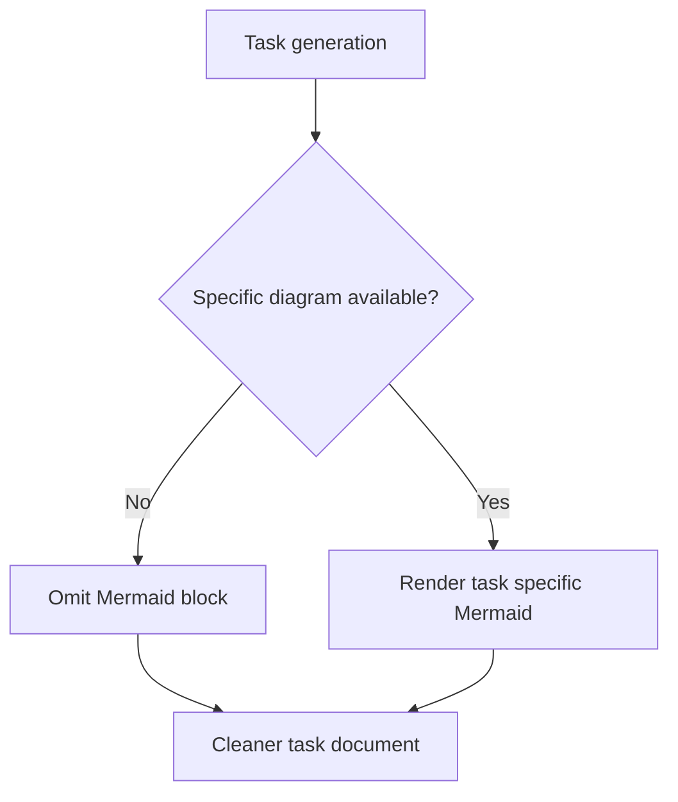

## req_232_stop_generating_generic_task_mermaid_diagrams - Stop generating generic task Mermaid diagrams
> From version: 2.6.1
> Schema version: 1.0
> Status: Ready
> Understanding: 96%
> Confidence: 91%
> Complexity: Medium
> Theme: Logics document quality
> Reminder: Update status/understanding/confidence and linked backlog/task references when you edit this doc.

# Needs
- Logics task documents should stop receiving generic Mermaid diagrams that only repeat the Logics delivery lifecycle.
- A task diagram should either explain something specific about the task's implementation or be omitted.
- Generated task docs should prioritize useful execution context over decorative process diagrams.

# Context
- Current generated task docs often include a generic diagram such as `Backlog -> Build -> Validate -> Close`.
- That diagram is mechanically true but usually not useful; it restates the workflow every task already follows.
- The Mermaid block takes space and makes task documents look more informative than they are.
- For technical work, a Mermaid diagram is still valuable when it models a real task-specific flow, data path, UI interaction, state transition, or architecture decision.
- The generator should therefore default to no task Mermaid unless it can produce a specific, meaningful diagram.

# Scope
- In: change task generation so default task templates do not include generic Logics lifecycle Mermaid diagrams.
- In: keep Mermaid allowed in task docs when the diagram describes task-specific behavior, architecture, data flow, state transitions, or UI interactions.
- In: update flow generation tests and snapshots that expect the generic task diagram.
- In: update any documentation or examples that imply every generated task should contain Mermaid.
- In: make generated tasks remain valid under Logics lint without a Mermaid block.
- Out: removing useful Mermaid diagrams from existing tasks by bulk migration.
- Out: changing request or backlog Mermaid generation unless a separate request covers those document types.
- Out: building AI diagram synthesis for every task; omission is acceptable when no meaningful diagram exists.

# Acceptance criteria
- AC1: Newly generated task documents do not include the generic Logics lifecycle Mermaid diagram by default.
- AC2: Task documents without Mermaid still pass Logics lint and closeout validation.
- AC3: The generator still permits task-specific Mermaid when a caller/template explicitly provides meaningful task behavior or architecture.
- AC4: Request and backlog Mermaid behavior is unchanged.
- AC5: Tests cover task generation without Mermaid and protect against the old generic `Backlog -> Build -> Validate -> Close` diagram returning by default.
- AC6: Documentation or examples that describe generated task structure are updated to match the new default.

# Definition of Ready (DoR)
- [x] Problem statement is explicit and user impact is clear.
- [x] Scope boundaries (in/out) are explicit.
- [x] Acceptance criteria are testable.
- [x] Dependencies and known risks are listed.

# Dependencies and risks
- Existing lint rules must not require Mermaid in tasks.
- Snapshot tests may need updates if they currently encode the generic task diagram.
- Some generated task docs may feel sparse after removing the diagram, so the surrounding sections should remain clear and useful.

# Companion docs
- Product brief(s): (none yet)
- Architecture decision(s): (none yet)

# References
- `logics_manager/flow.py`
- `tests/python/test_flow.py`
- `tests/python/test_logics_manager_cli.py`

# AI Context
- Summary: Stop generating generic task Mermaid lifecycle diagrams by default, while still allowing meaningful task-specific diagrams when they explain real implementation behavior.
- Keywords: task template, Mermaid, generic diagram, document quality, flow generation, lint
- Use when: Updating task generation templates, flow promotion output, or tests around generated task document structure.
- Skip when: Work is about request/backlog diagrams or editing a hand-authored meaningful task diagram.

# Backlog
- none
- `item_398_stop_generating_generic_task_mermaid_diagrams`
