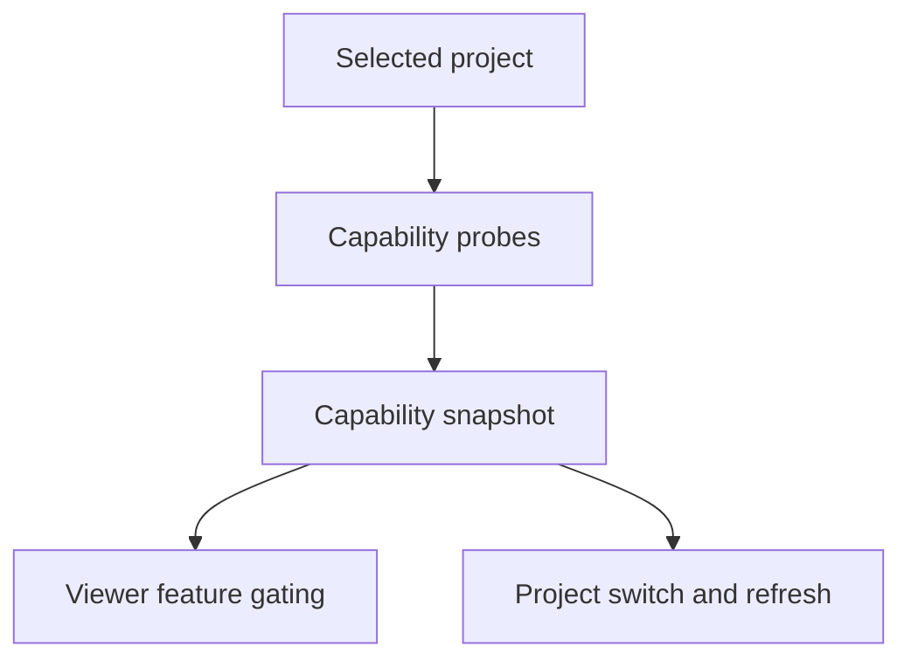

## req_233_add_project_capability_detection_for_viewer_features - Add project capability detection for viewer features
> From version: 2.6.1
> Schema version: 1.0
> Status: Done
> Understanding: 97%
> Confidence: 92%
> Complexity: High
> Theme: Viewer resilience
> Reminder: Update status/understanding/confidence and linked backlog/task references when you edit this doc.

# Needs
- The Logics viewer should detect which project capabilities are available before enabling feature surfaces.
- A selected project may not have Logics, Git, CI, CDX, or assistant-run support, and that must be a first-class state rather than an exceptional failure.
- Feature availability should be represented by a stable backend capability snapshot that all viewer panels can consume.

# Context
- Multi-project viewer navigation will let one viewer switch between repositories with very different setup states.
- Some projects may be new folders, non-Git folders, private repositories, Git repositories without CI, or projects where CDX is not installed.
- Current viewer actions are mostly feature-specific and can attempt calls independently; the next design should make availability explicit up front.
- A capability snapshot lets the UI hide, disable, or explain actions consistently before making expensive or doomed endpoint calls.

# Scope
- In: add a per-project capability model for the selected viewer project.
- In: include at least Logics corpus, Git repository, CI visibility/configuration, CDX availability, and CDX run registry availability.
- In: expose a stable JSON endpoint or payload section with capability state, reason, and optional next action hints for each capability.
- In: distinguish `ready`, `missing`, `unavailable`, `unsupported`, `unauthorized`, `unconfigured`, and `error` states where meaningful.
- In: ensure capability detection is cheap and bounded enough to run on project switch and refresh.
- In: make capabilities available to the browser host before rendering dependent panels.
- Out: implementing each feature panel's final disabled/empty-state UI; that belongs in follow-up gating requests.
- Out: remote project discovery or arbitrary filesystem scanning.
- Out: treating missing capabilities as fatal viewer startup errors.

# Acceptance criteria
- AC1: The backend exposes a project capability snapshot for the active viewer project.
- AC2: The snapshot includes Logics, Git, CI, CDX, and CDX runs capabilities with state and human-readable reason fields.
- AC3: Capability states distinguish absent/unconfigured/unauthorized/unsupported cases from unexpected errors where possible.
- AC4: Capability detection runs when the viewer loads and when a project switch occurs.
- AC5: The browser host can consume the snapshot without calling every feature endpoint first.
- AC6: Tests cover representative project states: full project, no Git, no Logics corpus, no CDX, CI unavailable/private, and CDX runs unsupported.

# Definition of Ready (DoR)
- [x] Problem statement is explicit and user impact is clear.
- [x] Scope boundaries (in/out) are explicit.
- [x] Acceptance criteria are testable.
- [x] Dependencies and known risks are listed.

# Dependencies and risks
- Capability probes must be fast and must not perform mutating setup.
- CI availability can depend on remote provider access, tokens, private repository settings, or missing remotes.
- CDX may be installed globally, unavailable, too old for runs, or unavailable for a selected project.
- The model should be extensible because future capabilities will likely include assistant providers and project bootstrap actions.

# Companion docs
- Product brief(s): (none yet)
- Architecture decision(s): (none yet)

# References
- `logics_manager/viewer.py`
- `logics_manager/viewer_assets/viewer/browser-host.js`
- `logics/request/req_231_add_multi_project_navigation_to_the_logics_viewer.md`
- `logics/request/req_230_add_logics_assistant_runs_cockpit_and_report_to_workflow_actions.md`

# AI Context
- Summary: Add a backend project capability snapshot so the viewer knows which Logics, Git, CI, CDX, and assistant-run features are available before enabling dependent UI.
- Keywords: viewer capabilities, feature gating, project switch, Git unavailable, CI unavailable, CDX unavailable, runs unsupported
- Use when: Designing or implementing per-project feature detection, capability JSON payloads, or viewer gating inputs.
- Skip when: Work is only about the visual disabled-state treatment for an already detected capability.

# Backlog
- none
- `item_399_add_project_capability_detection_for_viewer_features`
