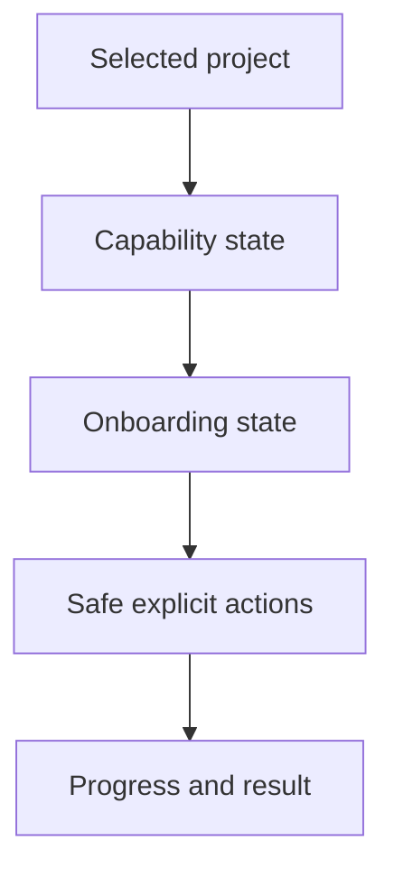

## req_234_add_new_project_onboarding_and_bootstrap_states_to_the_viewer - Add new project onboarding and bootstrap states to the viewer
> From version: 2.6.1
> Schema version: 1.0
> Status: Done
> Understanding: 97%
> Confidence: 92%
> Complexity: High
> Theme: Viewer onboarding
> Reminder: Update status/understanding/confidence and linked backlog/task references when you edit this doc.

# Needs
- The Logics viewer should guide operators when the selected project is new, incomplete, or not yet bootstrapped.
- A project without a Logics corpus, Git repository, runtime setup, or CDX integration should show clear states and safe next actions.
- Bootstrap/init actions must remain explicit and reviewable rather than happening automatically.

# Context
- Multi-project navigation makes it likely that operators will select folders that are not already healthy Logics projects.
- The existing extension/runtime already has bootstrap and environment-check concepts, but the local viewer needs a clear browser-facing onboarding state.
- Onboarding should use the capability snapshot rather than assuming all dependencies are present.
- Operators need to understand what will be created or changed before running bootstrap actions.

# Scope
- In: add viewer states for projects with no Logics corpus, invalid/incomplete Logics docs, missing Git repository, missing runtime support, and unavailable CDX.
- In: offer explicit safe actions such as `Bootstrap Logics`, `Initialize Git`, `Refresh`, `Open folder`, or `Check environment` only when supported by capability state.
- In: show what an action will do before it mutates the selected project.
- In: wire onboarding actions to the selected project only, respecting multi-project context.
- In: display progress/success/failure states for bootstrap and environment checks.
- In: keep onboarding accessible from empty project states and from capability detail views.
- Out: auto-running bootstrap on project selection.
- Out: forcing Git initialization as a requirement for viewing non-Git folders.
- Out: adding CDX installation flows beyond explaining that CDX is missing or unavailable.

# Acceptance criteria
- AC1: The viewer shows clear onboarding states when the selected project has no Logics corpus or incomplete Logics setup.
- AC2: The viewer can show missing Git as a normal project state and does not render Git-specific controls as if they work.
- AC3: Bootstrap/init actions are only shown when supported by capability state and require explicit user action.
- AC4: Mutating onboarding actions explain what will be created or changed before execution.
- AC5: Onboarding actions apply only to the active selected project.
- AC6: Progress, success, and failure states are visible after bootstrap/environment actions.
- AC7: Tests cover no-Logics, no-Git, missing runtime, failed bootstrap, successful bootstrap, and project-switch safety.

# Definition of Ready (DoR)
- [x] Problem statement is explicit and user impact is clear.
- [x] Scope boundaries (in/out) are explicit.
- [x] Acceptance criteria are testable.
- [x] Dependencies and known risks are listed.

# Dependencies and risks
- Depends on project capability detection so onboarding is driven by real project state.
- Bootstrap actions must be constrained to the selected project root and should not mutate unrelated repositories.
- Git initialization is a mutating operation and should be treated with explicit confirmation.
- Some projects may intentionally not use Logics or Git, so the UI should not shame or block them unnecessarily.

# Companion docs
- Product brief(s): (none yet)
- Architecture decision(s): (none yet)

# References
- `logics_manager/viewer.py`
- `logics_manager/bootstrap.py`
- `logics_manager/doctor.py`
- `logics/request/req_231_add_multi_project_navigation_to_the_logics_viewer.md`
- `logics/request/req_233_add_project_capability_detection_for_viewer_features.md`

# AI Context
- Summary: Add viewer onboarding states and explicit bootstrap/init actions for new or incomplete projects selected through the multi-project viewer.
- Keywords: new project onboarding, bootstrap Logics, initialize Git, missing Logics, missing Git, environment check, selected project
- Use when: Designing or implementing viewer empty states, bootstrap actions, environment checks, or selected-project onboarding flows.
- Skip when: Work is only about passive feature gating without bootstrap actions.

# Backlog
- none
- `item_400_add_new_project_onboarding_and_bootstrap_states_to_the_viewer`
