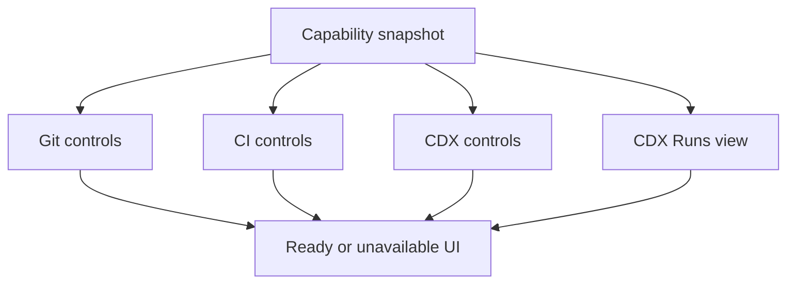

## req_235_gate_viewer_git_ci_cdx_and_runs_actions_by_project_availability - Gate viewer Git CI CDX and Runs actions by project availability
> From version: 2.6.1
> Schema version: 1.0
> Status: Done
> Understanding: 97%
> Confidence: 92%
> Complexity: High
> Theme: Viewer resilience
> Reminder: Update status/understanding/confidence and linked backlog/task references when you edit this doc.

# Needs
- The viewer should disable, hide, or explain Git, CI, CDX, and CDX Runs actions when the selected project does not support them.
- Missing dependencies should produce intentional UI states, not repeated failed calls or misleading controls.
- Operators should understand whether a feature is unavailable because it is absent, unconfigured, unauthorized, unsupported, or temporarily failing.

# Context
- Project capability detection will identify whether Git, CI, CDX, and CDX run registry support are available for the active project.
- The viewer currently has topbar actions for Git, CI, CDX, and planned CDX `Runs`, but not every selected project will support those features.
- Private repositories may hide CI, folders may not be Git repositories, and CDX may not be installed or may be too old for run tracking.
- The UI should avoid calling unavailable dependencies repeatedly once capability state says they are absent.

# Scope
- In: gate the Git topbar action and Git cockpit content when the selected project is not a Git repository or Git is unavailable.
- In: gate the CI action when the repository has no supported remote, CI is unconfigured, private/unavailable, unauthorized, or unsupported.
- In: gate the CDX action when CDX is missing, unavailable, or cannot inspect the selected project.
- In: gate the CDX `Runs` sub-view when CDX is missing or the installed CDX version does not expose run registry/status/report commands.
- In: provide clear disabled labels, tooltips, empty states, or unavailable panels for each non-ready capability.
- In: prevent automatic polling/refresh calls for feature endpoints that capability state marks as unavailable.
- In: keep manual refresh/check actions available where they make sense, without spamming failing dependencies.
- Out: implementing the capability probe model itself.
- Out: adding install flows for Git, CI providers, or CDX.
- Out: making private CI visible without required credentials.

# Acceptance criteria
- AC1: Git controls are disabled, hidden, or replaced with a clear unavailable state when the selected project is not a Git repository.
- AC2: Git-specific refs such as branch, history, staged files, and diff preview are not shown as active content for non-Git projects.
- AC3: CI controls clearly handle unconfigured, private, unauthorized, unsupported, and unavailable CI states.
- AC4: CDX controls clearly handle missing CDX, unavailable CDX, and unsupported CDX project/runtime states.
- AC5: The CDX `Runs` view is disabled or marked unsupported when CDX run registry/status/report commands are not available.
- AC6: The viewer avoids automatic calls to endpoints for capabilities marked unavailable, except for explicit refresh/check actions.
- AC7: Tooltips, labels, or empty states explain why each unavailable action cannot run and what the operator can do next when applicable.
- AC8: Tests cover no Git, private/unavailable CI, missing CDX, old CDX without Runs, and recovery after capability refresh.

# Definition of Ready (DoR)
- [x] Problem statement is explicit and user impact is clear.
- [x] Scope boundaries (in/out) are explicit.
- [x] Acceptance criteria are testable.
- [x] Dependencies and known risks are listed.

# Dependencies and risks
- Depends on project capability detection.
- Disabled controls must still be discoverable enough to explain why a feature is missing.
- CI unavailable is not always an error; private or unconfigured repos need neutral language.
- The Runs view depends on future CDX commands, so unsupported version handling must be explicit.

# Companion docs
- Product brief(s): (none yet)
- Architecture decision(s): (none yet)

# References
- `logics_manager/viewer_assets/viewer/browser-host.js`
- `logics_manager/viewer_assets/viewer/index.html`
- `logics_manager/viewer_assets/viewer/viewer.css`
- `logics/request/req_233_add_project_capability_detection_for_viewer_features.md`
- `logics/request/req_230_add_logics_assistant_runs_cockpit_and_report_to_workflow_actions.md`

# AI Context
- Summary: Gate Git, CI, CDX, and CDX Runs controls from the project capability snapshot so unavailable dependencies show intentional states and avoid unnecessary failing calls.
- Keywords: disabled controls, Git unavailable, CI private, CDX missing, Runs unsupported, feature gating, viewer resilience
- Use when: Implementing viewer action availability, disabled states, endpoint call suppression, or unavailable dependency messages.
- Skip when: Work is only about detecting capabilities rather than using them in UI controls.

# Backlog
- none
- `item_401_gate_viewer_git_ci_cdx_and_runs_actions_by_project_availability`
