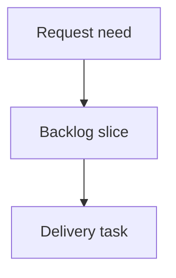

## req_236_preview_files_without_git_diffs_in_the_git_screen - Preview files without Git diffs in the Git screen
> From version: 2.7.1
> Schema version: 1.0
> Status: Draft
> Understanding: 92%
> Confidence: 87%
> Complexity: Medium
> Theme: Git workflow visibility
> Reminder: Update status/understanding/confidence and linked backlog/task references when you edit this doc.

# Needs
- In the local viewer Git screen, selecting a changed-file item that has no useful Git diff should still show useful read-only context by falling back to a file preview when the current file content is available.
- Operators should not hit an empty or low-value diff panel for cases such as untracked files, unchanged selected modes, or files where Git returns no diff content but the file can still be inspected safely.
- The fallback must clearly distinguish a file preview from a diff preview so users do not mistake current file contents for a patch.

# Context
- The Git cockpit already groups local changes and uses the right-hand detail area for selected-file context.
- Recent UI cleanup hides the diff detail area for non-file subviews such as History and Remote, but file-oriented subviews still need a useful detail response for every selectable row.
- Today the detail area can report that no diff is available, which is technically correct but less useful than showing the current file body when that file is readable.
- A safe fallback should preserve the read-only nature of the viewer and reuse existing bounded preview patterns where practical.
- This is especially useful for untracked files: Git status can list them before they have a meaningful tracked-base diff, but the operator still needs to inspect their content before deciding whether to stage or ignore them.

# Acceptance criteria
- AC1: When a selected Git file row produces no useful diff but the current file is readable text, the detail area renders a bounded read-only file preview instead of only an empty/no-diff message.
- AC2: The detail area labels fallback content as `File preview` or an equivalent explicit mode, keeping it visually and semantically distinct from `Diff preview`.
- AC3: Deleted files, missing files, binary/unsupported files, unsafe paths, and oversized files produce clear bounded messages rather than attempting to render misleading content.
- AC4: Existing diff behavior remains unchanged when a real diff is available, including staged versus worktree diff mode.
- AC5: File preview fallback works from the same file-oriented Git subviews that can select files: Changes, Staged, Worktree, and Untracked.
- AC6: The backend endpoint or payload used for fallback remains read-only, path-safe, and size-bounded.
- AC7: Tests cover at least one no-diff readable-file fallback, one unsupported/missing fallback, and the existing diff-first behavior.

# Definition of Ready (DoR)
- [ ] Problem statement is explicit and user impact is clear.
- [ ] Scope boundaries (in/out) are explicit.
- [ ] Acceptance criteria are testable.
- [ ] Dependencies and known risks are listed.

# Companion docs
- Product brief(s): (none yet)
- Architecture decision(s): (none yet)

# References
- `logics_manager/viewer.py`
- `clients/viewer/browser-host.js`
- `logics_manager/viewer_assets/viewer/browser-host.js`
- `tests/viewer.browser-host.test.ts`
- `tests/python/test_logics_manager_cli.py`

# AI Context
- Summary: Add a read-only file preview fallback in the local viewer Git screen when a selected file has no useful Git diff.
- Keywords: git cockpit, file preview, diff fallback, untracked files, local viewer, read-only detail panel
- Use when: Planning or implementing selected-file fallback behavior in the Git screen detail area.
- Skip when: Work targets Git history, commit badges, staging actions, or write-capable Git operations.

# Backlog
- `item_402_preview_files_without_git_diffs_in_the_git_screen`
