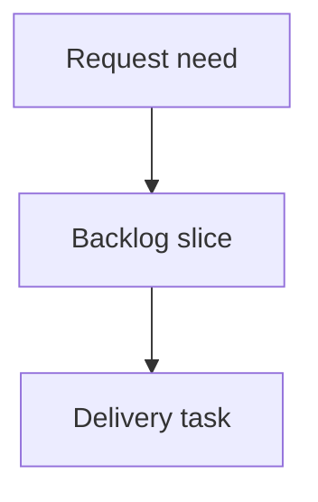

## req_237_avoid_unnecessary_viewer_refresh_work_when_state_is_unchanged - Avoid unnecessary viewer refresh work when state is unchanged
> From version: 2.7.1
> Schema version: 1.0
> Status: Draft
> Understanding: 92%
> Confidence: 87%
> Complexity: Medium
> Theme: Viewer performance
> Reminder: Update status/understanding/confidence and linked backlog/task references when you edit this doc.

# Needs
- The local viewer should avoid doing expensive or visually disruptive refresh work when a refresh observes the same effective project state as the previous refresh.
- Operators frequently refresh to check whether Git, CDX, CI, health, or corpus state changed; when nothing changed, the viewer should confirm the check without needlessly rerendering the active screen, resetting local panel state, or reloading detail content.
- The optimization must preserve correctness: the viewer still needs to perform enough lightweight observation to know whether state changed, and explicit manual refresh must remain trustworthy.

# Context
- The viewer already refreshes several independent surfaces: corpus items, Git badges/status, CI/CDX capability, CDX status/runs, health, and secondary document panels.
- Some refreshes can reload the same payload and rerender panels even when the meaningful state is identical, which creates unnecessary work and can disturb active UI context.
- A safe approach is to compute a deterministic state signature for the meaningful payload subset, compare it with the previous signature, and skip costly rerenders when the signature is unchanged.
- This should not mean "skip all probes": the viewer must still perform the bounded checks needed to detect changes. The saving is in avoiding redundant DOM replacement, detail reloads, and downstream panel work when the observed state did not change.
- Manual refresh and automatic/background refresh may need different behavior: manual refresh can still update a "checked" signal, while a force option can bypass the unchanged-state shortcut if needed.

# Acceptance criteria
- AC1: The viewer defines a stable state signature for the refresh-relevant data it already observes, covering at minimum corpus item identity/status timestamps, Git branch/count/badge state, and project capability state.
- AC2: When a refresh produces the same signature as the previous refresh, the viewer avoids replacing the active document/panel content and avoids reloading selected detail content solely because refresh was requested.
- AC3: When the signature changes, the viewer performs the normal update path and the UI reflects the new Git/CDX/CI/health/corpus state.
- AC4: Manual refresh still provides visible feedback that a check occurred, even when no state changed.
- AC5: A force-refresh path or equivalent escape hatch can bypass the unchanged-state shortcut for debugging or recovery.
- AC6: The signature comparison is deterministic and ignores volatile fields that should not trigger UI rerenders on their own, such as "checked at" timestamps or transient fetch bookkeeping.
- AC7: Tests cover unchanged refresh, changed refresh, manual no-change feedback, and at least one active-panel preservation case.
- AC8: The implementation does not introduce persistent cache complexity or stale-state risk beyond the current in-memory viewer session.

# Definition of Ready (DoR)
- [ ] Problem statement is explicit and user impact is clear.
- [ ] Scope boundaries (in/out) are explicit.
- [ ] Acceptance criteria are testable.
- [ ] Dependencies and known risks are listed.

# Companion docs
- Product brief(s): (none yet)
- Architecture decision(s): (none yet)

# References
- `clients/viewer/browser-host.js`
- `logics_manager/viewer_assets/viewer/browser-host.js`
- `logics_manager/viewer.py`
- `tests/viewer.browser-host.test.ts`
- `tests/python/test_logics_manager_cli.py`

# AI Context
- Summary: Add deterministic unchanged-state detection to the local viewer refresh flow so repeated refreshes skip costly rerenders when the observed state is identical.
- Keywords: local viewer, refresh optimization, state signature, rerender avoidance, Git status, CDX status, corpus refresh
- Use when: Planning or implementing refresh behavior that should distinguish real state changes from repeated identical payloads.
- Skip when: Work targets server-side indexing performance only, unrelated panel layout changes, or persistent cross-session caching.

# Backlog
- `item_403_avoid_unnecessary_viewer_refresh_work_when_state_is_unchanged`
