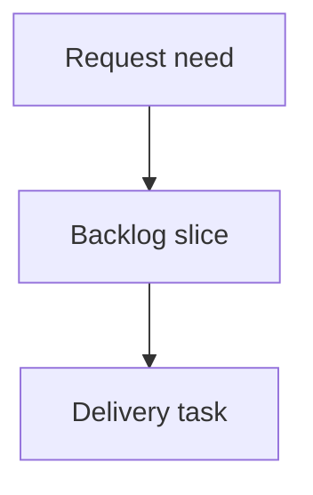

## req_238_block_concurrent_viewer_actions_and_show_loading_state - Block concurrent viewer actions and show loading state
> From version: 2.7.2
> Schema version: 1.0
> Status: Done
> Understanding: 93%
> Confidence: 88%
> Complexity: Medium
> Theme: Viewer interaction feedback
> Reminder: Update status/understanding/confidence and linked backlog/task references when you edit this doc.

# Needs
- The local viewer should make asynchronous actions visibly busy while they are loading and prevent competing actions from being triggered until the current operation settles.
- Operators currently can click other topbar or panel actions during normal network/runtime latency, which can create duplicate requests, competing document replacements, confusing status text, or unclear "did my click work?" moments.
- The UI should provide immediate feedback that an action is in progress, while preserving lightweight local interactions that do not compete with the active async operation.

# Context
- The viewer has several async actions that can replace the active document or fetch runtime state: refresh, Git, CI, CDX, Health, project switching, CDX runs/report fetches, and request creation flows.
- Some interactions are purely local and should remain responsive, such as revealing already-rendered rows, closing panels, or changing simple filters that do not start remote work.
- A pragmatic implementation should introduce a small busy-state model around async action handlers, not a broad application freeze.
- Busy state should be released in `finally` paths so errors do not leave the UI locked.
- The loading treatment should be visible but restrained: disabled competing actions, an in-button or topbar loading indicator, and status text are enough.

# Acceptance criteria
- AC1: Starting a primary async viewer action marks that action as loading and shows visible feedback before the awaited work completes.
- AC2: While a primary async action is loading, competing primary async actions are disabled or ignored so double-clicks and rapid cross-action clicks do not start duplicate/conflicting requests.
- AC3: The busy state is always cleared after success or failure, and errors leave the viewer interactive again.
- AC4: Local-only interactions that do not fetch or replace active content remain usable while safe, or are explicitly documented if they are intentionally blocked.
- AC5: The loading feedback identifies either the active action or a generic viewer loading state so users can tell that the click was accepted.
- AC6: Tests cover duplicate-click prevention for at least one network-backed action and competing-action prevention between two primary actions.
- AC7: Tests cover error cleanup so a failed async action does not leave buttons disabled or the loader visible.
- AC8: Existing action-specific guards such as Git history reveal busy handling continue to work and are not replaced by a less precise global lock.

# Definition of Ready (DoR)
- [x] Problem statement is explicit and user impact is clear.
- [x] Scope boundaries (in/out) are explicit.
- [x] Acceptance criteria are testable.
- [x] Dependencies and known risks are listed.

# Companion docs
- Product brief(s): (none yet)
- Architecture decision(s): (none yet)

# References
- `clients/viewer/browser-host.js`
- `clients/viewer/viewer.css`
- `logics_manager/viewer_assets/viewer/browser-host.js`
- `logics_manager/viewer_assets/viewer/viewer.css`
- `tests/viewer.browser-host.test.ts`

# AI Context
- Summary: Add visible loading state and concurrency guards for primary async actions in the local viewer.
- Keywords: local viewer, loading state, busy state, disabled actions, duplicate click prevention, async UI guard
- Use when: Planning or implementing viewer behavior around async button clicks, fetch-backed panels, project switching, or refresh actions.
- Skip when: Work targets backend command performance only, purely local filter interactions, or unrelated panel layout changes.

# Backlog
- `item_404_block_concurrent_viewer_actions_and_show_loading_state`
