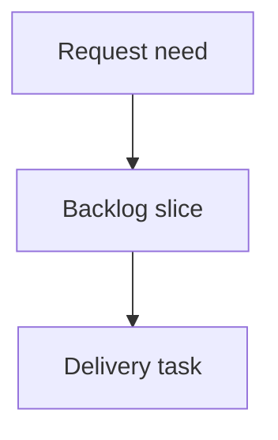

## req_239_launch_guided_cdx_missions_from_the_logics_viewer - Launch guided CDX missions from the Logics viewer
> From version: 2.7.0 (refreshed)
> Schema version: 1.0
> Status: Done
> Understanding: 100% (refreshed)
> Confidence: 95%
> Complexity: Medium
> Theme: CDX run orchestration
> Reminder: Update status/understanding/confidence and linked backlog/task references when you edit this doc.

# Needs
- The local Logics viewer should let operators launch guided CDX missions directly from the CDX screen instead of leaving the viewer to assemble commands manually.
- The first experience should focus on safe, opinionated missions such as a full audit, a review since the latest release tag, and preparing the Logics corpus for development from open workflow requests.
- Operators should be able to choose the target session, execution strength, and scope before launch, see a clear command/plan preview, and inspect run status and usage after execution.
- CDX should provide reasoning and analysis, while Logics remains responsible for deterministic workflow mutations such as promoting requests into backlog items/tasks after operator confirmation.

# Context
- The CDX screen already surfaces runtime status, sessions, providers, safe next commands, and runs.
- The next operator step is to turn that status surface into a controlled launch surface for common Logics/CDX missions.
- A free-form terminal is too risky for the viewer. The UI should expose a curated catalog of missions that map to safe command templates and bounded backend endpoints.
- "Prepare corpus ready for dev" must be plan-first: CDX can propose a workflow corpus plan, but Logics should show the plan and apply deterministic `logics-manager flow` changes only after explicit confirmation.
- Usage and cost observability matters for these runs. If CDX exposes token usage, the viewer should show it; otherwise it should at least record duration, session, provider/model, status, and bounded output/summary.

# Acceptance criteria
- AC1: The CDX screen exposes a `New CDX Run` or equivalent entry point for launching guided missions.
- AC2: The first mission catalog includes at least `Full audit`, `Review since latest release`, and `Prepare corpus ready for dev`.
- AC3: Mission setup lets the operator choose a CDX session and an execution strength such as Standard, Deep, or Max, using available CDX status data where possible.
- AC4: Scope selection supports at least repository-wide audit, latest-release-tag comparison, and open workflow docs/requests as the corpus-preparation target.
- AC5: Before launch, the viewer shows a safe preview of the planned command or execution plan, including detected tag/scope and any risk/availability warnings.
- AC6: The backend execution path is constrained to known mission templates and does not accept arbitrary shell commands from the browser.
- AC7: Runs report status, bounded output or summary, and usage metadata when available, including token usage if CDX exposes it.
- AC8: The corpus-preparation mission is plan-first and requires explicit confirmation before Logics applies workflow mutations such as request-to-backlog or backlog-to-task promotions.
- AC9: Failure states such as missing CDX, unavailable session, low quota, missing release tag, command failure, or unsupported usage metadata are shown clearly without corrupting viewer state.
- AC10: Tests cover mission command generation, session/strength selection, launch guardrails, run status rendering, usage metadata rendering, and plan-first corpus preparation behavior.

# Definition of Ready (DoR)
- [x] Problem statement is explicit and user impact is clear.
- [x] Scope boundaries (in/out) are explicit.
- [x] Acceptance criteria are testable.
- [x] Dependencies and known risks are listed.

# Companion docs
- Product brief(s): (none yet)
- Architecture decision(s): (none yet)

# References
- `clients/viewer/browser-host.js`
- `clients/viewer/viewer.css`
- `logics_manager/viewer.py`
- `logics_manager/viewer_assets/viewer/browser-host.js`
- `logics_manager/viewer_assets/viewer/viewer.css`
- `tests/viewer.browser-host.test.ts`
- `tests/python/test_logics_manager_cli.py`

# AI Context
- Summary: Add guided CDX mission launch support to the local Logics viewer, including mission selection, session/strength controls, plan preview, constrained execution, and run usage reporting.
- Keywords: CDX runs, guided missions, full audit, release review, corpus preparation, session selection, token usage, safe command templates
- Use when: Planning or implementing CDX launch workflows from the local viewer.
- Skip when: Work only displays passive CDX status or modifies unrelated Git/CI/Health panels.

# Backlog
- `item_405_define_guided_cdx_mission_catalog_and_setup_ui`
- `item_406_add_constrained_cdx_mission_execution_and_run_usage_reporting`
- `item_407_make_corpus_preparation_a_plan_first_cdx_and_logics_workflow`

# Report
- Delivered in task `task_213_orchestrate_guided_cdx_mission_launch_delivery`.
- The CDX screen now exposes a `Missions` tab for `Audit complet`, `Review depuis derniere release`, and `Preparer le corpus pret a dev`.
- Mission execution is constrained by backend templates and validates mission id, session id, strength, and release tag requirements.
- Run output is bounded and token usage is rendered when CDX exposes it.
- Corpus preparation is plan-first and only applies allowlisted `logics-manager flow` operations after explicit confirmation.
