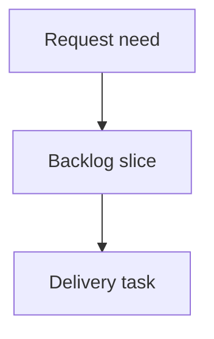

## req_240_make_logics_manager_cli_agent_friendly_for_workflow_inspection_and_closeout - Make logics-manager CLI agent-friendly for workflow inspection and closeout
> From version: 2.7.0
> Schema version: 1.0
> Status: Ready
> Understanding: 93%
> Confidence: 88%
> Complexity: Medium
> Theme: Operator workflow
> Reminder: Update status/understanding/confidence and linked backlog/task references when you edit this doc.

# Needs
- Make `logics-manager` easier and safer for agents to use during workflow inspection, bounded context gathering, validation, and closeout.
- Recent delivery work exposed several CLI ergonomics gaps: `flow show` is an intuitive command but does not exist, `sync read-doc` did not surface useful body content by default, `context-pack` accepts only one ref even when agents naturally need a small multi-doc pack, and `sync refresh-mermaid-signatures` can modify unrelated docs when a scoped repair is needed.
- The CLI should guide agents toward correct commands, minimize noisy Git changes, and provide deterministic closeout helpers that repair predictable workflow hygiene issues before audit/lint fail.

# Context
- Project instructions tell agents to prefer `logics-manager` for workflow state and bounded document context.
- In practice, several necessary operations still forced fallback to raw file reads or manual repair:
  - `logics-manager flow show <ref>` returned an unsupported-command error instead of suggesting `sync read-doc`.
  - `sync read-doc <ref> --max-chars ...` returned metadata without the useful document body.
  - `sync context-pack` rejected multiple refs, although multi-doc task/backlog/request context is a common agent workflow.
  - `sync refresh-mermaid-signatures` refreshed many unrelated docs without an obvious scoped mode, creating avoidable Git noise.
  - closing eligible requests still left predictable DoR and Mermaid/indicator hygiene failures for agents to discover late through `audit` and `lint`.
- The intended outcome is not a broad CLI redesign. It is a focused agent-friendly layer over the existing workflow commands.

# Acceptance criteria
- AC1: Workflow inspection has a discoverable command path, including `flow show <ref>` or an equivalent alias that reads a workflow doc and gives actionable suggestions for unsupported subcommands.
- AC2: Bounded context commands support agent-friendly document reads: `sync read-doc` surfaces useful body content by default or via clear flags, and `context-pack` supports multiple refs or an explicitly documented multi-ref form.
- AC3: Mermaid signature refresh and deterministic workflow repairs can be scoped to one ref/path or changed docs so agents can fix one delivery without modifying unrelated workflow files.
- AC4: Closeout commands can handle the predictable end-of-delivery chain: close eligible requests, repair DoR/DoD and indicator hygiene where deterministic, refresh scoped Mermaid signatures, and run or report lint/audit status.
- AC5: Error messages for unsupported commands and invalid arity are actionable, naming the nearest valid command or syntax.
- AC6: Agent-facing documentation or cookbook examples cover common workflows: inspect one doc, inspect linked docs, gather a multi-doc context pack, close out a task/request chain, and repair scoped Mermaid/signature issues.
- AC7: Tests cover the new aliases/options, scoped behavior, closeout/repair behavior, and error-message guidance without requiring external services.

# Definition of Ready (DoR)
- [x] Problem statement is explicit and user impact is clear.
- [x] Scope boundaries (in/out) are explicit.
- [x] Acceptance criteria are testable.
- [x] Dependencies and known risks are listed.

# Companion docs
- Product brief(s): (none yet)
- Architecture decision(s): (none yet)

# References
- `logics_manager/flow.py`
- `logics_manager/sync.py`
- `logics_manager/assist.py`
- `logics_manager/lint.py`
- `logics_manager/audit.py`
- `tests/python/test_logics_manager_cli.py`

# AI Context
- Summary: Improve `logics-manager` CLI ergonomics for agents inspecting workflow docs, collecting bounded context, repairing scoped Mermaid/signature issues, and closing out completed workflow chains.
- Keywords: agent CLI, flow show, read-doc, context-pack, scoped mermaid refresh, closeout repair, workflow ergonomics
- Use when: Planning or implementing agent-friendly `logics-manager` command surfaces and closeout workflows.
- Skip when: Work targets unrelated viewer UI, backend business logic, or non-workflow CLI commands.

# Backlog
- `item_408_add_discoverable_workflow_inspection_aliases`
- `item_409_make_bounded_document_context_commands_agent_friendly`
- `item_410_scope_mermaid_signature_refresh_and_deterministic_closeout_repairs`
- `item_411_document_and_clarify_agent_cli_workflows`
