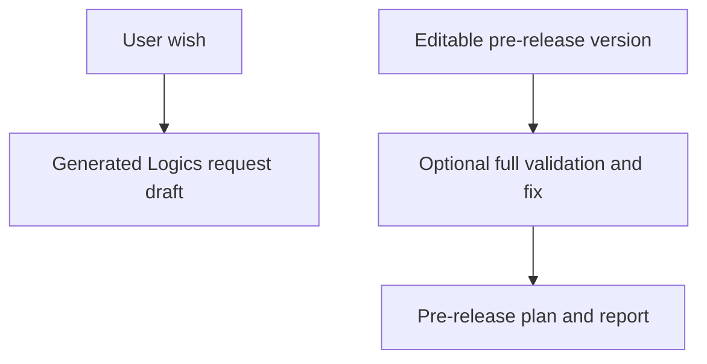

## req_241_add_wish_to_request_and_guided_pre_release_cdx_missions - Add wish-to-request and guided pre-release CDX missions
> From version: 2.7.0
> Schema version: 1.0
> Status: Done
> Understanding: 92%
> Confidence: 87%
> Complexity: Medium
> Theme: Guided mission workflow
> Reminder: Update status/understanding/confidence and linked backlog/task references when you edit this doc.

# Needs
- Add two guided CDX missions to the local viewer mission surface:
  - a low-risk `wish-to-request` mission that turns a free-form user wish into a structured Logics request draft
  - a guarded `pre-release` mission that helps prepare a pre-release from an editable semantic version, with an explicit full-validation-and-fix option before producing release material
- The missions should extend the guided mission workflow without adding publish/tag side effects in the first delivery slice.
- Operators should be able to start from intent instead of manually writing boilerplate requests or release-prep prompts, while still retaining review and validation gates.

# Context
- The viewer already exposes guided CDX missions through the CDX missions panel and backend mission catalog.
- Existing missions are oriented around audit/review/corpus preparation. The proposed additions cover two common next workflows:
  - capture a new product/engineering wish as a Logics request
  - prepare release material and validation evidence for a specific version
- The `wish-to-request` mission should be creation-oriented but bounded: it may create or propose one request document, but should not mutate unrelated workflow state.
- The `pre-release` mission is higher risk. It should initially generate a plan/report and optionally deterministic repair requests, not create tags, publish releases, push branches, or modify package versions unless a later request explicitly expands scope.
- The pre-release UI needs a version field editable as `vX.X.X` and a checkbox such as `Run full validation and fix before pre-release`.
- If the validation checkbox is selected, the mission should run the project-defined full validation path before finalizing the pre-release report and surface failures as actionable fixes or generated workflow docs.

# Acceptance criteria
- AC1: The viewer exposes a `wish-to-request` guided mission with a free-form input for the user's wish or intent.
- AC2: The `wish-to-request` mission produces a structured Logics request draft with needs, context, acceptance criteria, DoR state, references when available, and clear questions/open assumptions when the wish is under-specified.
- AC3: The `wish-to-request` mission remains read/write bounded to request creation or preview and does not promote backlog/tasks automatically unless explicitly added in a future request.
- AC4: The viewer exposes a guarded `pre-release` guided mission with an editable version field that validates `vX.X.X`-style semantic versions and rejects empty or malformed values.
- AC5: The `pre-release` mission includes an explicit checkbox for running full validation and fixing before pre-release; the UI and payload make the selected validation behavior unambiguous.
- AC6: The initial `pre-release` scope generates a pre-release plan/report, validation evidence, and actionable fixes or generated workflow docs when problems are found, without creating tags, publishing releases, pushing branches, or changing package versions.
- AC7: Backend mission payloads are path-safe, command-bounded, and auditable; any generated files are reported back to the viewer with IDs/paths.
- AC8: Tests cover mission catalog rendering, wish input payload handling, request draft generation path, version validation, validation-checkbox payload handling, and pre-release no-publish guarantees.
- AC9: Existing guided missions continue to work and remain visible after adding the new missions.

# Definition of Ready (DoR)
- [x] Problem statement is explicit and user impact is clear.
- [x] Scope boundaries (in/out) are explicit.
- [x] Acceptance criteria are testable.
- [x] Dependencies and known risks are listed.

# Companion docs
- Product brief(s): (none yet)
- Architecture decision(s): (none yet)

# References
- `logics_manager/viewer.py`
- `clients/viewer/browser-host.js`
- `logics_manager/viewer_assets/viewer/browser-host.js`
- `logics_manager/flow.py`
- `tests/python/test_logics_manager_cli.py`
- `tests/viewer.browser-host.test.ts`

# AI Context
- Summary: Add guided CDX missions for turning a free-form wish into a Logics request and preparing a guarded pre-release report for an editable semantic version.
- Keywords: CDX missions, wish-to-request, Logics request generation, pre-release, semantic version, full validation, release planning
- Use when: Planning or implementing new guided mission types in the local viewer CDX missions workflow.
- Skip when: Work targets publish-release automation, tag creation, unrelated viewer panels, or non-CDX workflow commands.

# Backlog
- `item_412_add_wish_to_request_guided_cdx_mission`
- `item_413_add_guarded_pre_release_guided_cdx_mission`
