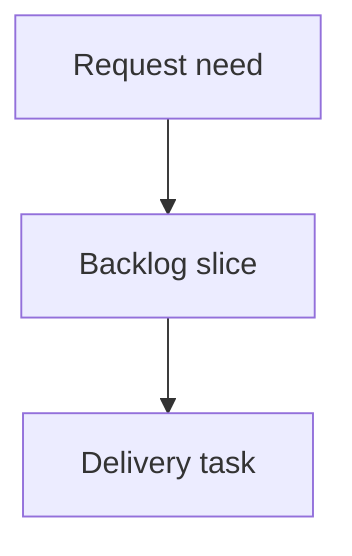

## req_242_address_full_audit_validation_and_documentation_drift - Address full audit validation and documentation drift
> From version: 2.8.0
> Schema version: 1.0
> Status: Draft
> Understanding: 90%
> Confidence: 86%
> Complexity: Medium
> Theme: Repository quality
> Reminder: Update status/understanding/confidence and linked backlog/task references when you edit this doc.

# Needs
- Address the actionable follow-up from the June 12, 2026 full repository audit without mixing broad product fixes into the audit closeout.
- The most important correctness gap is that `logics-manager audit --governance-profile strict` can report `ok: false`, hundreds of blocking findings, `can_continue: false`, and `release_ready: false` while the top-level CLI still exits with status 0.
- Documentation and validation also need cleanup: README badges are stale, dependency audit validation is blocked by external/cache assumptions in local runs, strict governance debt is large enough to be hidden by the passing standard audit, and several high-risk runtime/viewer surfaces remain oversized or weakly covered.

# Context
- Audit commands run on June 12, 2026:
  - `logics-manager status`, `health`, `audit`, and `lint` were clean under the standard workflow profile.
  - `npm run ci:check` passed, including compile, lint, TypeScript/Vitest coverage, Python CLI tests, extension smoke, npm CLI smoke, and VSIX package validation.
  - `npm run audit:logics:strict` printed `Workflow audit: FAILED` with 493 blocking token-hygiene findings, then still returned success because the top-level audit command exits 0.
  - `python3 -m logics_manager audit --governance-profile strict --format json` returned `ok: false`, `issue_count: 493`, `can_continue: false`, and `release_ready: false`, but exited 0 through the package CLI.
  - `logics_manager/audit.py` has a `main()` return contract for failure, while `logics_manager/cli.py` renders the same audit payload and returns 0 unconditionally for the `audit` command.
  - `npm audit --json` could not reach the registry in the sandbox, and default npm cache permissions also blocked `npm pack --dry-run` until a temp cache was supplied.
  - `npm pack --dry-run --json` with a temp cache succeeded for `@grifhinz/logics-manager@2.8.0`.
  - `npm run test:viewer-smoke` recorded a skip because this local environment cannot bind a localhost socket.
- Static audit notes:
  - `README.md` still advertises `version-v2.5.2` and `Vitest-2.1.8`, while `VERSION` and `package.json` are 2.8.0 and test output uses Vitest 4.1.x.
  - Large files remain in critical paths: `logics_manager/flow.py` is about 3361 lines, `logics_manager/viewer.py` about 2499 lines, `logics_manager/mcp.py` about 1554 lines, `clients/viewer/browser-host.js` about 4088 lines, and `tests/python/test_logics_manager_cli.py` about 5452 lines.
  - Coverage evidence from `npm run ci:check` shows some core extension/viewer modules below the overall average, including `logicsCodexWorkflowOperations.ts`, `logicsHybridAssistController.ts`, `logicsViewDocumentController.ts`, `logicsViewProvider.ts`, `harnessApi.js`, `hostApi.js`, `mainCore.js`, and `renderMarkdown.js`.
- Scope is follow-up planning and validation hardening only. Product/source fixes should be delivered through promoted backlog/tasks, not as part of an audit report artifact.

# Acceptance criteria
- AC1: Failed audit payloads produce nonzero process exits across `logics-manager audit`, `python -m logics_manager audit`, npm wrapper invocation, and relevant npm scripts, with tests covering JSON and text modes.
- AC2: Strict governance/token-hygiene debt is either reduced or explicitly separated from release-blocking standard audit gates so operators can see when strict mode is advisory versus mandatory.
- AC3: README and release-facing badges/docs are refreshed from current repository metadata or validated by a drift check so version/test-tooling badges do not lag releases.
- AC4: Dependency audit and package validation scripts document or implement local-cache and offline behavior clearly, distinguishing unreachable registry results from clean advisory status.
- AC5: Viewer smoke skips are visible in validation summaries and CI expectations, with at least one non-skipped CI lane or documented fallback proving the local viewer shell/API path.
- AC6: High-risk oversized runtime/viewer/test files have an actionable decomposition and coverage plan focused on correctness-critical surfaces rather than cosmetic refactors.
- AC7: Follow-up validation evidence includes standard audit/lint, strict audit exit behavior, npm package dry run, dependency audit outcome, and targeted tests for the changed validation contracts.

# Definition of Ready (DoR)
- [x] Problem statement is explicit and user impact is clear.
- [x] Scope boundaries (in/out) are explicit.
- [x] Acceptance criteria are testable.
- [x] Dependencies and known risks are listed.

# Companion docs
- Product brief(s): (none yet)
- Architecture decision(s): (none yet)

# References
- `logics_manager/cli.py`
- `logics_manager/audit.py`
- `logics_manager/flow.py`
- `logics_manager/viewer.py`
- `logics_manager/mcp.py`
- `clients/viewer/browser-host.js`
- `clients/shared-web/media/renderMarkdown.js`
- `clients/shared-web/media/harnessApi.js`
- `clients/shared-web/media/hostApi.js`
- `scripts/ci-check.mjs`
- `scripts/check-npm-audit.mjs`
- `tests/run_local_viewer_visual_smoke.mjs`
- `tests/python/test_logics_manager_cli.py`
- `README.md`

# AI Context
- Summary: Follow up on the June 2026 full repository audit by fixing failed audit exit codes, clarifying strict governance debt, refreshing stale README badges, hardening dependency/package validation, and planning focused coverage/decomposition for oversized critical surfaces.
- Keywords: audit exit code, strict governance, stale README badges, npm audit, viewer smoke, oversized modules, coverage gaps
- Use when: Planning validation hardening or documentation drift cleanup after a full repository audit.
- Skip when: Work targets unrelated feature delivery or direct source fixes outside the audit follow-up scope.

# Backlog
- `item_414_address_full_audit_validation_and_documentation_drift`
