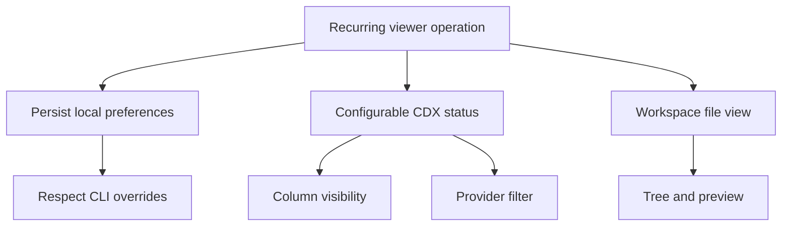

## req_243_persist_viewer_preferences_and_add_configurable_cdx_status_and_workspace_views - Persist viewer preferences and add configurable CDX status and workspace views
> From version: 2.8.0
> Schema version: 1.0
> Status: Done
> Understanding: 95%
> Confidence: 85%
> Complexity: High
> Theme: Viewer operator workflow
> Reminder: Update status/understanding/confidence and linked backlog/task references when you edit this doc.

# Needs
- Preserve operator choices in the local viewer between launches so repeated sessions do not reset frequently adjusted UI settings.
- Make the CDX status table configurable enough to hide low-signal columns and filter by provider without losing the default all-provider overview.
- Add a workspace-oriented file view to the viewer so operators can inspect repository files without switching away from the Logics cockpit.

# Context
- Operators use the local viewer as a recurring command cockpit, so transient UI-only state becomes friction when settings such as auto-refresh are adjusted on every launch.
- The CDX status surface is becoming denser. Columns such as `block` and `CR` should remain available, but they should be disabled by default and opt-in per user preference.
- Provider-specific investigations need a fast filter that does not change the underlying status data or hide new providers by accident.
- The viewer already exposes Git, CI, CDX, and workflow-focused screens. A workspace screen before Git would cover the file-system perspective and make non-Git file inspection available when the project supports it.
- Preferences should be local to the viewer/browser profile and should not override explicit CLI launch options.

# Acceptance criteria
- AC1: Viewer preferences are stored in a versioned local preference payload and survive viewer restarts in the same browser profile.
- AC2: Auto-refresh uses the priority `explicit CLI launch value > stored user preference > application default`, and UI slider changes persist only when the user changes the value in the viewer.
- AC3: The CDX status table has a settings icon button that opens a compact menu of column visibility checkboxes.
- AC4: CDX status column preferences persist across viewer restarts, with `block` and `CR` disabled by default and other existing status columns visible by default.
- AC5: The CDX status table has a provider-filter icon button next to the column settings button.
- AC6: Provider filtering persists across viewer restarts, defaults to all providers visible, and handles newly discovered providers without hiding them unexpectedly.
- AC7: A Workspace button appears before Git when the selected project exposes a workspace root or file-inspection capability.
- AC8: The Workspace screen provides a compact tree view on the left and a preview/details pane on the right for the selected object.
- AC9: Workspace file access is bounded to the selected workspace root, handles missing/unavailable workspace capability gracefully, and avoids reading large or binary files as plain text.
- AC10: Tests cover preference read/write precedence, CDX column defaults and persistence, provider filter persistence, workspace capability gating, tree selection, and preview safety limits.

# Definition of Ready (DoR)
- [x] Problem statement is explicit and user impact is clear.
- [x] Scope boundaries (in/out) are explicit.
- [x] Acceptance criteria are testable.
- [x] Dependencies and known risks are listed.

# Scope
- In:
  - Local viewer preference storage and migration guard for this preference payload.
  - Auto-refresh preference precedence and persistence.
  - CDX status table column visibility menu and persisted defaults.
  - CDX status provider filter menu and persisted selection semantics.
  - Workspace navigation button, capability gating, tree API/UI, and bounded preview behavior.
  - Unit/UI tests around state persistence and workspace safety behavior.
- Out:
  - Cloud synchronization of preferences across machines.
  - Writing or modifying workspace files from the Workspace screen.
  - Replacing the Git view or making the Workspace screen Git-specific.
  - Implementing a full IDE editor, search index, or large-file streaming viewer.

# Dependencies and risks
- Preference keys need stable identifiers for columns and providers so future labels can change without losing existing user choices.
- CLI-forced auto-refresh values must remain session overrides, not silently written into stored preferences.
- Workspace preview must normalize paths and reject traversal outside the selected workspace root.
- Large workspaces need bounded tree expansion and ignored directories so the screen remains responsive.
- Binary and large files need explicit preview fallbacks to avoid slow or unreadable rendering.

# Companion docs
- Product brief(s): (none yet)
- Architecture decision(s): (none yet)

# References
- `logics_manager/viewer.py`
- `logics_manager/viewer_assets/viewer/index.html`
- `logics_manager/viewer_assets/viewer/browser-host.js`
- `logics_manager/viewer_assets/media/mainApp.js`
- `logics_manager/viewer_assets/media/webviewChrome.js`
- `logics_manager/viewer_assets/media/hostApi.js`
- `tests/viewer.browser-host.test.ts`
- `tests/webview.harness-details-and-filters.test.ts`

# AI Context
- Summary: Persist local viewer preferences and add configurable CDX status controls plus a workspace file-inspection screen.
- Keywords: viewer-preferences, auto-refresh, cdx-status, column-visibility, provider-filter, workspace-tree, file-preview
- Use when: Planning or implementing persistent local viewer settings, CDX status configuration, or workspace file browsing in the Logics viewer.
- Skip when: The work is only about terminal `cdx status` rendering, Git diff preview, or remote preference synchronization.

# Backlog
- `item_415_persist_viewer_preferences_and_refresh_settings`
- `item_416_add_configurable_cdx_status_columns`
- `item_417_add_persisted_provider_filters_to_cdx_status`
- `item_418_add_workspace_file_explorer_view_to_the_viewer`
