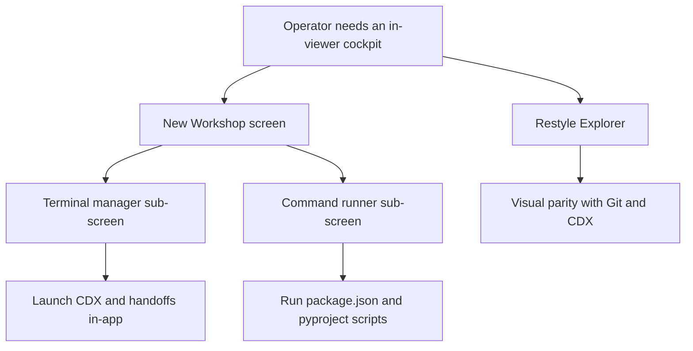

## req_244_restyle_the_explorer_and_add_a_workshop_screen_with_terminals_and_command_runner - Restyle the Explorer and add a Workshop screen with terminals and command runner
> From version: 2.8.1
> Schema version: 1.0
> Status: Draft
> Understanding: 80%
> Confidence: 70%
> Complexity: High
> Theme: Viewer operator workflow
> Reminder: Update status/understanding/confidence and linked backlog/task references when you edit this doc.

# Needs
- Upgrade the visual quality of the Workspace/Explorer screen so it matches the polish of the rest of the viewer instead of feeling raw and purely functional.
- Add a new top-level Workshop screen, positioned in the topbar between Explorer and Git, that hosts two sub-screens dedicated to live execution: a terminal manager and a project command runner.
- Make the terminal manager robust and visually finished enough to be the default place where operators launch CDX sessions and perform handoffs without leaving the Logics viewer.
- Expose the executable entry points already declared in the project (npm `package.json` scripts, Python `pyproject.toml` entry points, and similar) as one-click commands for servers, tests, and recurring developer tasks.

# Context
- The viewer topbar currently exposes Explorer, Git, CI, CDX, and Settings buttons (`clients/viewer/index.html`). The Explorer view is functional but visually unfinished compared to the Git and CDX views, which lowers operator confidence when it is used as the primary file-inspection surface.
- Operators frequently leave the viewer to open an external terminal in order to launch CDX, kick off handoffs, run dev servers, or invoke test suites. Each context switch breaks the cockpit experience that the viewer is otherwise designed to provide.
- The viewer backend is a Python stdlib `ThreadingHTTPServer` (`logics_manager/viewer.py`). It does not currently host PTYs, WebSockets, or subprocess streams. Adding terminals therefore requires a new backend transport (WebSocket for the PTY, or SSE for non-interactive command streams) and a new frontend renderer (xterm.js or equivalent).
- The project already standardizes on a single viewer entry point shared between the browser viewer and the VS Code webview, so the Workshop must follow the same dual-host pattern (browser-host + webview chrome) used by Explorer, Git, CI, and CDX.
- CDX missions and handoffs are already first-class concepts in the viewer (`req_239`, `req_241`); the Workshop must be able to launch them inside an in-app terminal session instead of as external instructions.

# Acceptance criteria
- AC1: The Workspace/Explorer screen is restyled with file-type icons, consistent spacing, hover and focus states, a breadcrumb of the current path, and a clearly indicated selected item, reaching visual parity with the Git and CDX screens.
- AC2: A new Workshop button is added to the viewer topbar, positioned between Explorer and Git, and is gated on workspace capability availability in the same way as the existing Explorer/Git/CI/CDX buttons.
- AC3: The Workshop screen renders a two-tab layout with `Terminals` and `Commands` sub-screens, and the active sub-screen is remembered through the viewer preferences payload across restarts.
- AC4: The Terminals sub-screen supports creating, renaming, switching between, and closing multiple terminal sessions, with the session list persistent within a viewer session and surviving sub-screen switches.
- AC5: Each terminal session is backed by a real PTY on the backend and rendered with a maintained terminal emulator on the frontend (xterm.js or equivalent), supports interactive input, ANSI colors, terminal resize on container resize, and copy/paste.
- AC6: A first-class affordance launches a CDX session or a handoff command directly inside a new Workshop terminal, reusing the existing CDX mission and handoff metadata instead of duplicating it.
- AC7: The Commands sub-screen discovers and lists executable entry points from at least `package.json` `scripts` and `pyproject.toml` (project/poetry scripts), grouped by source, with a clear label, the underlying command line, and a run/stop button per entry.
- AC8: Running a command from the Commands sub-screen streams stdout and stderr in real time into a log panel, exposes the exit code on completion, and allows stopping a running command without killing the viewer process.
- AC9: All Workshop subprocess execution is bounded to the selected workspace root, refuses to spawn outside it, and gracefully degrades (with a clear empty state) when the project exposes no workspace, no scripts, or no terminal capability.
- AC10: The new backend transport (WebSocket or equivalent) is feature-gated, documented in the viewer architecture notes, and falls back cleanly when the transport is unavailable so existing viewer features keep working.
- AC11: Tests cover the Explorer restyle markup and accessibility hooks, Workshop tab persistence, command discovery from `package.json` and `pyproject.toml`, command run/stop and exit-code reporting, terminal session lifecycle, and workspace-root sandboxing of spawned processes.

# Definition of Ready (DoR)
- [x] Problem statement is explicit and user impact is clear.
- [x] Scope boundaries (in/out) are explicit.
- [x] Acceptance criteria are testable.
- [x] Dependencies and known risks are listed.

# Scope
- In:
  - Restyle of the Workspace/Explorer screen (CSS, icons, breadcrumb, selection states) without changing its backing data model.
  - New Workshop topbar entry between Explorer and Git, with capability gating consistent with the existing Explorer/Git/CI/CDX buttons.
  - Workshop sub-screen layout with `Terminals` and `Commands` tabs, including persistence of the active tab via the existing viewer preferences payload.
  - Backend PTY management for terminal sessions, with a WebSocket (preferred) or SSE-based transport to the frontend.
  - Frontend terminal rendering via xterm.js or an equivalent maintained terminal emulator, including resize, copy/paste, and ANSI color support.
  - Discovery and execution of `package.json` scripts and `pyproject.toml` project/poetry scripts via the Commands sub-screen, with streamed stdout/stderr and exit-code reporting.
  - In-app launchers for CDX sessions and handoff commands inside a Workshop terminal, reusing existing CDX mission/handoff metadata.
  - Unit and UI tests for the Explorer restyle hooks, Workshop tab state, command discovery, command lifecycle, and terminal session lifecycle.
- Out:
  - Replacing the existing Git, CI, or CDX screens, or merging Workshop into any of them.
  - Building a full IDE editor, file editing from the Explorer, or in-place edits from the Commands sub-screen.
  - Remote synchronization of Workshop state, terminal sessions, or command history across machines.
  - Persisting terminal scrollback or command logs to disk between viewer restarts.
  - Running arbitrary ad-hoc shell commands typed into the Commands sub-screen (the runner is restricted to discovered entry points; ad-hoc commands belong in a terminal session).
  - Cross-platform parity work beyond the platforms already supported by the viewer runtime.

# Dependencies and risks
- Adding WebSocket (and/or PTY) support introduces a new Python dependency (e.g. `websockets`, `ptyprocess`) that must be evaluated against the bundled CLI distribution constraints and Windows support expectations.
- xterm.js (or any equivalent) must be vendored or fetched in a way that respects the existing offline-friendly asset bundling used by the viewer.
- Spawning real subprocesses from the viewer increases the security surface; spawn paths must be normalized, restricted to the selected workspace root, and refuse traversal or absolute paths outside that root.
- Terminal sessions and long-running commands must be cleaned up when the viewer shuts down or when the underlying client disconnects, to avoid orphaned processes.
- The CDX/handoff launchers must reuse the canonical mission/handoff metadata sources so the Workshop does not drift from the rest of the viewer.
- Visual polish on the Explorer must not regress existing accessibility hooks or break the VS Code webview rendering of the same markup.

# Companion docs
- Product brief(s): (none yet)
- Architecture decision(s): (none yet — a decision is likely required for the PTY transport choice and the terminal emulator dependency)

# References
- `clients/viewer/index.html`
- `clients/viewer/browser-host.js`
- `clients/viewer/viewer.css`
- `clients/shared-web/media/css/toolbar.css`
- `clients/shared-web/media/css/layout.css`
- `logics_manager/viewer.py`
- `logics_manager/viewer_assets/viewer/index.html`
- `logics_manager/viewer_assets/media/mainApp.js`
- `logics_manager/viewer_assets/media/webviewChrome.js`
- `logics_manager/viewer_assets/media/hostApi.js`
- `package.json`
- `pyproject.toml`

# AI Context
- Summary: Restyle the Explorer for visual parity with Git/CDX and add a Workshop screen between Explorer and Git that hosts a robust terminal manager (for CDX and handoffs) and a command runner driven by package.json and pyproject.toml entry points.
- Keywords: explorer-restyle, workshop-screen, terminal-manager, command-runner, pty, websocket, xterm, cdx-launcher, handoff-launcher, viewer-topbar
- Use when: Planning or implementing visual polish on the Workspace/Explorer screen, the new Workshop topbar entry, in-app terminal sessions, or the command runner that surfaces package.json/pyproject scripts in the Logics viewer.
- Skip when: The work is only about CLI-only CDX behavior, Git diff rendering, or remote synchronization of viewer state.

# Backlog
- `item_419_restyle_the_workspace_explorer_screen`
- `item_420_add_workshop_topbar_entry_with_terminal_and_command_sub_screens`
- `item_421_add_in_app_terminal_manager_with_pty_transport_and_cdx_handoff_launchers`
- `item_422_add_command_runner_driven_by_package_json_and_pyproject_entry_points`
