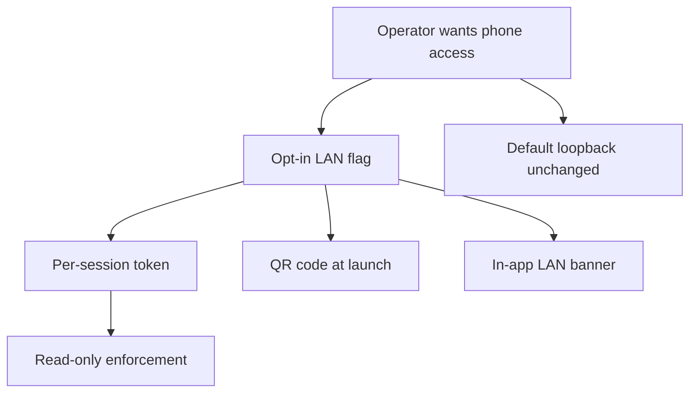

## req_245_expose_the_viewer_on_the_local_network_with_token_authentication_and_read_only_safety - Expose the viewer on the local network with token authentication and read-only safety
> From version: 2.8.1
> Schema version: 1.0
> Status: Draft
> Understanding: 88%
> Confidence: 85%
> Complexity: High
> Theme: Viewer operator workflow
> Reminder: Update status/understanding/confidence and linked backlog/task references when you edit this doc.

# Needs
- Let the operator open the local viewer to other devices on their LAN (typically a phone or tablet) on demand, without having to manually pass low-level bind arguments.
- Make any LAN exposure safe by default: gated behind an explicit opt-in flag, protected by a per-session token, and read-only at the network layer so that anyone on the same wifi cannot trigger write actions or scrape state without the token.
- Give the operator a frictionless way to open the exposed viewer on their phone via a QR code printed at launch, and a clear, always-visible visual reminder inside the viewer that the LAN mode is active.
- Keep the default behavior (loopback-only) unchanged so existing single-machine workflows are not affected.

# Context
- The viewer is served by a Python stdlib `ThreadingHTTPServer` (`logics_manager/viewer.py`) that already accepts a `--host` flag and even computes a network URL when the bind host is non-loopback (`_network_viewer_url` at `logics_manager/viewer.py:2631`). The piece that is missing is an opt-in, safe-by-default operator surface around that capability.
- Today, exposing the viewer requires the operator to manually pass `--host 0.0.0.0`. There is no authentication, no read-only enforcement at the network layer, no QR code, and no in-app indicator. Anyone on the same network can read the full state of the repository, and any future write action (CDX launchers, Workshop terminals from `req_244`) would be reachable without authentication.
- The viewer also already exposes interactive surfaces (CDX status, Git, CI, Workspace) that will, with `req_244`, grow to include terminal sessions and command execution. Opening any of those to the LAN without authentication is unacceptable.
- The viewer is rendered by both the browser host (`clients/viewer/browser-host.js`) and the VS Code webview chrome. The LAN exposure only changes the browser host path; the VS Code chrome is unaffected and stays loopback.
- Mobile usage assumes the viewer is already responsive on phone-sized screens. The responsive pass is tracked separately in `req_246` and is a hard prerequisite for the LAN experience to be usable, but it is not in this request's scope.

# Acceptance criteria
- AC1: The viewer CLI accepts an opt-in flag (for example `--lan`) that binds to all interfaces, distinct from the existing raw `--host` argument, and the default behavior without that flag remains loopback-only.
- AC2: When the LAN flag is used, the viewer generates a fresh per-session token that is required to access any HTTP endpoint, with the token regenerated on every launch and never persisted to disk.
- AC3: The launch output prints the network URL, the token, and a scannable QR code that encodes the URL with the token embedded, so the operator can open it from a phone without retyping.
- AC4: The viewer accepts the token through a query string parameter on first load and through an HTTP header on subsequent requests, and stores it client-side only in the browser session (no localStorage), so closing the tab invalidates the convenience.
- AC5: All HTTP endpoints reject requests that arrive from non-loopback origins without a valid token, with a clear unauthorized response that does not leak repository state.
- AC6: In LAN mode, the viewer disables or hides any action that would mutate state outside the viewer process (for example, CDX launchers, future Workshop terminals and command runners, file edits) and surfaces a clear read-only indication for those actions.
- AC7: The viewer renders a permanent, visually distinctive banner in the topbar whenever LAN mode is active, including a short status (LAN exposed, token active) and a way to copy the URL.
- AC8: When LAN mode is not used, no banner, no token check, and no QR code are produced, and existing loopback workflows behave exactly as before.
- AC9: The launch output and the in-app banner clearly state the security model in plain language (anyone on the network with the token can read; write actions are disabled) so the operator can reason about the risk.
- AC10: Tests cover token generation and required presence, loopback bypass when LAN is not enabled, rejection of unauthorized network requests, query-to-session token handoff, banner rendering in LAN mode and absence in default mode, and read-only enforcement of mutating actions.

# Definition of Ready (DoR)
- [x] Problem statement is explicit and user impact is clear.
- [x] Scope boundaries (in/out) are explicit.
- [x] Acceptance criteria are testable.
- [x] Dependencies and known risks are listed.

# Scope
- In:
  - New opt-in CLI flag that enables LAN exposure with a safe-by-default posture.
  - Per-session token generation, query-to-session handoff, and header-based enforcement for non-loopback requests.
  - QR code rendering at launch (terminal output) encoding the URL with the embedded token.
  - In-app banner that signals LAN mode and exposes a copy-URL affordance.
  - Read-only enforcement at the HTTP layer for any current or future mutating action when LAN mode is active.
  - Plain-language documentation of the security model in the launch output and in the banner.
  - Tests covering the auth path, the read-only enforcement, and the UI banner.
- Out:
  - Exposing the viewer beyond the local network (no public/internet exposure, no reverse proxy support).
  - Multi-user accounts, role-based access control, or persistent credentials beyond a single launch.
  - HTTPS / TLS termination inside the viewer (out of scope; users wanting TLS should front the viewer themselves and stay aware of the read-only guarantee).
  - Persistent token storage across viewer restarts (a future `--lan-token-file` may be considered, but is not part of this slice).
  - Mobile responsive UI work (tracked in `req_246`).

# Dependencies and risks
- LAN exposure is a security surface change; the read-only enforcement must be implemented at the HTTP layer (not only in the UI), otherwise a malicious client on the LAN can hit endpoints directly.
- Token must use a cryptographically secure source and have enough entropy that brute force on a LAN is not realistic; tokens must never be logged to disk and must be redacted from any error output that may be persisted.
- The QR code dependency (if any added Python package) must be evaluated against the bundled CLI distribution constraints; a pure-Python implementation is preferred.
- The interaction with the future Workshop terminals and command runners from `req_244` must be defined: in LAN mode, those features must either be disabled outright or require a stronger auth path; this request only commits to disabling them under LAN.
- The mobile UX is not usable until `req_246` lands. The LAN feature can be shipped before then, but the operator-facing documentation should explicitly call out the responsive prerequisite.
- Researched runtime choices that the implementation should follow unless the ADR overrides them: `secrets.token_urlsafe(32)` for token generation (256-bit, URL-safe, fits in a QR code without size pressure), `hmac.compare_digest` for constant-time comparison in the request handler, `history.replaceState` on first load to strip the one-time `?t=…` query string from the browser URL bar and history after stashing the token in `sessionStorage`, then `Authorization: Bearer <token>` header on subsequent requests, and `segno` (MIT pure-Python, no native dep) for the ASCII QR rendering at launch with `segno.make(url).save(sys.stdout.buffer, kind="txt")`. LAN-mode read-only enforcement is implemented at the request handler level via a maintained registry of mutating routes (`MUTATING_ROUTES`) checked before dispatch, so any future write endpoint must opt into the gate by extending the registry rather than by remembering to guard each handler manually.

# Companion docs
- Product brief(s): (none yet)
- Architecture decision(s): (none yet — an ADR is likely needed to record the auth model: per-session token, no persistence, read-only at HTTP layer, future extension path)

# References
- `logics_manager/viewer.py`
- `clients/viewer/browser-host.js`
- `clients/viewer/index.html`
- `clients/shared-web/media/css/toolbar.css`
- `clients/viewer/viewer.css`
- `req_244` (Workshop terminals and command runner — mutating surface to be disabled in LAN mode)
- `req_246` (Responsive pass — prerequisite for usable phone experience)

# AI Context
- Summary: Add a safe-by-default LAN exposure mode to the local viewer with a per-session token, a QR code at launch, an always-visible banner, and HTTP-layer read-only enforcement of mutating actions.
- Keywords: lan-exposure, viewer-token, qr-code, read-only-mode, viewer-banner, security-surface, opt-in-flag
- Use when: Planning or implementing the LAN access feature, the token auth layer, the QR code launcher output, or the read-only enforcement in the local viewer.
- Skip when: The work is about mobile responsive styling, public internet exposure, or persistent credentials.

# Backlog
- `item_423_add_lan_opt_in_cli_flag_with_http_layer_read_only_enforcement`
- `item_424_add_per_session_token_auth_with_query_to_session_handoff`
- `item_425_add_lan_qr_code_launch_output_and_in_app_banner`
