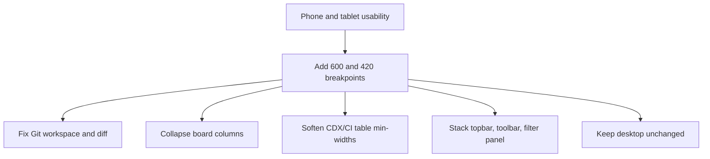

## req_246_make_the_viewer_responsive_on_tablet_and_phone_breakpoints - Make the viewer responsive on tablet and phone breakpoints
> From version: 2.8.1
> Schema version: 1.0
> Status: Done
> Understanding: 87%
> Confidence: 82%
> Complexity: Medium
> Theme: Viewer operator workflow
> Reminder: Update status/understanding/confidence and linked backlog/task references when you edit this doc.

# Needs
- Make every viewer screen readable and usable on tablet portrait (~600px) and phone portrait (~360–420px) viewports, instead of forcing horizontal scroll, crushed columns, or unreadable diff text.
- Eliminate the structural responsive gaps revealed by a full CSS audit: there is currently no `@media (max-width: 600px)` or `@media (max-width: 420px)` breakpoint anywhere in the viewer, and several multi-column grids and tables have hard `min-width` values that refuse to collapse.
- Fix the Git screen specifically, which the operator flagged as illegible at small breakpoints (3-column grid only collapses at 700px; diff preview uses `white-space: pre` causing horizontal scroll).
- Keep the desktop experience visually unchanged at the breakpoints currently used (700, 860, 900, 980px).

# Context
- A full audit of the viewer CSS (`clients/viewer/viewer.css`, `clients/shared-web/media/main.css`, `clients/shared-web/media/css/*.css`) shows only six `@media` rules: 980, 900, 860, 700 (x2), 560, and 275px. No tablet (600px) or phone (420px) breakpoints exist.
- The Git screen is the most visible failure: `.viewer-git__workspace` is a 3-column grid (`domains | content | detail`) that only collapses at 700px (`clients/viewer/viewer.css:1555`), and `.viewer-git__diff pre` uses `white-space: pre` which forces horizontal scroll for any diff line wider than the viewport.
- Other screens with the same root cause: the board (`--board-column-width: 260px` with `flex: 0 0 260px` columns that never shrink), CDX (`.viewer-cdx__table` with a hard `min-width: 920px`), CI and Workspace (grids that only collapse at 860px), the filter panel (aggregate 760px minimum width), and the insights hero (540px minimum).
- The viewport meta tag is already present in `clients/viewer/index.html`, so the missing piece is purely the CSS layer (and a few markup tweaks for stacking order).
- This work is a hard prerequisite for `req_245` (LAN access on phone) to be usable in practice, even though the two requests can be developed in parallel.

# Acceptance criteria
- AC1: The viewer introduces tablet (`max-width: 600px`) and phone (`max-width: 420px`) breakpoints applied consistently across the screens listed below, with desktop styles preserved above 600px.
- AC2: The Git screen at <=600px collapses its 3-column workspace grid to a single column, stacks file metadata vertically inside `.viewer-git__file`, and the diff preview wraps long lines (no horizontal scroll at <=420px) while preserving monospace alignment.
- AC3: The board (`.board` / `.column`) collapses to a single full-width column at <=420px and shrinks `--board-column-width` to fit the viewport at <=600px, instead of forcing horizontal scroll across multiple 260px columns.
- AC4: The CDX status table softens its hard 920px `min-width` at <=600px so the table fits the viewport with reduced font size and grouped columns, instead of triggering a viewport-level horizontal scroll.
- AC5: The CI and Workspace grids collapse to a single column at <=600px (instead of only at 860px), and the Workspace tree/preview split stacks vertically below that threshold.
- AC6: The filter panel collapses its 3-column grid to a single column at <=420px, and the toolbar search input becomes full-width below the same threshold.
- AC7: The topbar adapts at <=420px: the repository pill `max-width` is reduced, the actions row wraps, and primary actions remain reachable without horizontal scroll.
- AC8: The details pane at <=420px uses the full viewport width with reduced padding and font size for the header title, instead of the desktop 300px sidebar treatment.
- AC9: The insights hero (`.viewer-insights__hero`) collapses to a single column at <=420px, instead of waiting for the existing 700px breakpoint.
- AC10: The document inset (`inset: 64px 20px 20px`) is reduced at <=420px to keep usable reading width.
- AC11: No screen exhibits viewport-level horizontal scroll at 360px width on a modern mobile browser; per-region horizontal scroll on intentionally wide content (code blocks, tables explicitly marked overflowing) remains acceptable.
- AC12: Tests cover the presence of the new media query rules for Git, CDX table, board, filter panel, and topbar, and a small viewport snapshot or computed-style check confirms grid collapse at the new breakpoints.

# Definition of Ready (DoR)
- [x] Problem statement is explicit and user impact is clear.
- [x] Scope boundaries (in/out) are explicit.
- [x] Acceptance criteria are testable.
- [x] Dependencies and known risks are listed.

# Scope
- In:
  - Add `@media (max-width: 600px)` and `@media (max-width: 420px)` rules to `clients/viewer/viewer.css` and the relevant `clients/shared-web/media/css/*.css` files.
  - Collapse multi-column grids on Git, Board, CDX, CI, Workspace, Filter panel, Insights, and Details at the new breakpoints.
  - Soften the hard `min-width` declarations on `.viewer-filter-panel`, `.viewer-cdx__table`, and `.column` so they can shrink below their current floors on small viewports.
  - Wrap long lines in the Git diff preview at <=420px while keeping monospace alignment, and stack file metadata badges inside `.viewer-git__file`.
  - Adapt the topbar (repo pill, actions row) and toolbar (search, ordering) at the new breakpoints.
  - Reduce the document inset at <=420px so reading width is preserved.
  - Tests for the new media query rules and the resulting layout collapse.
- Out:
  - Any change to the backend, data model, endpoints, or preference payload.
  - Reworking the visual language, palette, or component design beyond the breakpoint adjustments.
  - Implementing a separate mobile-only navigation, drawer, or off-canvas layout.
  - LAN exposure, authentication, QR code, banner (tracked in `req_245`).
  - The Explorer restyle and the Workshop screen (tracked in `req_244`).

# Dependencies and risks
- The restyle of the Explorer screen from `req_244` (`item_419`) touches the same CSS files; coordinate the order of merges to avoid CSS conflicts, but neither blocks the other.
- The new Workshop screen from `req_244` must be designed with the same `<=600px` and `<=420px` breakpoints in mind from the start; this request defines those breakpoints as the project standard going forward.
- Some hard `min-width` values exist for genuine readability reasons (CDX table column density); softening them must not push the desktop experience into a degraded state.
- Computed-style tests must run against a deterministic JSDOM/Playwright viewport, since the existing viewer test harness does not yet exercise small viewports.
- Once shipped, this work becomes a hard prerequisite for `req_245`; messaging in `req_245` should reference this request as the responsive baseline.

# Companion docs
- Product brief(s): (none yet)
- Architecture decision(s): (none yet)

# References
- `clients/viewer/viewer.css`
- `clients/viewer/index.html`
- `clients/shared-web/media/main.css`
- `clients/shared-web/media/css/toolbar.css`
- `clients/shared-web/media/css/layout.css`
- `clients/shared-web/media/css/board.css`
- `clients/shared-web/media/css/details.css`
- `tests/viewer.browser-host.test.ts`
- `tests/webview.harness-details-and-filters.test.ts`
- `req_244` (Explorer restyle and Workshop screen — overlaps the same CSS surface)
- `req_245` (LAN access — depends on this responsive pass for phone usability)

# AI Context
- Summary: Add tablet (600px) and phone (420px) breakpoints across the viewer to fix the Git screen and all other multi-column screens that currently force horizontal scroll on small viewports, without changing desktop layout.
- Keywords: responsive, mobile-breakpoints, git-screen, board-columns, cdx-table, filter-panel, viewer-css, tablet-phone
- Use when: Implementing or testing responsive breakpoints in the local viewer CSS for tablet and phone viewports.
- Skip when: The work is about LAN exposure, backend endpoints, the Workshop screen runtimes, or the Explorer restyle.

# Backlog
- `item_426_fix_git_screen_layout_and_diff_preview_at_small_breakpoints`
- `item_427_collapse_multi_column_viewer_grids_at_tablet_breakpoint`
- `item_428_adapt_viewer_chrome_and_small_ui_at_phone_breakpoint`
