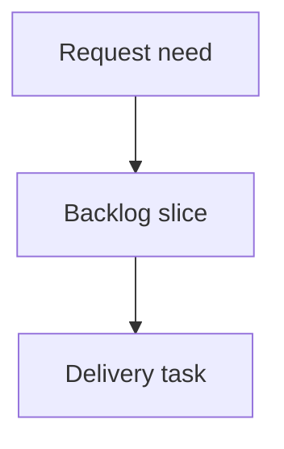

## req_247_remove_mandatory_mermaid_from_logics_workflow_docs - Remove mandatory Mermaid from Logics workflow docs
> From version: 2.9.8
> Schema version: 1.0
> Status: Done
> Understanding: 90%
> Confidence: 85%
> Complexity: Medium
> Theme: Operator workflow
> Reminder: Update status/understanding/confidence and linked backlog/task references when you edit this doc.

# Needs
- Remove Mermaid as a mandatory, hand-maintained artifact from the Logics request, backlog, and task workflow.
- Preserve workflow clarity through structured Markdown fields and CLI or viewer-generated relationship graphs.
- Reduce recurring lint failures and token overhead caused by fragile Mermaid generation in AI-assisted edits.

# Context
- Current workflow templates inject Mermaid diagrams into request, backlog, and task docs.
- The linter validates Mermaid metadata and signatures, so small content edits can produce stale or invalid diagram failures.
- AI agents regularly produce Mermaid that violates the kit constraints, especially around labels, signatures, and syntax hygiene.
- The diagram is a derived representation of workflow relationships, but today it behaves like source data that must be maintained manually.
- The useful workflow state already exists in indicators, lineage links, references, backlog links, task links, acceptance criteria, and validation records.
- Preferred direction: Markdown docs remain the source of truth, while graph views are generated by `logics-manager` or `cdx view` from structured relationships.

# Acceptance criteria
- AC1: New request, backlog, and task templates no longer include mandatory Mermaid blocks.
- AC2: `logics-manager lint` no longer requires Mermaid kind or signature comments for workflow docs.
- AC3: Existing workflow docs with Mermaid remain readable and do not become blocking failures during the migration window.
- AC4: Relationship graph functionality remains available through generated CLI or viewer output derived from workflow links.
- AC5: Documentation explains that Mermaid is optional or legacy in workflow docs and not the authoritative source of flow state.
- AC6: Migration behavior is explicit: either remove existing workflow Mermaid blocks with a command or tolerate them as non-blocking legacy content.

# Definition of Ready (DoR)
- [x] Problem statement is explicit and user impact is clear.
- [x] Scope boundaries (in/out) are explicit.
- [x] Acceptance criteria are testable.
- [x] Dependencies and known risks are listed.

# Scope
- In: workflow docs under `logics/request/`, `logics/backlog/`, and `logics/tasks/`.
- In: templates, lint rules, audit behavior, signature refresh behavior, docs, and tests for the workflow path.
- In: CLI or viewer graph generation that derives relationships from existing structured links.
- Out: removing Mermaid support from ADRs, product briefs, architecture docs, or arbitrary Markdown.
- Out: redesigning the Logics document schema beyond what is necessary to stop requiring Mermaid.

# Proposed approach
- Treat workflow Mermaid as legacy presentation, not source data.
- Update templates so new workflow docs are plain structured Markdown.
- Update lint so Mermaid metadata is optional for workflow docs and stale signatures are not blocking when Mermaid is absent.
- Add or preserve a generated graph command or viewer path that builds the visual flow from lineage and references.
- Provide a migration command or documented procedure for existing workflow Mermaid blocks.

# Risks
- Existing tests may assume Mermaid blocks are present in generated fixtures.
- Some viewer code may parse Mermaid blocks instead of structured workflow links.
- A hard removal could create noisy diffs across many existing docs if not staged carefully.
- During transition, lint must distinguish missing Mermaid from malformed Mermaid that should still be reported when explicitly present.

# Validation plan
- Run `logics-manager lint --require-status`.
- Run `logics-manager audit --legacy-cutoff-version 1.1.0 --group-by-doc`.
- Add or update tests proving new workflow docs pass without Mermaid.
- Add or update tests proving legacy Mermaid does not block unrelated workflow edits.

# Companion docs
- Product brief(s): (none yet)
- Architecture decision(s): (none yet)

# References
- `logics_manager/flow.py`
- `logics_manager/assist.py`
- `tests/python/test_logics_manager_cli.py`

# AI Context
- Summary: Draft a bounded request for remove mandatory mermaid from logics workflow docs.
- Keywords: request-draft, logics-manager, python runtime, bundled CLI
- Use when: You need a new bounded request doc for the Logics workflow.
- Skip when: The work already has an existing request or should go straight to a backlog slice.

# Backlog
- none
- `item_429_remove_mandatory_mermaid_from_logics_workflow_docs`
