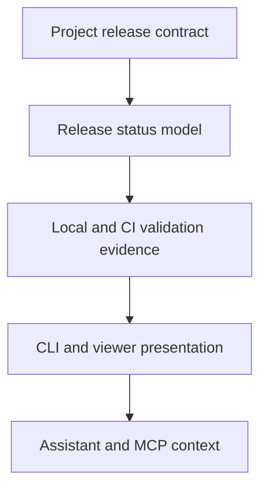

## req_248_release_workflow_multi_project_ai_assistants - Formaliser un workflow de release multi-projet pour les assistants IA
> From version: 2.8.1
> Schema version: 1.0
> Status: Done
> Understanding: 95%
> Confidence: 90%
> Complexity: High
> Theme: Operator workflow
> Reminder: Update status/understanding/confidence and linked backlog/task references when you edit this doc.

# Needs
- Define a reusable release workflow contract that makes release preparation, validation, CI follow-up, GitHub publication, and external publication checks explicit for humans and AI assistants.
- Make the workflow discoverable from repository files, `logics-manager` CLI commands, the Logics viewer, and MCP/assistant context surfaces.
- Replace assistant-specific release memory with project-owned state, gates, and evidence that any agent can inspect before claiming a release is ready.

# Context
- Current release work is repeated across projects such as `logics-manager`, `cdx-manager`, `cp-wc-26`, and `electrical-plan-editor`.
- The expected operator flow is usually: prepare version metadata, update changelog, run local validation, fix failures, commit, push, wait for GitHub CI, then create or verify the GitHub release and any external publication/deployment.
- Today this behavior depends too much on assistant memory and repo-specific habit. A new assistant should be able to run a bounded command, see the release state, and know the next safe action.
- The workflow should remain multi-project: each repo declares its release surfaces and checks, while Logics owns the common states, evidence model, CLI/viewer presentation, and assistant-facing context.

# Acceptance criteria
- AC1: A repository can declare a release workflow contract with version sources, changelog rules, validation commands, git/tag policy, GitHub release behavior, and optional external publication checks.
- AC2: `logics-manager` can report release state as structured data with explicit gates, next actions, blocking reasons, and evidence references.
- AC3: The release workflow distinguishes preparation, local validation, commit/push, CI verification, GitHub release publication, and external publication/deployment verification.
- AC4: The Logics viewer presents release workflow state in a compact, operator-readable view with drill-down evidence for each gate.
- AC5: Assistant-facing context and MCP surfaces expose enough release workflow information for Codex, ChatGPT, Claude, and other agents to follow the same project-owned contract.
- AC6: The workflow supports repo-specific profiles without hard-coding the release habits of one project into the global implementation.
- AC7: Validation covers at least fixture-style examples for the known release patterns from `logics-manager`, `cdx-manager`, and `cp-wc-26`.
- AC8: The workflow makes it hard to declare a release ready when required evidence is missing, stale, failed, or linked to the wrong commit/tag.

# Definition of Ready (DoR)
- [x] Problem statement is explicit and user impact is clear.
- [x] Scope boundaries (in/out) are explicit.
- [x] Acceptance criteria are testable.
- [x] Dependencies and known risks are listed.

# Scope
- In:
  - A release contract schema or equivalent project-owned declaration.
  - CLI commands for planning, status, validation, and evidence reporting.
  - Viewer representation of release gates and proof.
  - Assistant/MCP context that exposes the same state to multiple agents.
  - Initial support for project profiles matching the release flows already used in local repos.
- Out:
  - Automatically publishing every external package registry in the first slice.
  - Replacing existing GitHub Actions release workflows.
  - Making release publication irreversible without an explicit operator command.
  - A single global release recipe that ignores repo-specific version files or deployment checks.

# Proposed release states
- `not_configured`: no release contract found.
- `planned`: target version selected and expected changes known.
- `prepared`: version metadata and changelog are updated.
- `validated_local`: local release gates passed.
- `committed`: release prep commit exists.
- `pushed`: release commit is present on the expected remote branch.
- `ci_pending`: GitHub checks are still running for the release commit.
- `ci_green`: required checks passed for the release commit.
- `github_released`: GitHub release and tag are present and target the expected commit.
- `published`: required external package/deploy checks are verified.
- `blocked`: at least one required gate failed or lacks evidence.

# Evidence model
- Each gate should record command, timestamp, working tree state, commit SHA, relevant tag, conclusion, and machine-readable details.
- Evidence should be invalidated when the working tree, release commit, tag target, or configured checks drift.
- Human-readable summaries should be derived from the same structured evidence used by CLI, viewer, and MCP surfaces.

# Companion docs
- Product brief(s): (none yet)
- Architecture decision(s): (none yet)

# References
- `logics_manager/flow.py`
- `logics_manager/assist.py`
- `tests/python/test_logics_manager_cli.py`
- `logics_manager/viewer.py`
- `clients/viewer/browser-host.js`

# AI Context
- Summary: Formalize a multi-project release workflow so assistants can discover release requirements, run validation, collect evidence, and report readiness without relying on conversation memory.
- Keywords: release-workflow, multi-project, assistant-context, mcp, github-release, ci-verification, evidence, viewer
- Use when: You need to implement or review the Logics release workflow contract, CLI status, viewer release panel, or assistant-facing release context.
- Skip when: The work only prepares a specific project release using an already implemented release workflow.

# Backlog
- `item_430_define_the_release_workflow_contract_and_schema`
- `item_431_implement_release_status_and_validation_commands`
- `item_432_expose_release_workflow_state_in_the_logics_viewer`
- `item_433_expose_release_workflow_context_for_assistants_and_mcp_clients`
