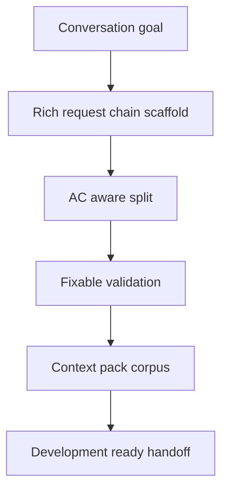

## req_249_improve_logics_workflow_scaffolding_validation_agent_docs - Improve Logics workflow scaffolding and validation for agent-authored docs
> From version: 2.8.1
> Schema version: 1.0
> Status: Done
> Understanding: 95%
> Confidence: 90%
> Complexity: High
> Theme: Operator workflow and runtime integration
> Reminder: Update status/understanding/confidence and linked backlog/task references when you edit this doc.

# Needs
- Make Logics workflow document creation faster, less token-heavy, and less correction-prone when an AI agent turns a conversation into request, backlog, product brief, task, and implementation context.
- Provide first-class commands for rich request-chain scaffolding, AC-aware splitting, orchestration task generation, deterministic fixes, and context-pack corpus handoff.
- Reduce the number of manual patch cycles needed after generation by making the CLI produce audit-ready docs and actionable diagnostics by default.

# Context
- A recent agent-authored workflow creation required the assistant to generate generic docs, rewrite most sections manually, discover that `flow promote backlog-to-task` did not accept `--title`, fix request AC traceability after audit failed, copy stale Mermaid signatures from lint output, and regenerate the index before commit.
- The process succeeded, but it forced extra file reads, patches, lint/audit loops, and agent reasoning that should be encoded in Logics commands.
- The desired operator experience is: provide the conversation-derived goal and item split, then let Logics scaffold a development-ready corpus with request, product brief, backlog slices, orchestration task, traceability, Mermaid signatures, index updates, and a context pack.
- This request is about improving Logics authoring workflow infrastructure, not implementing the separate release workflow itself.

# Acceptance criteria
- AC1: Logics can scaffold a request, product brief, backlog slices, orchestration task, traceability, Mermaid signatures, index changes, and optional context pack from structured input without forcing broad manual rewrites.
- AC2: Request splitting can map specific request ACs to specific backlog slices and can create an orchestration task with an explicit title and role.
- AC3: Deterministic lint/audit warnings such as stale Mermaid signatures, missing overview blocks, missing AC traceability, and index drift can be repaired or explained through one validation surface.
- AC4: Context-pack corpus generation can produce a compact, implementation-ready handoff from the new workflow refs with predictable output path and token profile.
- AC5: Agent-facing command output prioritizes current/recent/open/changed docs and returns structured next actions instead of forcing agents to infer state from generic lists.
- AC6: The improved flow preserves existing safety boundaries: no silent destructive edits, no publication actions, and no unrelated workflow docs modified by repair commands.
- AC7: Tests cover rich scaffold generation, AC-aware split metadata, fixable diagnostics, context-pack handoff, and failure cases where auto-fix should decline.
- AC8: Documentation and CLI help show the recommended one-pass workflow for turning a product conversation into development-ready Logics corpus.

# Definition of Ready (DoR)
- [x] Problem statement is explicit and user impact is clear.
- [x] Scope boundaries (in/out) are explicit.
- [x] Acceptance criteria are testable.
- [x] Dependencies and known risks are listed.

# Scope
- In:
  - New or extended `logics-manager flow` commands for rich scaffolding and orchestration task creation.
  - AC-aware request splitting and generated AC traceability.
  - Deterministic fix/validate UX for lint/audit issues that agents currently repair manually.
  - Context-pack generation tied to newly created workflow refs.
  - Recent/open/changed document listing and structured workflow output for agents.
- Out:
  - Replacing all existing flow commands at once.
  - Automatically implementing generated tasks.
  - Broad reformatting of historical Logics documents.
  - Provider-specific prompt hacks for one assistant.

# Proposed commands
- `logics-manager flow scaffold request-chain --input <file> [--context-pack <path>]`
- `logics-manager flow split request <ref> --slice <title:ACs> ... [--orchestration-task <title>]`
- `logics-manager flow validate <ref...> --fixable --explain [--apply-fixes]`
- `logics-manager flow repair mermaid --refs ...` should apply the exact signatures that `lint` reports as expected.
- `logics-manager sync list-docs --recent|--open|--changed`
- `logics-manager sync context-pack <refs...> --profile normal --mode full --out <path>`

# Companion docs
- Product brief(s): `logics/product/prod_023_agent_authored_logics_workflow_scaffolding_and_validation.md`
- Architecture decision(s): (none yet)

# References
- `logics_manager/flow.py`
- `logics_manager/assist.py`
- `tests/python/test_logics_manager_cli.py`
- `logics_manager/sync.py`
- `logics_manager/lint.py`
- `logics_manager/audit.py`

# AI Context
- Summary: Improve Logics so agents can create development-ready workflow corpus with fewer manual edits, fewer lint/audit repair loops, and less token-heavy exploration.
- Keywords: request-chain-scaffold, ac-aware-split, validation-autofix, context-pack, corpus-handoff, agent-ergonomics, mermaid-signature
- Use when: You are implementing or reviewing Logics workflow authoring improvements for agent-generated request/backlog/product/task/context-pack chains.
- Skip when: You are only implementing the product feature described by a generated workflow, not the workflow authoring system itself.

# Backlog
- `item_434_add_rich_request_chain_scaffolding_for_development_ready_logics_work`
- `item_435_make_request_splitting_ac_aware_and_task_orchestration_friendly`
- `item_436_add_deterministic_validation_repair_and_fixable_diagnostics`
- `item_437_improve_context_pack_corpus_generation_for_implementation_handoff`
- `item_438_improve_agent_ergonomics_for_recent_docs_and_structured_workflow_output`
