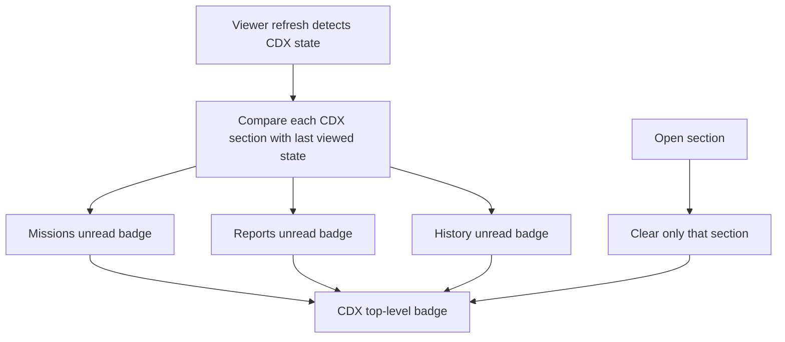

## req_252_add_unread_change_badges_to_cdx_missions_reports_and_history - Add unread change badges to CDX Missions Reports and History
> From version: 2.11.4+dev-ready
> Schema version: 1.0
> Status: Done
> Understanding: 95%
> Confidence: 90%
> Complexity: Medium
> Theme: Operator workflow
> Reminder: Update status/understanding/confidence and linked backlog/task references when you edit this doc.

# Needs
- Add unread change badges to the CDX `Missions`, `Reports`, and `History` sections in the local viewer.
- Mirror the existing `Remote` / `Release` change-notification behavior: show an attention badge when a section has changed since it was last viewed, and clear that section's badge when the operator opens it.
- Aggregate unread CDX section changes on the top-level `CDX` button so operators can see that one or more CDX screens need review without opening the menu.

# Context
- The local viewer already uses a badge on `Remote` and its `Release` menu item when release state changes.
- The CDX menu currently contains `Sessions`, `Missions`, `Reports`, and `History`.
- CDX status already has active-session/run badges, but the requested behavior is different: it is a per-screen unread-change signal for `Missions`, `Reports`, and `History`.
- Operators should be able to refresh or auto-refresh the viewer and immediately see which CDX screens have new information to inspect.
- The `Missions` screen should also expose quick stats like `Sessions`, `Reports`, and `History`, so operators can scan mission count, available sessions, preview state, and run state without reading the full form.

# Scope
- Track unread state independently for `Missions`, `Reports`, and `History`.
- Show a `!` badge on each changed CDX menu item when that section has new state since it was last opened.
- Show a `!` badge on the top-level `CDX` button when exactly one of those CDX sections has unread changes.
- Show a numeric badge on the top-level `CDX` button when multiple CDX sections have unread changes, with the number representing changed sections, not changed rows.
- Clear only the relevant section's unread badge when the operator opens that section.
- Recompute the top-level `CDX` badge after each section is opened and after each refresh that detects new state.
- Preserve existing active-session / running-run badges and avoid conflating them with unread-change badges.
- Add a compact `Missions` summary row with mission catalog count, session count, plan/preview state, and run state.

# Out of scope
- Counting the number of new missions, reports, or history entries inside a section.
- Changing the internal route names such as `cdx:status` or `data-viewer-cdx-mode="status"`.
- Adding unread badges to `Sessions` in this slice.
- Adding write actions, acknowledge-all actions, or persistent cross-device notification state.
- Adding detailed mission analytics or historical mission trends beyond the compact `Missions` screen stats.

# Acceptance criteria
- AC1: When refreshed CDX `Missions` data differs from the last viewed `Missions` state, the `Missions` menu item shows an unread `!` badge.
- AC2: When refreshed CDX `Reports` data differs from the last viewed `Reports` state, the `Reports` menu item shows an unread `!` badge.
- AC3: When refreshed CDX `History` data differs from the last viewed `History` state, the `History` menu item shows an unread `!` badge.
- AC4: Opening `Missions` clears only the `Missions` unread badge and leaves `Reports` / `History` unread badges unchanged.
- AC5: Opening `Reports` clears only the `Reports` unread badge and leaves `Missions` / `History` unread badges unchanged.
- AC6: Opening `History` clears only the `History` unread badge and leaves `Missions` / `Reports` unread badges unchanged.
- AC7: The top-level `CDX` button shows `!` when exactly one of `Missions`, `Reports`, or `History` has unread changes.
- AC8: The top-level `CDX` button shows the number of unread changed sections when two or three of `Missions`, `Reports`, and `History` have unread changes.
- AC9: Once all changed CDX sections have been opened, the unread-change badge on the top-level `CDX` button disappears.
- AC10: Existing CDX active-session and running-run indicators continue to render correctly and are not replaced by the unread-change badge logic.
- AC11: The `Missions` screen includes summary stats for available missions, available sessions, plan/preview state, and run state, using the same compact card pattern as the other CDX screens.
- AC12: Tests cover unread detection, per-section clearing, top-level aggregation, `Missions` stats, and coexistence with existing CDX badges in both source and packaged viewer assets.

# Definition of Ready (DoR)
- [x] Problem statement is explicit and user impact is clear.
- [x] Scope boundaries (in/out) are explicit.
- [x] Acceptance criteria are testable.
- [x] Dependencies and known risks are listed.

# Companion docs
- Product brief(s): (none yet)
- Architecture decision(s): (none yet)

# References
- `clients/viewer/index.html`
- `clients/viewer/browser-host.js`
- `clients/viewer/viewer.css`
- `logics_manager/viewer_assets/viewer/index.html`
- `logics_manager/viewer_assets/viewer/browser-host.js`
- `logics_manager/viewer_assets/viewer/viewer.css`
- `logics_manager/viewer.py`
- `tests/viewer.browser-host.test.ts`
- `tests/python/test_logics_manager_cli.py`

# AI Context
- Summary: Add unread-change badges for CDX Missions, Reports, and History in the local viewer, with per-section clearing, top-level CDX aggregation, and compact Missions stats.
- Keywords: local-viewer, cdx, missions, mission-stats, reports, history, unread-badge, notification-badge, section-change, viewer-refresh
- Use when: You need to implement or review CDX unread-change indicators in the local viewer.
- Skip when: The work is about release badges, active-session counts, CDX status routing, or mutating CDX sessions.

# Backlog
- none
- `item_447_add_unread_change_badges_to_cdx_missions_reports_and_history`
