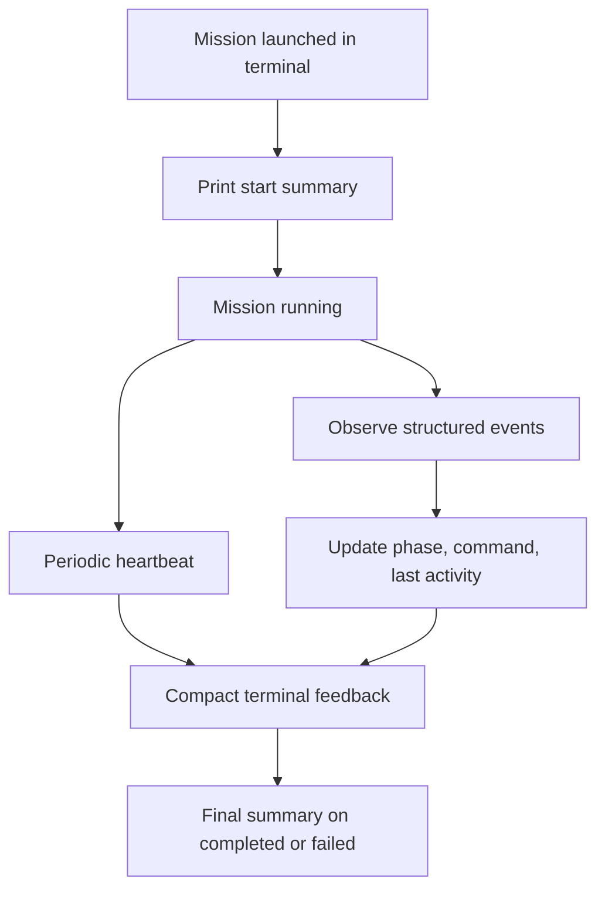

## req_253_add_live_terminal_progress_feedback_for_cdx_mission_runs - Add live terminal progress feedback for CDX mission runs
> From version: 2.11.4
> Schema version: 1.0
> Status: Draft
> Understanding: 90%
> Confidence: 85%
> Complexity: Medium
> Theme: Operator workflow
> Reminder: Update status/understanding/confidence and linked backlog/task references when you edit this doc.

# Needs
- When an operator launches a CDX mission from the terminal, provide live progress feedback so they can tell whether the mission is advancing, waiting, blocked, or silent.
- Show useful observable signals during the run without inventing a fake percentage: elapsed time, last activity, current step, current command, recent significant events, and completion/failure state.
- Keep the default terminal output compact and readable, with an explicit verbose/watch path for operators who want richer live detail.

# Context
- CDX missions can run for long enough that the terminal may appear idle even when work is still happening.
- Operators need to know whether a mission is actively reading/editing/testing, waiting on command output, waiting on approval/input, or potentially stalled.
- The local viewer can show mission state after the fact, but the terminal running the mission is the highest-attention surface during launch.
- The desired behavior is not a precise progress bar. It is a compact live heartbeat and event summary based on real mission events.

# Scope
- Add compact live terminal feedback for mission runs launched from the CLI.
- Print a mission start summary containing mission name, run id, session/provider when available, and report/transcript path when available.
- Emit periodic heartbeat/status updates while the mission is running, including elapsed time and time since last observed activity.
- Surface the current phase when it can be inferred from real events, using labels such as `Planning`, `Inspecting files`, `Editing`, `Running command`, `Testing`, `Waiting`, `Finalizing`, `Completed`, and `Failed`.
- Surface the currently running command or a short command label when available.
- Surface significant event lines such as plan created, files read, patch applied, command started, tests failed/passed, permission/input required, blocked, and completed.
- Provide a concise default mode that avoids flooding stdout/stderr.
- Provide or document a verbose mode that streams richer raw detail for debugging.
- Provide or document a watch-style mode that refreshes a compact terminal status area when the terminal supports it.
- Ensure final output includes completion/failure status, elapsed time, report/transcript path, and next action when one is available.

# Out of scope
- Displaying a fabricated percentage complete.
- Parsing arbitrary human prose from agents as the primary progress contract when structured events are available.
- Replacing the full transcript or report artifact.
- Building a full TUI dashboard in the first slice.
- Adding viewer-side unread badges or CDX section notifications; that is covered separately by `req_252_add_unread_change_badges_to_cdx_missions_reports_and_history`.
- Changing mission execution semantics, permissions, or provider routing.

# Acceptance criteria
- AC1: Launching a CDX mission prints a start summary with mission identifier, run id when available, and where the report or transcript can be inspected.
- AC2: While a mission is running, the terminal prints periodic compact status updates with elapsed time and time since last activity.
- AC3: Status updates include the current phase when the phase can be inferred from structured mission events.
- AC4: When a command is running, the terminal shows a short current-command label and how long that command has been active when available.
- AC5: Significant mission events are printed once as readable event lines without duplicating noisy raw output in default mode.
- AC6: Waiting states are explicit: approval required, input required, waiting on command output, blocked, or no recent activity beyond a configured threshold.
- AC7: The default mode remains compact enough for normal terminal use and does not interleave large raw stdout/stderr dumps unless an error or final summary requires it.
- AC8: A verbose mode or equivalent option exposes richer raw mission detail for debugging.
- AC9: A watch-style mode or equivalent option presents the same live signals in a refreshable compact terminal view when supported.
- AC10: Mission completion prints a final summary with status, elapsed time, changed-file/test/command counters when available, and report/transcript path.
- AC11: Mission failure prints the failure state, the most relevant last event or error, and a next action or report path for investigation.
- AC12: Tests cover heartbeat rendering, event rendering, waiting/stale activity messaging, compact-vs-verbose behavior, and final success/failure summaries.

# Definition of Ready (DoR)
- [x] Problem statement is explicit and user impact is clear.
- [x] Scope boundaries (in/out) are explicit.
- [x] Acceptance criteria are testable.
- [x] Dependencies and known risks are listed.

# Companion docs
- Product brief(s): (none yet)
- Architecture decision(s): (none yet)

# References
- `logics/product/prod_022_cdx_status_cockpit_for_the_local_viewer.md`
- `logics/request/req_252_add_unread_change_badges_to_cdx_missions_reports_and_history.md`
- `logics_manager/viewer.py`
- `clients/viewer/browser-host.js`
- `logics_manager/viewer_assets/viewer/browser-host.js`
- `tests/viewer.browser-host.test.ts`
- `tests/python/test_logics_manager_cli.py`

# AI Context
- Summary: Add compact live terminal feedback for CDX mission runs, including heartbeat, last activity, current phase, current command, significant events, verbose/watch modes, and final summaries.
- Keywords: cdx, mission-run, terminal-feedback, heartbeat, live-status, current-command, watch-mode, verbose-mode, progress-signals, operator-workflow
- Use when: You need to implement or review terminal-side progress feedback for long-running CDX missions.
- Skip when: The work is about viewer-only CDX badges, release badges, or changing mission execution semantics.

# Backlog
- none
