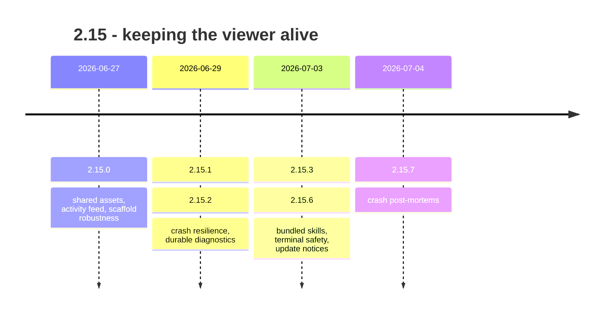

## road_001_2_15_keeping_the_viewer_alive - 2.15: keeping the viewer alive

> Date: 2026-08-09
> Status: Settled
> Related product: (none yet)
> Related request: `req_284_make_the_recent_activity_feed_legible_for_git_and_ci_events`, `req_285_single_source_the_shared_web_assets_and_stop_committing_build_mirrors`, `req_286_make_flow_scaffold_request_chain_fail_fast_atomic_and_self_documenting`
> Reminder: Update status, milestone scope, linked refs, risks, and success signals when you edit this doc.

# AI Context

- Summary: Retrospective roadmap for the 2.15 line — three planned requests followed by five unplanned patch releases spent making the viewer survive its own environment.
- Keywords: roadmap, retrospective, 2.15, viewer stability, crash diagnostics, terminal, tty
- Use when: You need to know what the 2.15 line delivered, or why it has eight releases.
- Skip when: You need execution details for a single backlog item or task.

# Summary

2.15 is the only line in this range whose shape was decided by defects rather than
intentions. The three requests it opened with (`req_284_make_the_recent_activity_feed_legible_for_git_and_ci_events`, `req_285_single_source_the_shared_web_assets_and_stop_committing_build_mirrors`, `req_286_make_flow_scaffold_request_chain_fail_fast_atomic_and_self_documenting`) shipped in
2.15.0. Everything after that — five releases in six days — is the viewer refusing to stay
up, and the tooling built to find out why.

It is the most instructive line to read backwards, because the durable diagnostics added in
2.15.2 are what made 2.15.7's post-mortems possible. The instrument had to ship before the
bug could be caught.

# Milestones

## 2.15.0 - shared assets, activity feed, scaffold robustness

- Delivered: Shared web assets single-sourced, with the committed build mirrors deleted
  (`req_285_single_source_the_shared_web_assets_and_stop_committing_build_mirrors`, `task_282_orchestrate_single_sourcing_of_shared_web_assets`). The Recent Activity feed became legible for git and CI events
  (`req_284_make_the_recent_activity_feed_legible_for_git_and_ci_events`, `task_281_orchestrate_the_recent_activity_feed_legibility_polish`). `flow scaffold request-chain` became fail-fast, atomic, and
  self-documenting (`req_286_make_flow_scaffold_request_chain_fail_fast_atomic_and_self_documenting`, `task_283_orchestrate_scaffold_robustness_hardening`).
- Proven by: v2.15.0, released 2026-06-27.
- Note: `req_286_make_flow_scaffold_request_chain_fail_fast_atomic_and_self_documenting` is the one that still pays rent. An atomic scaffold means a failed chain
  leaves no half-written corpus behind.

## 2.15.3 - crash resilience and durable diagnostics

- Delivered: The viewer stopped taking the whole session down with it, diagnostics started
  being written somewhere that survives the crash, navigation was repaired, Python packaging
  was corrected, and the first bundled agent skills shipped.
- Proven by: v2.15.1 through v2.15.3, released 2026-06-29 to 2026-07-03.
- No request backs this milestone. It was reactive work.

## 2.15.5 - the terminal that would not release the keyboard

- Delivered: Terminal safety and handling. A child process was leaving the tty in `-isig`,
  so Ctrl+C stopped reaching the foreground process and the session hung. The fix was to
  give spawned processes `stdin=subprocess.DEVNULL` (`11bad482`, first released in v2.15.4).
- Proven by: v2.15.4 and v2.15.5, released 2026-07-03.
- Why it is worth remembering: The symptom (Ctrl+C does nothing) pointed nowhere near the
  cause (a spawned child inheriting and mutating the terminal). `stty -a` on the hung shell
  is the diagnostic that closes this class of bug.

## 2.15.7 - crash post-mortems

- Delivered: Update notices in the viewer (2.15.6), then post-mortem reporting for viewer
  crashes (2.15.7) — the payoff for the durable diagnostics added five releases earlier.
- Proven by: v2.15.6 and v2.15.7, released 2026-07-03 and 2026-07-04.

# Sequencing

Planned work in 2.15.0. Everything after it was found, not scheduled. The line ends when
the crashes became explainable, not when a scope was finished.

# What this line did not settle

- Eight releases, three requests. Five of those releases have no workflow document behind
  them at all, so the corpus records the intentions of 2.15 and almost none of its actual
  work. A memory layer that only remembers the planned half is the failure mode this
  project exists to prevent.
- The blank-viewer crash investigated on 2026-07-04 was narrowed (OOM and panel causes
  eliminated, a synchronous hang suspected) rather than closed.

# Success signals

- A viewer crash leaves behind a readable post-mortem instead of an empty window.
- Ctrl+C reaches the foreground process after the viewer has spawned children.
- A failed `scaffold request-chain` writes nothing.

# References

- Product brief(s): (none yet)
- Request(s): `req_284_make_the_recent_activity_feed_legible_for_git_and_ci_events`, `req_285_single_source_the_shared_web_assets_and_stop_committing_build_mirrors`, `req_286_make_flow_scaffold_request_chain_fail_fast_atomic_and_self_documenting`
- Backlog item(s): (none yet)
- Task(s): `task_281_orchestrate_the_recent_activity_feed_legibility_polish`, `task_282_orchestrate_single_sourcing_of_shared_web_assets`, `task_283_orchestrate_scaffold_robustness_hardening`
- Releases: v2.15.0 … v2.15.7 (2026-06-27 → 2026-07-04)
