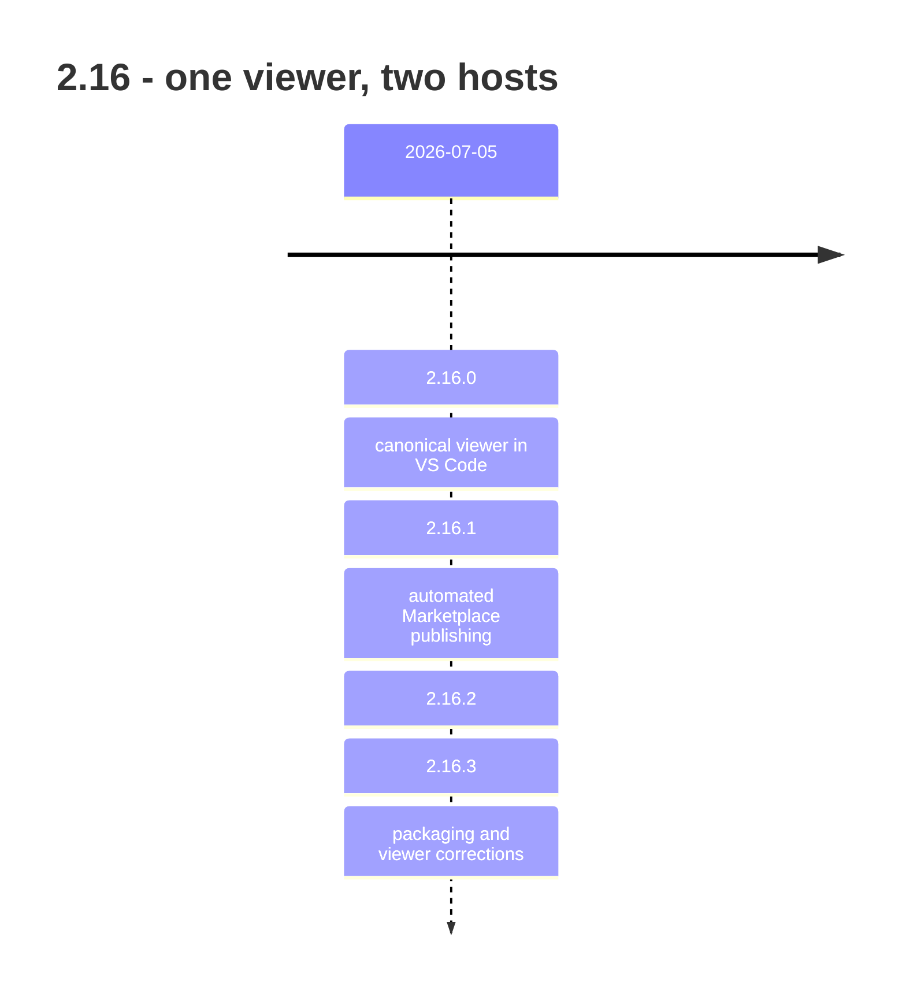

## road_002_2_16_one_viewer_two_hosts - 2.16: one viewer, two hosts

> Date: 2026-08-09
> Status: Settled
> Related product: (none yet)
> Related request: `req_287_make_the_vs_code_extension_host_the_same_logics_viewer_ui`, `req_288_sort_projects_by_last_used`, `req_289_split_the_cdx_usage_gauge_into_5h_and_week_columns`, `req_290_post_release_viewer_and_vs_code_hardening`
> Reminder: Update status, milestone scope, linked refs, risks, and success signals when you edit this doc.

# AI Context

- Summary: Retrospective roadmap for 2.16 — the line that stopped maintaining two viewer UIs by making the VS Code extension host the standalone one.
- Keywords: roadmap, retrospective, 2.16, VS Code, extension, marketplace, packaging
- Use when: You need to know when and why the extension stopped having its own webview UI.
- Skip when: You need execution details for a single backlog item or task.

# Summary

Before 2.16 there were two implementations of the same board: the standalone viewer and the
VS Code webview. `req_287_make_the_vs_code_extension_host_the_same_logics_viewer_ui` collapsed them — the extension now hosts the same viewer UI, and
the webview stopped being a second product with its own bugs.

The rest of the line is the cost of that decision landing on a Sunday: four releases in one
day, three of them packaging and publishing corrections.

# Milestones

## 2.16.0 - the VS Code extension hosts the same viewer

- Delivered: The extension embeds the canonical Logics viewer UI (`req_287_make_the_vs_code_extension_host_the_same_logics_viewer_ui`, `task_284_orchestrate_vs_code_embedded_viewer_parity`).
  Projects sort by last used (`req_288_sort_projects_by_last_used`, `task_285_sort_projects_by_last_used`). The CDX usage gauge splits into 5h and
  week columns (`req_289_split_the_cdx_usage_gauge_into_5h_and_week_columns`, `task_286_implement_split_5h_week_cdx_usage_gauge`). Viewer, CDX, runtime, and workflow hardening
  throughout.
- Proven by: v2.16.0, released 2026-07-05.
- Why it matters: This is the decision the whole client story rests on. Every viewer feature
  after this date lands in both hosts at once, which is what made the 2.21 viewer work
  affordable.

## 2.16.3 - publishing the thing automatically

- Delivered: Automated Marketplace publishing (2.16.1), then two corrections to VS Code
  packaging and viewer updates (2.16.2, 2.16.3). Post-release hardening carried by `req_290_post_release_viewer_and_vs_code_hardening`
  and `task_287_orchestrate_post_release_viewer_hardening`.
- Proven by: v2.16.1 through v2.16.3, all released 2026-07-05.

# Sequencing

One planned release, three same-day corrections. `req_290_post_release_viewer_and_vs_code_hardening` was opened after 2.16.0 shipped
to hold the hardening work, which is the right instinct recorded too late to prevent the
patches.

# What this line did not settle

- Automating Marketplace publishing in the same day as the release it was meant to publish
  produced two packaging patches. The automation had no dry run.
- Merging the two UIs removed the duplicate, not the size: the single viewer inherited both
  implementations' surface area, and splitting it is still open work five minor versions
  later (`req_311_lift_the_viewer_s_sub_systems_out_of_its_core_and_turn_the_size_ledger_into_a_ratchet`, `req_312_finish_lifting_the_browser_host_s_sub_systems_on_the_seam_cdx_proved`).

# Success signals

- A viewer change ships to the standalone board and the VS Code extension from one source.
- A tagged release reaches the Marketplace without manual steps.

# References

- Product brief(s): (none yet)
- Request(s): `req_287_make_the_vs_code_extension_host_the_same_logics_viewer_ui`, `req_288_sort_projects_by_last_used`, `req_289_split_the_cdx_usage_gauge_into_5h_and_week_columns`, `req_290_post_release_viewer_and_vs_code_hardening`
- Backlog item(s): (none yet)
- Task(s): `task_284_orchestrate_vs_code_embedded_viewer_parity`, `task_285_sort_projects_by_last_used`, `task_286_implement_split_5h_week_cdx_usage_gauge`, `task_287_orchestrate_post_release_viewer_hardening`
- Releases: v2.16.0 … v2.16.3 (all 2026-07-05)
